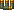
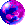

= Freedoom Manual
// SPDX-License-Identifier: BSD-3-Clause
:toc:
:toc-title:

image::../graphics/titlepic/titlepic.png[Freedoom Title Image,align="center",width=380,pdfwidth=50vw]

Welcome to Freedoom, a complete game that is
https://www.gnu.org/philosophy/free-sw.html[free]
and https://opensource.org/osd/[open source software].
Freedoom is made available under the <<licence,modified BSD license>>, meaning that
anyone is free to share it, modify it and reuse parts of it.

For more details, see the website at https://freedoom.github.io/.

== Installing Freedoom

Freedoom is distributed as three files named `freedoom1.wad`, `freedoom2.wad`
and `freedm.wad` which contain the artwork, levels, music and sound
effects that make up the game.

To actually play the game, you can use one of many adaptations ("source ports")
of the original Doom program that fans have developed for modern systems.

The Doom Wiki
https://doomwiki.org/wiki/Source_port[source ports page] has a
comprehensive list of such programs. As a starting point, you can try:

* https://zdoom.org[GZDoom], a modern source port that includes hardware
  rendering and extended mod capability.
* https://www.chocolate-doom.org/wiki/index.php/Crispy_Doom[Crispy Doom],
  a more minimalist source port that retains an “old school” feel.

Setup depends on the source port you use, and it’s best to refer to the
instructions for that source port. Generally though, you can try one of the
following:

* Place the Freedoom `.wad` files into the same folder as the source port
  before launching. The source port may be able to automatically detect them.
* If launching from the command line, try
  eg. `my-favorite-port -iwad freedoom1.wad`.

Freedoom is split into _Freedoom: Phase 1_ (`freedoom1.wad`) and
_Freedoom: Phase 2_ (`freedoom2.wad`). _Phase 1_ is split into four separate
episodes of eight levels each, while _Phase 2_ is a single, 30 level campaign.
This gives 62 levels to play through, plus the secret levels -- if
you can discover how to reach them.

FreeDM (`freedm.wad`) is a monster-free set of levels, made specifically
for player-versus-player. For how to host a multiplayer game,
check the instructions on your source port.

<<<

[[menus]]
== Using the Freedoom Menus

The main menu can be brought up at any time by pressing the
_Esc_ key on your keyboard.

image::images/menu-mainmenu.png[Freedoom Main Menu,align="center",width=380,pdfwidth=50vw]

[cols="2,5",width="100%",align="center",valign="middle"]
|==========================
| <<newgame,**New game**>> | Start a new game, abandoning the current game (if you’re
already playing).
| **Options** | Brings up the options menu. The appearance of this menu
and the available options depend upon the source port you’re using.
| <<savegame,**Load Game**>> | Load a saved game.
| <<savegame,**Save Game**>> | Save your current game, so that you can continue playing
later.
| **Read This!** | Brings up a help screen showing the
items you’ll encounter in the game.
| **Quit Game** | Exit to the operating system.
|==========================

[[newgame]]
=== Starting a new game

[**Shortcut:** On most source ports, if you repeatedly hit _Enter_ after the
program has started, you will start a new game on the default skill level
(in the first episode if you're playing Phase 1). You do not need to do this quickly.]

To start a new game, press _Esc_ to bring up the main menu, and choose
_New Game_.

When starting a new game, you may be prompted to choose which episode to
start playing.

image::images/menu-episode.png[Freedoom Episode Menu,align="center",width=432,pdfwidth=50vw]

If you’re new to the game, start with Phase 1 _Outpost Outbreak_, the first
episode (and easiest). There is no requirement to play episodes in order.

[[skill]]
After choosing an episode, you need to pick a skill level. Skill level
affects several factors in the game, most importantly the number of
monsters you’ll encounter.

image::images/menu-skill.png[Skill Selection Menu,align="center",width=473,pdfwidth=50vw]

[cols="1,5,13",width="90%",align="center",valign="middle"]
|==========================
| 1 | **Please Don’t +
Kill Me!** | The easiest skill level. This is
effectively the same as _Will This Hurt?_, except that damage is halved.
| 2 | **Will This Hurt?** | Easy skill level.
| 3 | **Bring On +
The Pain.** | The default skill level.
| 4 | **Extreme Carnage.** | Hard skill level.
| 5 | **MAYHEM!** | **Not Recommended**. This is equivalent to
_Extreme Carnage_ except that monster attacks are up to twice as fast,
and killed monsters come back to life after around 40 seconds.
|==========================

[[savegame]]
=== Loading and saving the game

It is a good idea to save the game regularly -- for example, at the start
of each new level. You may also want to save the game after completing a
challenging section of a level so that you do not have to repeat it again
if you die.

image::images/menu-save-game.png[Save Game Menu,align="center",width=473,pdfwidth=50vw]

To save the game, press _Esc_ to bring up the menu, select _Save Game_ and
choose a slot to save in. Type a memorable description for the save game (e.g.,
“E1M3 - Blue Key Door”) and press _Enter_. If there are no free slots, you can
overwrite an existing one, destroying the old data.

To restore your saved game, select _Load Game_ from the main
menu and choose your saved game.

If you find yourself saving the game often, you may want to use the
_Quicksave_ feature. Press _F6_ during play to quicksave. The _Save Game_
menu appears as usual; choosing a slot makes that your quicksave slot.
Pressing _F6_ again in the future will overwrite your quicksave slot
without navigating the menu.

You can restore your quicksave slot with the menu or by pressing _F9_.

[**Warning:** Chocolate Doom emulates an original _Doom_ bug that makes it crash
when you save a game while too much is going on in the level. This can be disabled
in `chocolate-setup` under "Vanilla savegame limit".]

=== Quitting the game

When you’re finished playing Freedoom, press _Esc_ to bring up the main
menu and select _Quit Game_ to exit. (You may want to <<savegame, save
your game>> first.)

=== Keyboard shortcuts

The function keys instantly open some common menu items:

[cols="2,6,16",width="90%",align="center",valign="middle"]
|==========================
| **Esc** | <<menus,Menu>> | Bring up the main menu.
| **F1** | Help | Bring up the help screen that shows information about the
in-game items.
| **F2** | <<savegame,Save>> | Bring up the _Save Game_ menu.
| **F3** | <<savegame,Load>> | Bring up the _Load Game_ menu.
| **F4** | Volume | Bring up the sound and music volume sliders.
| **F6** | <<savegame,Quicksave>> | Save the game to your quicksave slot.
| **F7** | End Game | End the current game and return to the title screen.
| **F8** | Messages | Toggles showing on-screen messages for pickups,
keys, cheats, etc..
| **F9** | <<savegame,Quickload>> | Load the game in your quicksave slot.
| **F10** | Quit Game | Quit the game and return to the operating system.
| **F11** | Gamma | Cycle through the in-game display brightness levels.
|==========================

<<<

== How to Play

image::images/map01-sshot.png[Freedoom Screenshot,width="640",pdfwidth="70vw",align="center"]

Freedoom is a real-time first-person shooter (FPS). You’ll be exploring a
series of levels, in each one trying to find the way to the exit. An
assortment of monsters will try to stop you, and you’ll need to use weapons
to defend yourself. Portions of the levels may be inaccessible until you
find a particular key, or find a switch to open a passage. Gameplay will
involve hidden-object exploration puzzles as well as real-time action
puzzles about placing and timing the shots of your weapons.

A table of the core in-game controls follows. **_Doom_'s defaults are widely
considered suboptimal;** check your source port for how to reconfigure them.
Common alternatives are provided but no single "best" solution works for
everyone -- you need to experiment. At minimum you must be comfortable
moving in any one of the four directions while turning and shooting.

[options="header",cols="1,1,1,1",width="100%",align="center",halign="center"]
|==========================
| Function | Default control 1 | Default control 2 | Common alternative
| Move forward / backward | Up/Down | Move mouse (or Mouse2 for forward) | W/S^1^
| Move ("strafe") left/right | ,/. | Alt (or Mouse3) + Left/Right | A/D
| Turn left/right^2^ | Left/Right | Move mouse | Move mouse
| Fire | Ctrl | Mouse1 | Mouse1
| Use | Space | Double-click Mouse2 or Mouse3 | E
| Run^3^ | Shift | _<none>_ | Shift
|==========================

^1^On a QWERTY keyboard the W, S, A and D keys
form a second set of arrow keys for the left hand.

^2^If you have a monster, a barrel or a PvP opponent crossing the middle
of your screen when your weapon discharges, the game will adjust your
vertical aim for you. Some source ports will let you disable this
behaviour and aim manually instead.

^3^Most source ports have an "Always Run" option where holding this key
makes you go slower instead. Since the player character does not get tired,
going slow only helps for increased precision.

<<<

=== A Tutorial

image::images/e1m1-tutorial-sshot.png[Freedoom Screenshot,width="640",pdfwidth="70vw",align="center"]

This tutorial will introduce you to every basic action you need to play
and beat all of Freedoom.

Start a new game in Phase 1, Episode 1 on easy and follow the steps.
Skip anything that bores or confuses you, and redo anything you find
challenging as long as you like, before moving on to the next thing or
redoing a previous thing.

. Try moving forward, backward, left, and right.
  Trace a square. Try both directions. Try doing a figure eight.
  (Don't leave the cage yet -- there are monsters outside.)

. Turn around in a circle to examine your surroundings. Go at your own pace,
  stopping or reversing to look at anything whenever you want.
  Do a second circle, moving a little bit as you go, and watch how that
  changes the perspective and how sideways movement can help you see
  how long a wall or how far away an object is.

. Move back to the middle of the cage. Turn to point your handgun
  directly at one of the doorframe columns.

. Move -- without turning -- so that your handgun is pointed at the other column.
 (Bonus points if you can come to a natural stop on target.)

. Move a bit left or right, then turn to point at the column again.
  Do it again, but start turning before your momentum wears off.
  Do this again a few times, cycling through all four directions and turning
  sooner and sooner until you are pointing and the moving seamlessly.
  (Move backwards or forwards to reset if you start running into walls.)

. Try doing a square (or figure eight, etc.) while pointing at the column
  the entire time. Prioritize smoothness over precision -- it's better to
  be close most of the time than perfect some of the time.

. Move to one of the corners with the beds on them so that the column is
  no longer in your line of sight. Move in and out of sight with
  the column playing "Peek-A-Boo" with it. Mess with distance and timing.
  Try to stay pointed at the column even when you can't see it.

. Play around with the above for a bit. Try pressing the Fire key to shoot at
  the column, both standing still and moving, and note where and when
  the bullet puffs appear. (Stop shooting before your ammo count goes below
  30 or so -- you will need those for later!)

. Tap the 1 key on the keyboard to switch to your fist, and try to punch the
  column and see how far away you can do it. Tap the 2 key to switch back
  to the handgun.

. Try to do everything while holding down the Run key.

. Enter the trench and kill a <<enemies,zombie>>. Try not to get hit.

. Once you're safe, look near the zombie's body to see if it may have left
  a <<ammo,clip>>. If it has, move over it to pick it up.

. Go back the way you came. Go up to the lift like you're going to punch it,
  then hit Use to call it down. Get on it and it will take you back up.
  Pick up the items in the upper area to restore or boost your health.

. Explore the rest of the area. You will find two doors, which can be
  opened with the Use key just like the lift. The lower door will take you
  closer to the exit, while the higher one leads to a more
  difficult but more rewarding detour.

. Once you've decided which way to go, open the door -- and get ready
  to start playing Gun Peek-A-Boo again...

<<<

=== The Status Bar

At the bottom of the screen, you’ll see the status bar, which is divided into
the following sections:

image::images/status-bar.png[Freedoom Status Bar,width="640",pdfwidth="70vw",align="center"]

[cols="2,5",width="90%",align="center",valign="middle"]
|==========================
| **Ammo** | Number of units of <<ammo,ammunition>> remaining for the current
weapon.
| **Health** | If this reaches zero, you’re dead! See the
<<health,health section>> for power-ups you can find to replenish your health.
| **Arms** | Which weapons you’ve found so far. Check out the
<<weapons,weapons section>> for more information.
| **Freedoomguy** | A quick visual indication of how your health is.
| **Armor** | The more armor you have, the less your health will suffer if
you’re injured. See the <<armor,armor section>> for more information.
| **Ammo counts** | How much you’re carrying of each of the <<ammo,four types of
ammunition>>, and the maximum of each you can carry.
|==========================

<<<

[[items]]
=== Items

Within the game you’ll encounter various collectible items: <<weapons,weapons>>,
<<ammo,ammunition>>, <<health,health>>, <<armor,armor>>, <<keys,keys>> and
some <<specialitems,rarer power-ups>> which give you special abilities.

Picking something up is a simple matter of walking over it -- an
on-screen message and a brief flash of the screen indicate that you’ve done so
successfully. If you don’t pick it up, it’s likely you don’t need it right
now (for example, you can’t pick up a health refill when you already have 100%
health). If an item gives you more than you can carry, the difference is lost.

[[weapons]]
=== Weapons

You start the game with only a handgun, 50 bullets and your fists.
Exploring the level will reveal more weapons and ammo that you can pick up and use.

Pressing the number key on the keyboard switches to the given weapon
(if you have it). Apart from the melee weapons, each weapon consumes a
certain type of ammo, which may be found somewhere in the level.

[options="header",cols="3,1,9",valign="middle",width="100%"]
|==========================
| Weapon | Key | Description
| **Fist** | 1 | If you have no ammunition, you can always fall back on punching the
monsters with your bare hands. _Ammo:_ None
| **Ripsaw** +
image:../sprites/csawa0.png[Ripsaw] |
1 | Designed for cutting through wood, the ripsaw
also works well as a melee weapon for cutting through flesh. _Ammo:_ None
| **Handgun** +
image:../sprites/pista0.png[Handgun] |
2 | Your starter weapon. Its main purpose is to let you fight your way to
a better weapon, and to hit shootable switches without wasting a second bullet.
_Ammo:_ Bullets
| **Pump-action Shotgun** +
image:../sprites/shota0.png[Pump-action Shotgun] |
3 | Shoots seven pellets in a fan pattern, letting you hit multiple
targets or one big one. _Ammo:_ Shells
| **Double-barrelled Shotgun** +
image:../sprites/sgn2a0.png[Double-barrelled Shotgun] |
3 | Stronger tolerance for powerful loads means better
projectile fragmentation for almost 50% more hits per shell
across a wider spread. Good for short range against groups of
enemies. _Ammo:_ Shells
| **Minigun** +
image:../sprites/mguna0.png[Minigun] |
4 | A much better use for your bullets than the handgun.
Up to forty seconds of bringing the pain to keep you safe.
_Ammo:_ Bullets
| **Missile Launcher** +
image:../sprites/launa0.png[Missile Launcher] |
5 | Fires missiles that deal a lot of damage on impact, then explode to take
out any smaller monsters nearby. Be careful not to get caught in the blast!
_Ammo:_ Missiles
| **Polaric Energy Weapon** +
image:../sprites/plasa0.png[Polaric Energy Weapon] |
6 | Produces a continuous stream of polaric energy
projectiles which are very effective against stronger monsters.
_Ammo:_ Energy
| **SKAG 1337** +
image:../sprites/bfuga0.png[SKAG 1337] |
7 | Experimental weapon that launches a single massive polaric energy ball,
then releases a secondary energy blast in the same direction!
Slow to shoot, but worth the wait. _Ammo:_ Energy
|==========================

[[ammo]]
=== Ammo
[options="header",cols="2,1,1",width="70%",align="center",valign="middle"]
|==========================
| Ammo type | Small | Large
| **Bullets** |
image:../sprites/clipa0.png[Bullet Clip] |
image:../sprites/ammoa0.png[Case of Bullets]
| **Shells** |
 |
image:../sprites/sboxa0.png[Box of Shotgun Shells]
| **Missiles** |
image:../sprites/rocka0.png[Missile] |
image:../sprites/broka0.png[Crate of Missiles]
| **Energy** |
image:../sprites/cella0.png[Small Energy Recharge] |
image:../sprites/celpa0.png[Large Energy Recharge]
| **Backpack** |
- |
image:../sprites/bpaka0.png[Backpack]
|==========================

The backpack gives one small pickup's worth of every ammo type.
Once you have one, you can carry twice as much ammo as normal
for the rest of the game.

[[health]]
=== Health

You start with 100% health. You die if your health reaches 0%.

Picking up any health item will give you the number shown, up to its limit.
The refills are limited to 100%, but the boosts (1% and 100%) are limited to 200%.

[options="header",cols="1,1,1,1",width="70%",align="center",halign="center"]
|==========================
| 1% | 10% | 25% | 100%
| image:../sprites/bon1a0.png[Health Boost] |
image:../sprites/stima0.png[Small Health Refill] |
image:../sprites/media0.png[Large Health Refill] |
image:../sprites/soula0.png[Ectoplasmic Surge]
|==========================

[[armor]]
=== Armor

You start with 0% armor. Picking up a vest will get you up to the number
shown, while each small boost increases your armor until you reach 200%.

[options="header",cols="1,1,1",width="70%",align="center",halign="center"]
|==========================
| 1% | 100% | 200%
| image:../sprites/bon2a0.png[Armor Boost] |
image:../sprites/arm1a0.png[Force Field Armor Vest] |
image:../sprites/arm2a0.png[Attuned Force Field Armor Vest]
|==========================

Normal armor absorbs one third of damage you receive, rounded down.
if you have 100 health and 100 armor and are hit for 50 damage, you'll lose
34 health and 16 armor.

The attuned armor has slightly different behavior: in addition to being
worth 200% armor, it also absorbs half of all damage. Because the small
boosts add the same armor type you already have, it may be good to pick
up the attuned armor vest immediately if you don't already have one.

[[keys]]
=== Keys

image:../sprites/bkeya0.png[Blue Passcard] image:../sprites/bskua0.png[Blue Skeleton Key] +
image:../sprites/ykeya0.png[Yellow Passcard] image:../sprites/yskua0.png[Yellow Skeleton Key] +
image:../sprites/rkeya0.png[Red Passcard] image:../sprites/rskua0.png[Red Skeleton Key]

Keys you to open certain locked doors and activate locked switches.
Usually essential to be able to progress, although they sometimes allow
access to shortcuts or secret areas.

=== Color blind accessibility

Freedoom's keys are designed to be distinguishable not just by color but
also by shape, to make the game more accessible to color-blind players.
Each key color has an associated shape:

[cols="2,3",width="50%",align="center",valign="middle"]
|==========================
| **Key color** | **Shape**
| Blue | Diagonal cross
| Yellow | Vertical lines
| Red | Horizontal lines
|==========================

These shapes are used consistently in the status bar icons,
the key sprites and on walls indicating keyed doors.

For the skeleton keys, pay attention to the direction that the horns point.
For example, here is how the different key icons appear in the status bar:

image:images/key-icons.png[Key icons,align="center"]

[[specialitems]]
=== Special Items

You may also encounter any one of these while exploring:

[cols="1,3",width="90%",align="center",valign="middle"]
|==========================
| **Low-Light Goggles** +
image:../sprites/pvisa0.png[Low-Light Goggles] |
Let you see in the dark. +
Lasts 2 minutes.
| **Area Survey Map** +
image:../sprites/pmapa0.png[Area Survey Map] |
Reveals unexplored areas of the map, including some secret areas that
may not be immediately visible. +
Lasts the entire level but effective only for the current level.
| **Rescue Operations Suit** +
image:../sprites/suita0.png[Rescue Operations Suit] |
Protects you from heat, toxins and radiation from damaging floors. +
Lasts 1 minute.
| **Strength Symbiote** +
image:../sprites/pstra0.png[Strength Symbiote] |
Increases your health back to 100%, and enhances your fists to do ten times their
normal damage. +
Health lasts until removed by damage; enhanced fists last only for that level. +
| **Invisibility Cloak** +
image:../sprites/pinsa0.png[Invisibility Cloak] |
Makes you almost invisible. Monsters still detect
your presence, but they'll find it much harder to aim. +
Lasts 1 minute.
| **Negentropic Surge** +
image:../sprites/megaa0.png[Negentropic Surge] |
Maxes you out to 200% health+armor. +
Lasts until removed by damage.
| **Vanguard Device** +
 |
Makes you immune to all damage, allowing you to get
past overwhelming defences and unavoidable traps. +
Lasts 30 seconds.
|==========================

[[enemies]]
=== Enemies

The levels are filled with monsters who have no goal apart from stopping
you from completing your mission. Here’s a selection of some of these monsters
who you can expect to encounter.

[frame="none",cols="5,2",valign="middle",grid="none",align="center",width="100%"]
|==========================
| **Zombie** +
These brain-dead workers of iniquity are armed with a handgun and intent on
your destruction. Drops a bullet clip when killed. |
image:images/monster-zombie.png[Zombie,100,100,width=100%]
| **Shotgun Zombie** +
These guys traded their handgun for a shotgun and pack far more of a punch.
Drops a shotgun when killed. |
image:images/monster-shotgun-zombie.png[Shotgun Zombie,100,100,width=100%]
| **Minigun Zombie** +
As soon as you’re in sight of one of these, he’ll lock on with his minigun and
keep on firing until you’re dead. It’s best to take cover quickly or take him
out. Drops a minigun when killed. |
image:images/monster-minigun-zombie.png[Minigun Zombie,100,100,width=100%]
| **Serpentipede** +
Rank and file footsoldiers of the alien invasion. Let them get close and they’ll
tear you to shreds; at a distance they’ll instead rain down fireballs. |
image:images/monster-serpentipede.png[Serpentipede,100,100,width=100%]
| **Flesh Worm** +
Tough and fast-moving, these worms attack at close range and take several
shotgun blasts to take down. It’s best to keep back. |
image:images/monster-flesh-worm.png[Flesh Worm,100,100,width=100%]
| **Stealth Worm** +
Some flesh worms can bend light around them, making them
nearly invisible in darker and noisier environments. |
image:images/monster-stealth-worm.png[Stealth Worm,100,100,width=100%]
| **Hatchling** +
Ionized alien larvae that bodyslam you for surprising amounts of damage. |
image:images/monster-hatchling.png[Hatchling,100,100,width=100%]
| **Matribite** +
What sick mother sends her own babies to fight? Thus is the duty of empire. |
image:images/monster-matribite.png[Matribite,100,100,width=100%]
| **Trilobite** +
These flying orb-like things spit plasma and bite if you get too close. |
image:images/monster-trilobite.png[Trilobite,100,100,width=100%]
| **Pain Bringer** +
These guys take at least three rocket blasts to take down, and
while you’re trying they’ll shower you with energy projectiles. |
image:images/monster-pain-bringer.png[Pain Bringer,100,100,width=100%]
| **Pain Lord** +
If the Pain Bringer wasn’t tough enough, this one can take five rocket
blasts. |
image:images/monster-pain-lord.png[Pain Lord,100,100,width=100%]
| **Octaminator** +
Fast moving, tough, and fires homing missiles. Do not get into a boxing
match with one of these guys. |
image:images/monster-octaminator.png[Octaminator,100,100,width=100%]
| **Necromancer** +
If he’s not setting you on fire, he’s undoing all your hard work by bringing
his friends back from the dead. |
image:images/monster-necromancer.png[Necromancer,100,100,width=100%]
| **Combat Slug** +
These genetically-engineered living, slithering tanks have been fitted
with long distance flame throwers. |
image:images/monster-combat-slug.png[Combat Slug,100,100,width=100%]
| **Technospider** +
These cybernetic creatures fire high-capacity polaric energy support weapons,
making them a deadly challenge. |
image:images/monster-technospider.png[Technospider,100,100,width=100%]
| **Large Technospider** +
This tank on legs is equipped with a rapid-fire minigun and will take a lot
of effort to bring down. Immune to explosions from rockets and barrels. |
image:images/monster-large-technospider.png[Large Technospider,100,100,width=100%]
| **Assault Tripod** +
The ultimate blend of military technology and genetic engineering, these
three-legged creatures are fast-moving, heavily armored and equipped with a
missile launcher that you’ll want to avoid. Immune to explosions from rockets and barrels. |
image:images/monster-assault-tripod.png[Assault Tripod,100,100,width=100%]
|==========================

=== Using the map

When exploring Freedoom’s levels, it is sometimes possible to get lost,
especially if the level is particularly large or complex. Fortunately, the
map is available to help you find your way. Press the _Tab_ key during play to
bring up the map.

image::images/map.png[Map Screenshot,width="640",pdfwidth="70vw",align="center"]

Your current position and orientation are shown by a white arrow.
Areas of the map are usually color coded as follows:

[frame="none",cols="3,8",valign="middle",align="center",width="70%"]
|==========================
| **Red** | Walls (or possibly secret doors)
| **Yellow** | Changes in ceiling height, including doors.
| **Brown** | Changes in floor height (eg. steps)
| **Grey** | Undiscovered areas (not normally shown, but may be revealed
if the <<specialitems,Tactical Survey Map>> item is discovered).
|==========================

While using the map, the game continues as normal. Controls work as usual,
in addition to the following:

[frame="none",cols="1,4",valign="middle",align="center",width="80%"]
|==========================
| **Tab** | Toggle map.
| **-** | Zoom out.
| **+** | Zoom in.
| **0** | Maximum zoom out.
| **F** | Toggle whether the map follows the player. When turned off,
you can use the cursor keys to pan the view of the map around independent
of your current position.
| **G** | Toggle map grid.
| **M** | Add map bookmark at your position.
| **C** | Clear all bookmarks.
|==========================

=== Environmental Hazards

If the monsters weren’t enough, the environment itself poses hazards which
can hurt or even kill you!

[frame="none",cols="2,5,3",valign="middle",grid="none",width="100%"]
|==========================
| **Barrels** |
These exploding barrels litter many of the levels. Several shots with a handgun
are usually enough to make them detonate, damaging anything in their immediate
vicinity. Make sure when engaged in combat to never stand too close, or a stray
shot from an enemy may cause one to explode in your face! Be aware too of the
potential for chain reactions when several barrels are clustered together. |
image:images/hazard-barrels.png[Barrels,150,150,width=100%]
| **Damaging Floors** |
Red-hot lava and radioactive sludge are just two of the types of damaging floor
you can encounter in Freedoom’s levels. If walking over it is necessary, try to
find yourself a <<specialitems,rescue suit>>, a shorter path through the area,
or way to run over the area without touching the floor. |
image:images/hazard-slime.png[Radioactive slime,150,150,width=100%]
| **Crushing Ceilings** |
Many of the levels have been rigged with traps and this is just one of them.
These moving ceilings are often placed above tempting-looking items. Be very
careful not to get caught beneath one, or it will quickly crush you into a
paste! |
image:images/hazard-crusher.png[Crushing Ceiling,150,150,width=100%]
|==========================

=== Dying

Eventually you will get into a situation you can't handle and your player
avatar will be killed. You can take this as a sign to take a break from
playing, or reload your last saved game, or press Use to restart the level
with full health but no gear except your handgun and 50 bullets. (Some source
ports don't do this last one, but instead save your game at the start of
every level and pressing Use loads that game instead.)

There is no lives limit.

In multiplayer pressing Use will reset your health and inventory and put
you at the starting position, but the game itself continues normally.
It is possible to pick up ammo and die without using it so many times
that your team is forced to finish the map using only handguns,
dying in order to reload.

=== Tactical tips

If you’re struggling with the difficulty of the game, it may be worth looking
into some of these suggestions:

* Put time into setting up your controls -- both button/key assignment
  and mouse/joystick turning sensitivity. No one configuration
  is best for everyone and it is a good idea to experiment: whatever helps
  you dodge projectiles and pop in and out of cover while keeping your
  weapon pointed at the enemy, and provides the least distraction as you
  move about the map looking for things, is good.

* Play with headphones. The game’s stereo separation can give helpful audio
  cues about the positions of enemies and alert you to incoming projectiles.
  Headphones give you a more precise way to pick up on these cues.

* Do *not* button-mash! Nearly every weapon has a slight cooldown period
  when you let go of the Fire key, costing you time and giving your target
  more opportunity to return fire. Holding down Fire will let you shoot
  any weapon continuously until your ammo runs out or you let go.

* Take cover! Monsters only attack when you’re in their line of sight. You’ll
  want to find hard cover (most opaque things that show up on your automap
  without cheat codes) that you can put between yourself and any enemy you're not
  actively hitting with your own weapon. Cover is particularly important
  when facing certain monsters which can “lock on” to you (minigun zombie;
  necromancer) and finding cover may be the only way to get them to stop
  shooting long enough for you to return fire. Monsters with guns are also
  not any better or worse at hitting you whether you are moving or standing
  still, so you can't continuously dodge on open ground the
  way you can against visible projectiles.

* Many of the levels are littered with exploding barrels. While these can pose
  a danger to you, they’re equally dangerous to your opponents. A single,
  well-timed shotgun blast aimed at a barrel can take down several enemies at
  once. One barrel explosion can trigger another, so it can sometimes set off
  a chain reaction that takes down a whole crowd -- but be careful that
  doesn’t include you!

* If a monster gets injured by another monster, it’ll retaliate against the
  one that injured it (this is called _monster in-fighting_). If faced with a
  crowd of enemies, an effective strategy can be to stand in just the right
  place so that those at the back shoot those at the front. Do it right and
  they’ll spend more time fighting each other than fighting you, and the
  survivors will be significantly weakened.  Be aware though, that a monster
  cannot be injured by a visible projectile launched by another of the same species.

* Sometimes you’ll face crowds of monsters, which can be overwhelming and also
  drain your ammo supplies. Learn to master crowd control. The primary
  instinct of all monsters is to move towards you. Circle around the crowd
  continually -- this encourages them to cluster in a single spot that’s
  easier for you to target. It also encourages monster in-fighting; if done
  effectively, they’ll spend their energy killing each other and you’ll save
  on ammunition.

* If you encounter flesh worms or stealth worms and are not at immediate
  risk of being surrounded, the ripsaw is a great way to conserve ammo and
  avoid taking damage. Worms can’t attack while being sawed, and if you
  back into any corner that is roughly as wide as or narrower than a right
  angle, they can only come at you one at a time.

<<<

[[wads]]
== Playing with fan-made WADs and mods ==

.Scythe MAP09 playing with Freedoom.
image::images/scythe-map09.png[Scythe MAP09,width="640",pdfwidth="70vw",align="center"]

One of the nicest features of Freedoom is its compatibility with the
catalog of thousands of fan-made levels made for the classic _Doom_ games.
Most popular mods and levels for _Doom_ and _Doom II_
can also be played with Freedoom.

For mods designed for the original _Doom_, use Freedoom: Phase 1
(`freedoom1.wad`); for others designed for _Doom 2_ or _Final Doom_,
use Freedoom: Phase 2 (`freedoom2.wad`). If you’re using the command
line, use the `-file` parameter when you start the
game. For example, to load the file `scythe.wad`:

  my-favorite-port -iwad freedoom2.wad -file scythe.wad

If you’re not using the command line, you can try dragging and dropping the
`.wad` file onto the source port icon in your file manager -- several
source ports support this.

=== Suggested resources

Over more than two decades, literally thousands of _Doom_ levels have been
made, and there are so many that it may seem difficult to know where to
start. The following are some suggestions for where to look for the best
content:

* Doomworld’s https://www.doomworld.com/10years/bestwads/[Top 100 WADs Of All Time]
was written in 2003 and aimed to list the best works from the first 10
years of fan-made mods. It’s still a great list of classic mods.

* https://www.doomworld.com/cacowards/[The Cacowards] are Doomworld’s
annual award ceremony that recognizes the best releases from the _Doom_
community over the past year. This is a great way to find out about more
recent developments, including some of the more unusual mods that people
are releasing.

* The Doom Wiki’s https://doomwiki.org/wiki/List_of_notable_WADs[List of
notable WADs] contains an extensive list of fan-made WADs and includes
screenshots, maps and per-level statistics.

* Doomworld’s interface to the idgames archive includes the ability to
list the https://www.doomworld.com/idgames/index.php?top[top levels] based
on five star rankings by visitors to the site.

<<<

== Cheats ==

If you can't get through a spot regardless of <<skill,skill level>>,
or if you just want to experiment with game mechanics, try typing any
of these ingame (case insensitive, do not use any console):

[cols="2,4",width="90%",align="center",valign="middle"]
|==========================
| **IDDQD** | God mode. You take no damage other than telefrags.
| **IDFA** | Gives all weapons and ammo.
| **IDKFA** | Gives all weapons, ammo and keys.
| **IDCLIP** | Noclip mode. You are not stopped by collisions with walls or actors.
| **IDDT** | Reveals full map; type twice to reveal all enemies and items.
| **IDCLEVxy** | Starts a new game (which resets everything) on ExMy (Phase 1) or MAPxy (Phase 2).
| **IDMUSxy** | Change music to that of ExMy (Phase 1) or MAPxy (Phase 2).
| **IDCHOPPERS** | Gives the ripsaw weapon.
| **IDBEHOLDV** | Gives the vanguard device powerup.
| **IDBEHOLDS** | Gives the strength powerup.
| **IDBEHOLDI** | Gives the invisibility powerup.
| **IDBEHOLDR** | Gives the rescue suit powerup.
| **IDBEHOLDM** | Gives the area survey map.
| **IDBEHOLDL** | Gives the low-light goggles.
|==========================

<<<

== Freedoom is about freedom ==

When people hear about Freedoom, they often assume the name refers to price --
that the only thing this project aims to do is to provide an alternative to
Doom that can be obtained without paying money. But this is not the case.

The word "free" has two different meanings in English. We say "free" to mean
that something costs nothing, but we also use it to refer to freedom -- like
"free speech" or "the free press". Freedoom is about the latter. That might
sound confusing. What does it mean?

Imagine a world where artists could only buy paints from a single company. A
monopoly like that would mean paints would probably be more expensive, but the
price wouldn't be the main concern. The bigger issue would be the power that it
would grant to that company. The freedom of those artists to express themselves
would depend on the company supplying them their paints.

For over 30 years now, the Doom modding community has produced thousands upon
thousands of levels, mods and even entirely new games built upon the original
Doom games. These are works of art and ought to be recognised as such.
https://www.youtube.com/watch?v=KxYND6K6u8w[Doom is an art scene].
The raw material these works of art are made from is not paint or ink, but the
original game itself -- endlessly modified, reused and remixed into new
variations.

The authors of Doom, id Software, have historically been very generous to the
Doom community. From the time of the game's release they went out of their way
to share technical details with fans, and they later released Doom's source
code under a free software license -- something that was unknown in the games
industry at the time and should be commended. But despite this benevolence,
they have always held a position of power. Today, rather than being a small
independent studio, they and the Doom franchise are owned by a large
multinational corporation.

Everybody deserves to be able to experience the wonder that is Doom and take
part in its vibrant modding community that has endured for so many years. But
that community also deserves its freedom and independence. By providing a free
alternative that anyone can play, share, modify and reuse, we hope that's
something that Freedoom can help to provide.

== Contributing to Freedoom ==

Freedoom is a https://www.gnu.org/philosophy/free-sw.html[free content]
project contributed to by many users around the world. It is available as both
free in cost (free as in free beer) and in modification and redistribution
rights (free as in free speech) to end users, provided that the original
software license is included and/or viewable by users of modified or
redistributed versions.

If you’d like to contribute to the Freedoom project, please check out
the following community hubs:

* Freedoom's source repository: +
https://github.com/freedoom/freedoom

* the Freedoom discussion forum on Doomworld: +
https://www.doomworld.com/forum/17-freedoom/

* the Discord guild: +
https://discord.gg/9DA3fut

For more information on how to submit an addition, please see the following pages on how to use GitHub:

* How to use Git version control for contributions: +
https://help.github.com/en/github

* How to fork a project and create a pull request with Git: +
https://guides.github.com/activities/forking/

[[reusing]]
== Reusing portions of Freedoom ==

Since https://freedoom.github.io/about.html[Freedoom is free], some other
projects have used Freedoom’s assets.  We think this is a great use of the
project and should be encouraged. If you use portions of Freedoom in your
project, please let us know by filing an issue or pull request on
Freedoom’s website project page at https://github.com/freedoom/freedoom.github.io.

[[licence]]
=== BSD 3-Clause copyright licence

Copyright © 2001-2024
Contributors to the Freedoom project.  All rights reserved.

Redistribution and use in source and binary forms, with or without
modification, are permitted provided that the following conditions are
met:

  * Redistributions of source code must retain the above copyright
    notice, this list of conditions and the following disclaimer.
  * Redistributions in binary form must reproduce the above copyright
    notice, this list of conditions and the following disclaimer in the
    documentation and/or other materials provided with the distribution.
  * Neither the name of the Freedoom project nor the names of its
    contributors may be used to endorse or promote products derived from
    this software without specific prior written permission.

THIS SOFTWARE IS PROVIDED BY THE COPYRIGHT HOLDERS AND CONTRIBUTORS “AS
IS” AND ANY EXPRESS OR IMPLIED WARRANTIES, INCLUDING, BUT NOT LIMITED
TO, THE IMPLIED WARRANTIES OF MERCHANTABILITY AND FITNESS FOR A
PARTICULAR PURPOSE ARE DISCLAIMED. IN NO EVENT SHALL THE COPYRIGHT OWNER
OR CONTRIBUTORS BE LIABLE FOR ANY DIRECT, INDIRECT, INCIDENTAL, SPECIAL,
EXEMPLARY, OR CONSEQUENTIAL DAMAGES (INCLUDING, BUT NOT LIMITED TO,
PROCUREMENT OF SUBSTITUTE GOODS OR SERVICES; LOSS OF USE, DATA, OR
PROFITS; OR BUSINESS INTERRUPTION) HOWEVER CAUSED AND ON ANY THEORY OF
LIABILITY, WHETHER IN CONTRACT, STRICT LIABILITY, OR TORT (INCLUDING
NEGLIGENCE OR OTHERWISE) ARISING IN ANY WAY OUT OF THE USE OF THIS
SOFTWARE, EVEN IF ADVISED OF THE POSSIBILITY OF SUCH DAMAGE.

For a list of contributors to the Freedoom project, see the file
CREDITS.
