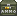

= Manual de Freedoom
// SPDX-License-Identifier: BSD-3-Clause
:toc:
:toc-title:

image::../graphics/titlepic/titlepic.png[Freedoom Title Image,align="center",width=380,pdfwidth=50vw]

Bienvenido a Freedoom, un juego completo que es software
https://www.gnu.org/philosophy/free-sw.html[libre]
y de https://opensource.org/osd/[código abierto].
Freedoom esta disponible bajo una <<licence,licencia BSD modificada>>, lo que significa
que cualquiera es libre de compartirlo, modificarlo y reutilizar partes de el.

Para más detalles, ver el sitio web en https://freedoom.github.io/.

Traducción: NecSau, DoomguyAlighieri, Alaux

== Instalar Freedoom

Freedoom esta distribuido en tres archivos llamados `freedoom1.wad`, `freedoom2.wad`
y `freedm.wad` los cuales contienen todo el contenido gráfico, niveles,
música y efectos de sonido que componen al juego.

Para jugar al juego, puedes usar una de las muchas adaptaciones ("source ports")
del programa original de Doom que los aficionados han desarrollado para los sistemas modernos.

https://doomwiki.org/wiki/Source_port[La página de source ports] de la
Wiki de Doom tiene una comprensiva lista. Como un punto inicial, puedes probar:

* https://zdoom.org[GZDoom], un source port moderno que incluye renderización
  por hardware y capacidad ampliada de modificación.
* https://www.chocolate-doom.org/wiki/index.php/Crispy_Doom[Crispy Doom],
  un source port más minimalista que retiente esa sensación de la “vieja
  escuela”.

La configuración depende del source port que uses, y lo mejor es referirse
a las instrucciones de tal source port.
Sin embargo, en general, puedes probar uno de los siguientes metodos:

* Coloca los archivos Freedoom .wad en el mismo folder que el source port
  antes de iniciarlo. Pueden ser automaticamente detectados.
* Al iniciar desde las líneas de comando, probar por ejemplo.
  `my-favorite-port -iwad freedoom1.wad`.

Freedoom esta dividido en _Freedoom: Phase 1_ (`freedoom1.wad`) y
_Freedoom: Phase 2_ (`freedoom2.wad`). Phase 1 esta dividido en cuatro
episodios separados de ocho niveles cada uno, mientras que Phase 2 es una
sola compaña de 30 niveles. Esto da 62 niveles por los cuales jugar, y
ademas existen también niveles secretos -- si puedes descubrir cómo llegar
a ellos.

FreeDM (`freedm.wad`) es un conjunto de niveles sin monstruos, creado
específicamente para jugador contra jugador. Para saber cómo alojar
una partida multijugador, consulta su source port.

<<<

[[menus]]
== Usar los Menús de Freedoom

El menú principal puede desplegarse a cualquier momento al
presionar la tecla _Esc_ en tú teclado.

image::images/menu-mainmenu.png[Menú principal de Freedoom,align="center",width=380,pdfwidth=50vw]

[cols="2,5",width="100%",align="center",valign="middle"]
|==========================
| <<newgame,**New game**>> | Comienza un Nuevo Juego, abandonando el juego en
curso (Si ya estas jugando).
| **Options** | Muestra el menú de opciones. La apariencia de este menú y las
opciones disponibles dependen del source port que eses usando.
| <<savegame,**Load Game**>> | Carga un juego guardado.
| <<savegame,**Save Game**>> | Guarda el juego en curso, para que puedas
continuar jugando después.
| **Read This!** | Despliega una pantalla de ayuda con los objetos
que puedes encontrar en el juego.
| **Quit Game** | Salir al Sistema operativo.
|==========================

[[newgame]]
=== Comenzar un nuevo juego

[**Atajo:** En la mayoría de los source ports, si pulsas repetidamente _Enter_ después
de que el programa se haya iniciado, empezarás una nueva juego en el nivel de dificultad
default (en el primer episodio si jugares Phase 1). No necesitas hacerlo rápidamente.]

Para empezar un nuevo juego, presiona _Esc_ para mostrar el menú principal, y
elije _New Game_.

Cuando inicies un nuevo juego, es posible que se te pida con que episodio
comenzar a jugar.

image::images/menu-episode.png[Freedoom Episode Menu,align="center",width=432,pdfwidth=50vw]

Si eres nuevo en el juego, empieza con _Outpost Outbreak_ en Phase 1, el primer episodio
(y el más fácil). No hay ningún requerimiento para jugar los episodios en orden.

[[skill]]
Después de elegir un episodio, necesitas elegir un nivel de dificultad. El
nivel de dificultad afecta múltiples factores en el juego, más convenientemente
el numero de monstruos con los que te encontraras.

image::images/menu-skill.png[Skill Selection Menu,align="center",width=473,pdfwidth=50vw]

[cols="1,5,13",width="90%",align="center",valign="middle"]
|==========================
| 1 | **Please Don’t +
Kill Me!** | El nivel de dificultad más sencillo. Este es
esencialmente igual a _Will This Hurt?_, excepto que el daño enemigo se reduce
a la mitad.
| 2 | **Will This Hurt?** | Nivel de dificultad fácil.
| 3 | **Bring On +
The Pain.** | El nivel de dificultad default.
| 4 | **Extreme Carnage.** | Nivel de dificultad difícil.
| 5 | **MAYHEM!** | **No Recomendado**. Esto es equivalente a _Extreme Carnage_
con la excepción de que los ataques de los monstruos son el doble de rápidos, y
los monstruos asesinados regresan a la vida tras aproximadamente 40 segundos.
|==========================

[[savegame]]
=== Cargar y guardar el juego

Es una Buena idea guardar el juego regularmente -- por ejemplo, al comienzo de
cada nuevo nivel. También podrías querer guardar el juego tras completar una
sección desafiante de un nivel para que no tengas que repetirlo de nuevo si
mueres.

image::images/menu-save-game.png[Save Game Menu,align="center",width=473,pdfwidth=50vw]

Para guardar el juego, presiona _Esc_ para mostrar el menú, selecciona _Save
Game_ y elije un espacio en el cual guardar.  Escribe una descripción fácil de
recordar para la partida guardada (p. ej., “E1M3 - Puerta de llave azul”) y
presione _Enter_. Si no hay espacios vacantes, puedes sobrescribir uno existente,
destruyendo los datos antiguos.

Para restaurar tu juego guardado, selecciona _Load Game_
desde el menú principal y escoge tu juego guardado.

Si te encuentras a ti mismo guardando el juego a menudo, tal vez quieras usar
la función de Guardado Rápido. Presiona _F6_ durante el juego para hacer un
guardado rápido. El menú para Guardar Juego aparecerá como es usual; elegir una
ranura hace que esta se convierta en tú espacio de guardado rápido. Presionar
_F6_ de nuevo en el futuro sobre-escribirá en tu espacio de guardado rápido
sin navegar por el menú.

Puedes restaurar tu espacio de guardado rápido con el menú o al presionar _F9_.

[**Advertencia:** el programa Doom original tiene un error que hace que
se bloquee cuando guardas una partida mientras están pasando demasiadas
cosas en el nivel. Chocolate Doom emula intencionadamente este
error. Es posible que desee ir a chocolate-setup y desactivar
"Vanilla savegame limit" antes de jugar.]

=== Salir del juego

Cuando hayas terminado de jugar Freedoom, presiona _Esc_ para mostrar el menú
principal y selecciona _Quit Game_ para salir. Puede que quieras seleccionar
_Save Game_ primero para guardar tú progreso para que puedas regresar a donde
lo dejaste la próxima vez que juegues.

=== Atajos del teclado

Los siguientes son algunos útiles atajos del teclado que pueden ahorrarte
tiempo para acceder a funciones comunes del menú.

[cols="2,6,16",width="90%",align="center",valign="middle"]
|==========================
| **Esc** | <<menus,Menu>> | Muestra el menú principal.
| **F1** | Help | Muestra la pantalla de ayuda que muestra información de los
objetos dentro del juego.
| **F2** | <<savegame,Save>> | Muestra el menú de _Guardar Juego_.
| **F3** | <<savegame,Load>> | Muestra el menú de _Cargar Juego_.
| **F4** | Volume | Muestra un menú para controlar los niveles de volumen.
| **F6** | <<savegame,Quicksave>> | Guarda el juego en tu ranura de _guardado
rápido_, lo que guarda tiempo si estas guardando tu progreso repetidamente
mientras juegas.
| **F7** | End Game | Termina el juego en curso y regresas a la pantalla de
titulo.
| **F8** | Messages | Alterna entre mostrar u ocultar en la pantalla los
mensajes mostrados cuando recolectas un objeto.
| **F9** | <<savegame,Quickload>> | Carga el juego de tu ranura de _juego rápido_.
| **F10** | Quit Game | Sales del juego y regresas al Sistema operativo.
| **F11** | Brightness | Modifica los niveles de brillo de la pantalla.
|==========================

<<<

== Como Jugar

image::images/map01-sshot.png[Captura de pantalla de Freedoom,width="640",pdfwidth="70vw",align="center"]

Freedoom es un juego en tiempo real de disparos en primera persona (FPS).
Estarás explorando una serie de niveles, en cada uno, tratando de encontrar un
camino hacia la salida. Una variedad de monstruos trataran de detenerte, y
necesitarás usar armas para defenderte. Algunas partes de los niveles pueden
ser inaccesibles hasta que encuentre una llave en particular, o encuentres un
interruptor para abrir un paso. Esto le da un elemento de
rompecabezas al juego que se añade a la acción.

Estos son los controles principales del juego para interactuar con el entorno:
[options="header",cols="1,1,1,1",width="100%",align="center",halign="center"]
|==========================
| Function | Primera control default | Segunda control default | Comúnmente configurado para
| Avanzar / Retroceder | Up/Down | Movimiento del mouse (o Mouse2 para avanzar) | W/S^1^
| Mover a la izquierda / derecha | ,/. | Alt (o Mouse3) + izquierda / derecha | A/D
| Girar a la izquierda / derecha^2^ | Izquierda / Derecha | Movimiento del mouse | Movimiento del mouse
| Disparo | Ctrl | Mouse1 | Mouse1
| Usar | Espaciadora | Doble clic Mouse2 o Mouse3 | E
| Correr^3^ | Mayúsculas | - | Mayúsculas
|==========================

^1^En un teclado QWERTY las teclas W, S, A y D forma un segundo juego
de teclas de dirección para la mano izquierda.

^2^Si tienes un monstruo, un barril o un oponente PvP cruzando el medio
de tu pantalla cuando tu arma se dispara, el juego ajustará tu puntería
vertical por ti. Algunos source ports te permitirán desactivar este
comportamiento y ajustar la puntería vertical manualmente.

^3^La mayoría de los source ports tienen una opción de "Correr siempre"
("Always Run"), en la que si mantienes pulsada esta tecla, irás más despacio.
El personaje del jugador no se cansa, así que la velocidad lenta
sólo es necesaria para aumentar la precisión.

**Los valores predeterminados de Doom se consideran en general subóptimos;**
consulta el source port para saber cómo reconfigurarlos. Se proporcionan 
as opciones más comunes, pero existe una solución "óptima" que funcione
para todo el mundo; es posible que deba experimentar.
Como mínimo, debes sentirte cómodo moviéndote en cualquiera de las cuatro
direcciones mientras giras y disparas simultáneamente.

=== Uno Tutorial

image::images/e1m1-tutorial-sshot.png[Captura de pantalla de Freedoom,width="640",pdfwidth="70vw",align="center"]

Este tutorial te presentará todas las acciones básicas que necesitas
para jugar y vencer a Freedoom.

Comienza un nuevo juego en la Phase 1, Episodio 1 en modo fácil y sigue los pasos.
Sáltate algo que te aburra o te confunda, y repite algo que te resulte difícil
tanto tiempo como quieras, antes de pasar a lo siguiente o de volver
a hacer algo anterior.

* Intenta moverte hacia delante, hacia atrás, a la izquierda y a la derecha.
  Intenta hacer un cuadrado. Intenta ambos direcciónes. Intenta hacer un ocho.
  (No salgas de la jaula todavía: hay monstruos fuera.)

* Gira en círculo para examinar tu entorno. Ve a tu propio ritmo, parando o
  invirtiendo para mirar cualquier cosa que quieras. Haz un segundo círculo,
  moviéndote un poco a medida que avanzas, y observa cómo eso cambia la
  perspectiva y cómo el movimiento lateral puede ayudarte a ver lo larga
  que es una pared o lo lejos que está un objeto.

* Vuelve al centro de la jaula. Gíra para apuntar con tu pistola directamente
  a una de las columnas del marco de la puerta.

* Muévete -sin girarte- para que tu pistola apunte a la otra columna.
  (Puntos extra si puedes detenerte de forma natural sobre el objetivo).

* Muévete un poco a la izquierda o a la derecha, luego gira para apuntar
  de nuevo a la columna. Vuelve a hacerlo, pero empieza a girar antes de
  que tu momento se desgasta. Vuelve a hacerlo unas cuantas veces,
  recorriendo las cuatro direcciones y girando cada vez más pronto hasta
  que estés apuntando y el movimiento sea de una pieza.
  (Retrocede o avanza para reajustarte si te acercas demasiado
  o chocas contra las paredes).

* Intenta hacer un cuadrado (o un ocho, etc.) mientras apuntas a la columna
  todo el tiempo. Prioriza la suavidad sobre la precisión: es mejor estar
  cerca la mayor parte del tiempo que ser perfecto algunas veces.

* Muévete a una de las esquinas con las camas encima para que la columna
  ya no esté en tu línea de visión. Entra y desaparece de la vista con
  la columna jugando "Cucú" con ella. Lío con la distancia y el tiempo.
  Intente permanecer apuntando a la columna incluso cuando no pueda verla.

* Juega un poco con lo anterior. Intente presionar la tecla Disparo para
  disparar a la columna, ya sea que esté quieta o en movimiento, y observe
  dónde y cuándo aparecen las bocanadas de bala.
  (Deja de disparar antes de que tu recuento de munición baje de 30
  aproximadamente; ¡las necesitarás para más adelante!)

* Toque la tecla 1 en el teclado para cambiar a su puño e intente
  golpear la columna y vea a qué distancia puede hacerlo.
  Toque la tecla 2 para volver a la pistola.

* Vea si aún puede hacer todo mientras presionando la tecla Correr.

* Baja a la trinchera y mata a un <<enemies,zombi>>. Trate de no ser golpeado.

* Una vez que estés a salvo, mira cerca del cuerpo del zombi para ver
  si puede haber dejado un <<ammo,cargador>>. Si es así, muévete sobre
   él para recogerlo.

* Vuelve por donde viniste. Sube al ascensor como si fueras con puño a
  golpearlo y luego presiona Usar para llamarlo. Súbete a él y te llevará
  de regreso. Recoge los elementos en el área superior para restaurar
  o mejorar tu salud.

* Explora el resto de la zona. Encontrarás dos puertas que se pueden
  abrir directamente, como el ascensor. El inferior te acercará a la
  salida, mientras que el superior te abrirá una ruta opcional,
  más difícil pero más gratificante. Una vez que hayas decidido qué
  camino tomar, abre la puerta y prepárate para empezar
  a jugar Cucú de las Pistolas nuevamente.

=== Barra de Estatus

En la zona inferior de la pantalla, podrás ver la barra de estatus, la cual
está dividida en las siguientes secciones:

image::images/status-bar.png[Freedoom Status Bar,width="640",pdfwidth="70vw",align="center"]

[cols="2,5",width="90%",align="center",valign="middle"]
|==========================
| **Ammo** | El número de unidades de <<ammo,munición>> restantes en el arma
actual.
| **Health** | Si llega a zero, ¡estas muerto! Mira la <<health,sección de
salud>> para ver potenciadores que puedes encontrar para recuperar tu salud.
| **Arms** | Cuales armas has encontrado hasta ahora. Revisa la
<<weapons,sección de armas>> para más información.
| **Freedoomguy** | Una rápida indicación visual de como se encuentra tu salud.
| **Armor** | Mientras más armadura tengas, menos sufrirá tu salud cuando seas
lastimado. Mira la <<armor,sección de armadura>> para más información.
| **Recuentos de munición** | Cuanto estas cargando de cada uno de los <<ammo,cuatro
tipos de munición>>, junto con el máximo que puedes cargar de cada una.
|==========================

[[items]]
=== Objetos

Dentro del juego encontrarás varios objetos coleccionables y potenciadores:
<<weapons,armas>>, <<ammo,munición>>, <<health,salud>>, <<armor,blindaje>>,
<<keys,llaves>> y algunos de los <<specialitems,potenciadores más
raros>> que te otorgan habilidades especiales.

Recoger algo es tan simple como solo caminar sobre el objeto — un mensaje
en tu pantalla y un breve parpadeo de la pantalla indicaran que lo has
hecho exitosamente. Si no lo recoges, es probable que no lo necesites en
este momento (por ejemplo, no puedes recoger un recambio de salud cuando
ya tienes 100% de salud). Si un artículo te da más de lo que puedes
llevar, se pierde la diferencia.

[[weapons]]
=== Armas

Empiezas un juego con tan solo una pistola, 50 balas y tus puños.
Explorar el nivel revelará más armas y municiones que puedes recoger y usar.

Presiona la tecla numerada en el teclado para cambiar al arma correspondiente
(si lo tiene). Con excepción de las armas cuerpo a cuerpo, cada
arma consume cierto tipo de munición, que puede encontrarse en algún lugar del nivel.

[options="header",cols="3,1,9",valign="middle",width="100%"]
|==========================
| Arma | Tecla | Descripción
| **Puño** | 1 | Si no tienes munición, siempre puedes recurrir a golpear a los
monstruos con tus manos desnudas. _Munición:_ Ninguna
| **Sierra de hender** +
image:../sprites/csawa0.png[Sierra de hender] |
1 | Diseñada para cortar a través del madera, pero la
sierra de hender funciona igual de bien como arma cuerpo a cuerpo para cortar
a través de la carne. +
_Munición:_ Ninguna
| **Pistola** +
image:../sprites/pista0.png[Pistola] |
2 | Tu arma inicial. Su objetivo principal es permitirte abrirte camino hacia
una mejor arma, y presionar interruptores disparables sin desperdiciar
una segunda bala. _Munición:_ Balas
| **Escopeta de bombeo** +
image:../sprites/shota0.png[Escopeta de bombeo] |
3 | Dispara siete perdigones en forma de abanico, lo que le permite golpear
múltiples objetivos o uno grande. _Munición:_ Perdigones
| **Escopeta de doble cañón** +
image:../sprites/sgn2a0.png[Escopeta de doble cañón] |
3 | Mayor tolerancia a cargas potentes significa mejor fragmentación
del proyectil, para casi un 50% más de impactos por cartucho a través de
una dispersión más amplia. Es buena a corto alcance contra grupos de
enemigos. _Munición:_ Perdigones
| **Minigun** +
image:../sprites/mguna0.png[Minigun] |
4 | Un uso mucho mejor para los balas que la pistola.
Hasta cuarenta segundos de traer el dolor para mantenerte a salvo. +
_Munición:_ Balas
| **Lanzamisiles** +
image:../sprites/launa0.png[Lanzamisiles] |
5 | Dispara misiles que tratan mucho daño en el impacto, y explotan para matar
pequeños monstruos cercanos. ¡Ten cuidado de no ser atrapado en la explosión!
_Munición:_ Misiles
| **Arma de energía polarica** +
image:../sprites/plasa0.png[Arma de energía polarica] |
6 | Produce un continuo flujo de proyectiles de
energía polarica. Los cuales son efectivos contra monstruos más fuertes. +
_Munición:_ Energía
| **SKAG 1337** +
image:../sprites/bfuga0.png[SKAG 1337] |
7 | Un arma experimental que lanza una bola orbe de energía polarica que
hace una gran cantidad de daño, y suelta una ráfaga secundaria de energía
en la misma dirección. Lenta para disparar, vale la pena esperar.
_Munición:_ Energía
|==========================

[[ammo]]
=== Munición
[options="header",cols="2,1,1",width="70%",align="center",valign="middle"]
|==========================
| Tipo de municion | Pequeño | Grande
| **Balas** |
image:../sprites/clipa0.png[Cargador de balas] |

| **Perdigones** |
image:../sprites/shela0.png[Perdigones] |

| **Misiles** |
image:../sprites/rocka0.png[Misile] |
image:../sprites/broka0.png[Cajón de misiles]
| **Energía** |
image:../sprites/cella0.png[Pequeña ecarga de energía] |
image:../sprites/celpa0.png[Gran ecarga de energía]
| **Mochila** |
- |
image:../sprites/bpaka0.png[Mochila]
|==========================

La mochila ofrece una recogida pequeña de cada tipo de munición.
Una que tengas uno, podrás llevar el doble de munición de lo normal,
durante el resto del juego.

[[health]]
=== Salud

Comienzas con 100% de salud. Mueres si tu salud llega a 0%.

Recoger cualquier objeto de salud te dará el número mostrado, hasta su límite.
Los recambios están limitados al 100%, pero los empujes (1% y 100%) están limitados al 200%.

[options="header",cols="1,1,1,1",width="70%",align="center",halign="center"]
|==========================
| 1% | 10% | 25% | 100%
| image:../sprites/bon1a0.png[Empuje de salud] |
image:../sprites/stima0.png[Recambio pequeño de salud] |
image:../sprites/media0.png[Recambio grande de salud] |
image:../sprites/soula0.png[Oleada ectoplásmica]
|==========================

[[armor]]
=== Blindaje

Comienzas con 0% de blindaje. Recoger una coraza o una armadura te llevará hasta
el número mostrado, mientras que cada pequeño empuje incrementa tu blindaje
hasta que alcanzas los 200%.

[options="header",cols="1,1,1",width="70%",align="center",halign="center"]
|==========================
| 1% | 100% | 200%
| image:../sprites/bon2a0.png[Empuje de blindaje] |
image:../sprites/arm1a0.png[Coraza de campo de fuerza] |
image:../sprites/arm2a0.png[Armadura sintonizada de campo de fuerza]
|==========================

El blindaje normal absorbe un tercio del daño que recibes.
La absorción se redondea: si tienes 100 de salud y 100 de blindaje y
te golpea por 50 puntos de daño, perderás 34 de salud y 16 de blindaje.

La armadura sintonizada tiene un comportamiento ligeramente diferente: en
adición de valer un 200 % de blindaje, también absorbe la mitad de todo el
daño. Como los empujes pequeños dan el mismo tipo de blindaje que ya tienes,
puede ser una buena idea para obtener inmediatamente una armadura sintonizada
si tu no tiene ya uno.

[[keys]]
=== Llaves

image:../sprites/bkeya0.png[Tarjeta de acceso azul] image:../sprites/bskua0.png[Llave muerta azul] +
image:../sprites/ykeya0.png[Tarjeta de acceso amarillo] image:../sprites/yskua0.png[Llave muerta amarillo] +
image:../sprites/rkeya0.png[Tarjeta de acceso rojo] image:../sprites/rskua0.png[Red Llave muerta rojo]

Llaves permiten abrir ciertas puertas bloqueadas y activar interruptores bloqueados.
Suelen ser imprescindibles para poder progresar, aunque en ocasiones permiten
acceder a atajos o zonas secretas.

=== Accesibilidad para daltónicos

Las llaves de Freedoom están diseñadas para distinguirse no sólo por su
color, sino también por su forma, para hacer el juego más accesible a los
jugadores daltónicos. Cada color de llave tiene una forma única asociada:

[cols="2,3",width="50%",align="center",valign="middle"]
|==========================
| **Key color** | **Shape**
| Azul | Cruz diagonal
| Amarillo | Líneas verticales
| Rojo | Líneas horizontales
|==========================

Estas formas se utilizan sistemáticamente en todo el juego: en los iconos
de la barra de estatus, en los sprites de las llaves y en las paredes que
indican las puertas con llave.

Para las llaves muertas, presta atención a la dirección a la que apuntan
los cuernos. Por ejemplo, así es como aparecen los distintos iconos de las
llaves en la barra de estatus:

image:images/key-icons.png[Key icons,align="center"]

[[specialitems]]
=== Objetos Especiales

También puedes encontrar cualquiera de estos objetos especiales mientras
exploras:

[cols="1,2",width="90%",align="center",valign="middle"]
|==========================
| **Gafas luminosas** +
image:../sprites/pvisa0.png[Gafas luminosas] |
Te permiten ver en la obscuridad por un tiempo limitado.
| **Mapa del área** +
image:../sprites/pmapa0.png[Mapa del área] |
Desbloquea todas las áreas del mapa, incluidas algunas áreas secretas que
pueden no ser inmediatamente visibles.
| **Ropa de protección** +
image:../sprites/suita0.png[Ropa de protección] |
Te protege de la radiación de los pisos dañinos, por un tiempo limitado.
| **Simbionte de fuerza** +
image:../sprites/pstra0.png[Simbionte de fuerza] |
Incrementa tu salud al 100% y mejora tus puños para que hagan 10 veces su daño
normal, hasta el final del nivel.
| **Invisibilizador** +
image:../sprites/pinsa0.png[Invisibilizador] |
Te hace casi invisible por tiempo limitado.
| **Oleada negentropica** +
image:../sprites/megaa0.png[Oleada negentropica] |
Maximiza tu salud y armadura hasta el 200%.
| **Artefacto de vanguardia** +
image:../sprites/pinva0.png[Artefacto de vanguardia] |
Te hace inmune a todo el daño por tiempo limitado.
|==========================

<<<

[[enemies]]
=== Enemigos

Los niveles están llenos de monstruos que no tienen otro objetivo más que
impedir que completes tu misión. Aquí hay una selección de
monstruos con los que puedes encontrarte.

[frame="none",cols="5,2",valign="middle",grid="none",align="center",width="100%"]
|==========================
| **Zombi** +
Estas obradores de iniquidad con muerte cerebral están armadas con una pistola y tienen
la intención de destruirte. Sueltan un cargador de balas cuando muere. |
image:images/monster-zombie.png[Zombi,100,100,width=100%]
| **Escopeta zombi** +
Estos muchachos cambiaron su pistola por una escopeta y tienen mucho más
impacto. Sueltan una escopeta cuando mueren. |
image:images/monster-shotgun-zombie.png[Escopeta zombi,100,100,width=100%]
| **Minigun zombi** +
Tan pronto como estés a la vista de uno de estos, activaran su ametralladora y
seguirá disparando hasta que estés muerto. Lo mejor es ponerse a cubierto
rápidamente o eliminarlo. Sueltan una ametralladora cuando mueren. |
image:images/monster-minigun-zombie.png[Minigun zombi,100,100,width=100%]
| **Serpentipede** +
Soldados rasos de la invasión alienígena. Deja que se acerquen y te harán trizas;
a distancia, en cambio, lloverán bolas de fuego. |
image:images/monster-serpentipede.png[Serpentipede,100,100,width=100%]
| **Gusano de carne** +
Resistentes y rápidos, estos atacan a corta distancia y necesitan
varios disparos de escopeta para derribarlos. Lo mejor es quedarse atrás. |
image:images/monster-flesh-worm.png[Gusano de carne,100,100,width=100%]
| **Gusano de sigilo** +
A estas variantes de los gusanos de carne se les han dado habilidades de sigilo
que las hacen prácticamente invisibles. |
image:images/monster-stealth-worm.png[Gusano de sigilo,100,100,width=100%]
| **Cría** +
Larvas alienígenas flotantes que cargan desde la distancia. |
image:images/monster-hatchling.png[Cría,100,100,width=100%]
| **Matribite** +
¿Qué madre arroja a sus hijos desde su nacimiento a las crueles fauces de la guerra?
En su imperio nunca se pone el sol. |
image:images/monster-matribite.png[Matribite,100,100,width=100%]
| **Trilobite** +
Estas cosas voladoras con forma de orbe escupen bolas de plasma y muerden si
te acercas demasiado. |
image:images/monster-trilobite.png[Trilobite,100,100,width=100%]
| **Portador de dolor** +
Estos tipos necesitan al menos tres disparos de misiles para
derribarlos y, mientras lo intentas, te bañarán con proyectiles de energía. |
image:images/monster-pain-bringer.png[Portador de dolor,100,100,width=100%]
| **Señor de dolor** +
Por si el portador de dolor no fuera lo suficientemente duro, este puede resistir
cinco disparos de misiles. |
image:images/monster-pain-lord.png[Señor de dolor,100,100,width=100%]
| **Octaminator** +
Rápidos, resistentes y disparan misiles autoguiados. No te metas en un
combate de boxeo con uno de estos tipos. |
image:images/monster-octaminator.png[Octaminator,100,100,width=100%]
| **Nigromante** +
Si no te está prendiendo fuego, está deshaciendo todo tu arduo trabajo al traer
a sus amigos de entre los muertos. |
image:images/monster-necromancer.png[Necromancer,100,100,width=100%]
| **Babosa de batalla** +
Estos tanques vivientes y deslizantes diseñados genéticamente han sido
equipados con lanzallamas de larga distancia. |
image:images/monster-combat-slug.png[Babosa de batalla,100,100,width=100%]
| **Tecnaraña** +
Estas criaturas cibernéticas han sido equipadas con ametralladoras de energía
polarica. |
image:images/monster-technospider.png[Tecnaraña,100,100,width=100%]
| **Tecnaraña grande** +
Este tanque con patas está equipado con una ametralladora de fuego rápido y
requerirá mucho esfuerzo para derribarlo.
Inmune a las explosiones de misiles y barriles. |
image:images/monster-large-technospider.png[Tecnaraña grande,100,100,width=100%]
| **Trípode de asalto** +
La combinación definitiva de tecnología militar e ingeniería genética, estas
criaturas de tres patas se mueven rápidamente, están fuertemente blindadas y
equipadas con un lanzamisiles que querrás evitar.
Inmune a las explosiones de misiles y barriles. |
image:images/monster-assault-tripod.png[Trípode de asalto,100,100,width=100%]
|==========================

=== Usando el mapa

Al explorar los niveles de Freedoom, a veces es posible perderse, especialmente
si el nivel es particularmente grande o complejo. Afortunadamente, el mapa está
disponible para ayudarlo a encontrar su camino. Presiona la tecla _Tab_ durante
el juego para que aparezca el mapa.

image::images/map.png[Map Screenshot,width="640",pdfwidth="70vw",align="center"]

Tu posición y orientación actuales se muestran con una flecha blanca. Las áreas
del mapa generalmente están codificadas por colores de la siguiente manera:

[frame="none",cols="3,8",valign="middle",align="center",width="70%"]
|==========================
| **Rojo** | Paredes (o posibles puertas secretas)
| **Amarillo** | Cambios en la altura del techo, incluidas las puertas.
| **Café** | Cambios en la altura del suelo (ej. escalones)
| **Gris** | Áreas sin descubrir (normalmente no se muestran, pero pueden
revelarse si se descubre el <<specialitems,Mapa de Inspección Táctica>>).
|==========================

Mientras usas el mapa, el juego continúa con normalidad. Los controles continúan 
funcionando como de costumbre, pero las siguientes teclas adicionales están disponibles:

[frame="none",cols="1,4",valign="middle",align="center",width="80%"]
|==========================
| **Tab** | Mostrar mapa.
| **-** | Menos zoom.
| **+** | Más zoom.
| **0** | Aleja el zoom al máximo.
| **F** | Cambia si el mapa sigue al jugador. Cuando está deshabilitado, las
teclas del cursor se pueden usar para desplazar la vista del mapa
independientemente de tu posición actual.
| **G** | Muestra la cuadricula del mapa.
| **M** | Agrega un marcador al mapa sobre tu ubicación actual.
| **C** | Elimina todos los marcadores.
|==========================

=== Peligros Ambientales

Por si los monstruos no fueran suficientes, el ambiente mismo posee peligros
que pueden lastimarte, ¡o incluso matarte!

[frame="none",cols="3,7,3",valign="middle",grid="none",width="100%"]
|==========================
| **Barriles** |
Estos barriles explosivos ensucian muchos de los niveles. Varios disparos con
una pistola suelen ser suficientes para hacerlos detonar, dañando cualquier
cosa en sus proximidades. ¡Asegúrate de no pararte demasiado cerca cuando estés
en combate, o un disparo perdido de un enemigo puede hacer que uno explote en
tu cara! Ten en cuenta también el potencial de reacción en cadena cuando se
agrupan varios barriles. |
image:images/hazard-barrels.png[Barrels,150,150,width=100%]
| **Suelos Dañinos** |
La lava al rojo vivo y el lodo radiactivo son solo dos de los tipos de suelo
dañino que puedes encontrar en los niveles de Freedoom. Si es necesario caminar
sobre el, intenta encontrar un <<specialitems,traje de protección>>, pero ten
en cuenta que solo te protegerá por un tiempo limitado. |
image:images/hazard-slime.png[Radioactive slime,150,150,width=100%]
| **Techos Aplastantes** |
Muchos de los niveles han sido manipulados con trampas y esta es solo una de
ellas. Estos techos móviles a menudo se colocan sobre elementos de aspecto
tentador. Ten mucho cuidado de no quedar atrapado debajo de uno, ¡o te
aplastará rápidamente hasta convertirte en una pasta! |
image:images/hazard-crusher.png[Crushing Ceiling,150,150,width=100%]
|==========================

=== Muriendo

Con el tiempo, te encontrarás en una situación que no podrás manejar y
tu avatar de jugador morirá. Puedes tomar esto como una señal para tomar
un descanso del juego, o recargar tu último juego guardado, o presionar
Usar para reiniciar el nivel con plena salud pero sin equipo excepto tu
pistola y 50 balas. (Algunos source ports no hacen esto último, sino
que guardan el juego al comienzo de cada nivel, en cuyo caso al presionar
_Usar_ se carga ese juego).

No hay límite de vidas.

En el modo multijugador, presionar Usar restablecerá tu salud y tu
inventario y te colocará en la posición inicial, pero el juego continúa
normalmente. Es posible recoger munición y morir sin usarla tantas veces
que su equipo se ve obligado a terminar el mapa usando sólo pistolas,
muriendo para poder recargar.

=== Consejos Tácticos

Si tienes problemas con la dificultad del juego, puede que valga la pena
considerar algunas de estas sugerencias:

* Dedica algo de tiempo a configurar tus controles -- ambos asignación
  de botones/teclas y sensibilidad de giro del mouse/joystick. Ninguna
  configuración es mejor para todos y es una buena idea experimentar:
  cualquiera que te ayude a esquivar proyectiles y entrar y salir de la
  cubierto mientras mantienes tu arma apuntando al enemigo, y proporciona
  la menor distracción mientras te mueves por el mapa buscando. cosas, es bueno.

* Juega con auriculares. La separación estéreo del juego puede brindar pistas
  de audio útiles sobre las posiciones de los enemigos y alertarte sobre los
  proyectiles que se aproximan. Los auriculares te brindan una forma más
  precisa de captar estas señales.

* ¡No aplastes los botones! Casi todas las armas tienen un ligero período de
  recuperación cuando sueltas la tecla Disparo, lo que te cuesta tiempo y
  le da a tu objetivo más oportunidades de devolver el fuego. Mantener
  presionado Disparo te permitirá disparar cualquier arma continuamente
  hasta que se te acabe la munición o la sueltes.

* ¡Ponte a cubierto! Los monstruos solo atacan cuando estás en su línea de
  visión. Querrás encontrar paredes, pilares y otras formas de cubierto tras
  las que puedas esconderte mientras recargas tu arma. Este consejo es
  particularmente importante cuando te enfrentas a ciertos monstruos que pueden
  "fijarte" (minigun zombi, nigromante); esconderse de estos es una habilidad
  crucial. Los monstruos con armas de fuego no son ni mejores ni peores a la
  hora de golpearte, ya sea que estés en movimiento o parado, por lo que no
  puedes esquivar continuamente en campo abierto como lo haces contra
  proyectiles que se mueven visiblemente.

* Muchos de los niveles están llenos de barriles que explotan. Si bien estos
  pueden representar un peligro para ti, son igualmente peligrosos para tus
  oponentes. Un solo disparo de escopeta en el momento oportuno dirigido a un
  barril puede derribar a varios enemigos a la vez. La explosión de un barril
  puede desencadenar otro, por lo que a veces puedes desencadenar una reacción
  en cadena que derriba a toda una multitud. ¡Ten cuidado de que no te
  incluya a ti!

* Si un monstruo es herido por otro monstruo, tomará represalias contra el que
  lo hirió (a esto se llama _lucha interna de monstruos_). Si te enfrentas a una
  multitud de enemigos, una estrategia efectiva puede ser pararte en el lugar
  correcto para que los de atrás disparen a los de adelante. Hazlo bien y
  pasarán más tiempo peleando entre ellos que peleando contigo, y los
  sobrevivientes se debilitarán significativamente. Sin embargo, ten en cuenta
  que un monstruo no puede ser herido por un proyectil visible lanzado por otro
  de la misma especie.

* A veces te enfrentarás a multitudes de monstruos, lo que puede resultar
  abrumador y agotar tus reservas de munición. Aprende a dominar el control de
  multitudes. El instinto primario de todos los monstruos es moverse hacia ti.
  Circule alrededor de la multitud continuamente -- esto los alienta a agruparse
  en un solo lugar que es más fácil para ti. También fomenta las luchas
  internas entre monstruos; si se hace de manera efectiva, gastarán su energía
  matándose unos a otros y ahorrarás en municiones.

* Si te encuentras con una horda de gusanos de carne o gusanos sigilosos, la
  sierra de hender es una gran arma para conservar munición y evitar daños.
  Los gusanos no pueden atacar mientras están siendo aserrados, y si retrocedes
  hacia cualquier esquina que sea aproximadamente tan ancha o más estrecha que
  un ángulo recto, solo pueden atacarte uno a la vez.

<<<

[[wads]]
== Jugar fan-made WADs y mods

.Scythe MAP09 jugándose con Freedoom.
image::images/scythe-map09.png[Scythe MAP09,width="640",pdfwidth="70vw",align="center"]

Una de las mejores características de Freedoom es su compatibilidad con el
catálogo de miles de niveles creados por fanáticos para los juegos clásicos de
_Doom_. Con algunas excepciones, las modificaciones y los niveles más populares
de _Doom_ y _Doom II_ también se pueden jugar con Freedoom. El repositorio más
grande de mods de _Doom_ es el archivo idgames, y una interfaz de navegación para
el archivo https://www.doomworld.com/idgames/[puede encontrarse en Doomworld].

Jugar un archivo `.wad` usualmente es bastante simple. Para mods diseñados para
el original _Doom_, usa Freedoom: Phase 1 (`freedoom1.wad`); para otras
diseñadas para _Doom 2_ or _Final Doom_, usa Freedoom: Phase 2
(`freedoom2.wad`). Si estas usando una linea de comandos, usa el parámetro
`-file` cuando empieces el juego. Por ejemplo, para cargar el archivo
`scythe.wad`:

  my-favorite-port -iwad freedoom2.wad -file scythe.wad

Si no estas usando lineas de comando, puedes intentar arrastrar y soltar el
archive `.wad` en el icono del source port en tu administrador de
archivos -- múltiples source ports poseen esta función.

=== Sugerencias

Durante más de dos décadas, se han creado literalmente miles de niveles de
_Doom_, y hay tantos que puede parecer difícil saber por dónde empezar. Las
siguientes son algunas sugerencias sobre dónde buscar el mejor contenido:

* https://www.doomworld.com/10years/bestwads/[El Top 100 WADs de Todos los
  Tiempos] de Doomworld fue escrito en 2003 y tenía como objetivo enumerar los
  mejores trabajos de los primeros 10 años de mods creados por fans. Sigue
  siendo una gran lista de mods clásicos.

* https://www.doomworld.com/cacowards/[Los Cacowards] son la ceremonia anual de
  Doomworld que reconoce los mejores lanzamientos de la comunidad _Doom_ durante
  el último año. Esta es una excelente manera de conocer los desarrollos más
  recientes, incluidos algunas de los mods más inusuales que la gente está
  lanzando.

* https://doomwiki.org/wiki/List_of_notable_WADs[La Lista de WADs notables] de
  la Doom Wiki contiene una lista bastante extensa de WADs creadas por fans. La
  wiki de Doom incluye amplia información sobre dichos mods, incluidas capturas
  de pantalla, mapas y estadísticas por nivel, por lo que es un punto de
  entrada útil para descubrir mods interesantes.

* La interfaz de archivos de idgames de Doomworld incluye la habilidad de
  listar https://www.doomworld.com/idgames/index.php?top[los niveles top
  basado] en una calificación de 5 estrellas por los visitantes del sitio.

<<<

== Trucos

Si no puedes pasar de cierto punto, o si quieres experimentar con
la mecánica del juego, hay algo chetos a los que puedes recurrir.
(Introdúcelos durante el juego, no abras la consola.)

[cols="2,6",width="100%",align="center",valign="middle"]
|==========================
| **IDDQD** | Modo Dios. Te hace invulnerable a todo el daño.
| **IDFA** | Te da todas las armas y munición.
| **IDKFA** | Te da todas las armas, munición y llaves.
| **IDCLIP** | Modo noclip, lo que te permite caminar a traves de las
paredes.
| **IDDT** | Revela el mapa completo; escribelo dos veces para revelar todos
los enemigos y objetos.
| **IDCLEVxy** | Empieza un nuevo juego (que reinicia todo) en ExMy (Phase 1) o MAPxy (Phase 2).
| **IDMUSxy** | Cambia la música por la de ExMy (Phase 1) o MAPxy (Phase 2).
| **IDCHOPPERS** | Te da una sierra de hender.
| **IDBEHOLDV** | Te da el artefacto de **v**anguardia.
| **IDBEHOLDS** | Te da una **s**imbionte de fuerza.
| **IDBEHOLDI** | Te da el **i**nvisibilizador.
| **IDBEHOLDR** | Te da **r**opa de protección.
| **IDBEHOLDM** | Te da un mapa del **á**rea.
| **IDBEHOLDL** | Te da gafas **l**uminosas.
|==========================

<<<

== Freedoom es sobre libertad ==

Cuando la gente oye hablar de Freedoom, suelen asumir que el nombre se refiere
al precio -- que el proyecto solamente apunta a ser una alternativa a Doom que
puede obtenerse gratuitamente. Pero no es así.

La palabra "free" tiene dos significados diferentes en inglés. Decimos "free"
para decir que algo no tiene costo (es "gratis"), pero también para referirnos
a la libertad (es "libre") -- como "libre expresión". Freedoom es sobre esto
último. Eso puede ser confuso. ¿Qué significa?

Imagina un mundo en el cual los artistas solamente pueden comprar cuadros de
una única compañia. Un monopolio como ese significaría que las pinturas
probablemente serían más caras, pero el precio no sería la mayor inquietud.
El gran problema sería el poder que otorgaría a esa compañia. La libertad de
expresión de esos artistas dependería de la compañia que les provee sus
pinturas.

Por más de 30 años, la comunidad de modding de Doom ha producido miles y miles
de niveles, mods e incluso juegos completamente nuevos hechos en base a los
juegos de Doom originales. Estos son obras de artes y deberían ser reconocidos
como tales.
https://www.youtube.com/watch?v=KxYND6K6u8w[Doom es una escena artística].
La materia prima de estas obras de arte no es pintura ni tinta, sino el juego
original -- modificado, reutilizado y reversionado sin cesar para dar nuevas
variaciones.

Históricamente, los autores de Doom, id Software, han sido muy generosos con
la comunidad de Doom. Desde el lanzamiento del juego se lanzaron a compartir
detalles técnicos con los fans, y posteriormente lanzaron el código fuente de
Doom bajo una licencia de software libre -- algo desconocido en la industria
de juegos de la época y que debería ser elogiado. Pero a pesar de esta
generosidad, siempre mantuvieron una posición de poder. Hoy en día, en lugar
de ser un pequeño estudio independiente, ellos y la franquicia de Doom son
propiedad de una gran corporación multinacional.

Todos merecen poder experimentar la maravilla que es Doom y formar parte de su
vibrante comunidad de modding que ha perdurado por tantos años. Pero esa
comunidad también merece su libertad e independencia. Al ofrecer una
alternativa libre y gratuita que cualquiera puede jugar, compartir, modificar
y reutilizar, esperamos que eso sea algo que Freedoom pueda otorgar.

== Contribuir a Freedoom

Freedoom es un proyecto de
https://www.gnu.org/philosophy/free-sw.es.html[contenido libre] al que
contribuyen muchos usuarios de todo el mundo. Está disponible tanto como sin
costo (gratis) y en derechos de modificación y redistribución (libre como en
libertad de expresión) para los usuarios finales, siempre que la licencia de
software original esté incluida y/o sea visible para los usuarios del software
modificado o versiones redistribuidas.

Si te gustaría contribuir al proyecto Freedoom, por favor revisa:

* la página del proyecto: +
https://github.com/freedoom/freedoom

* los foros de discusión: +
https://www.doomworld.com/forum/17-freedoom/

* el chat de Discord: https://discord.gg/9DA3fut

Para más información sobre cómo enviar una adición, consulte las páginas sobre cómo utilizar GitHub:

* Cómo usar el control de versiones de Git para contribuciones: +
https://help.github.com/es/github

* Cómo bifurcar un proyecto y crear una solicitud de extracción con Git (Revisar): +
https://guides.github.com/activities/forking/

[[reusing]]
== Reusar porciones Freedoom

Dado que https://freedoom.github.io/about.html[Freedoom es libre], algunos
otros proyectos han utilizado los materiales de Freedoom. Creemos que este es
un gran uso del proyecto y debe fomentarse. Si tu usas partes de Freedoom en tu
proyecto, puedes informarnos presentando una solicitud a
la página web del proyecto Freedoom en https://github.com/freedoom/freedoom.github.io.

[[licence]]
=== Licencia BSD modificada (inglés)

Copyright © 2001-2024
Contributors to the Freedoom project.  All rights reserved.

Redistribution and use in source and binary forms, with or without
modification, are permitted provided that the following conditions are
met:

  * Redistributions of source code must retain the above copyright
    notice, this list of conditions and the following disclaimer.
  * Redistributions in binary form must reproduce the above copyright
    notice, this list of conditions and the following disclaimer in the
    documentation and/or other materials provided with the distribution.
  * Neither the name of the Freedoom project nor the names of its
    contributors may be used to endorse or promote products derived from
    this software without specific prior written permission.

THIS SOFTWARE IS PROVIDED BY THE COPYRIGHT HOLDERS AND CONTRIBUTORS “AS
IS” AND ANY EXPRESS OR IMPLIED WARRANTIES, INCLUDING, BUT NOT LIMITED
TO, THE IMPLIED WARRANTIES OF MERCHANTABILITY AND FITNESS FOR A
PARTICULAR PURPOSE ARE DISCLAIMED. IN NO EVENT SHALL THE COPYRIGHT OWNER
OR CONTRIBUTORS BE LIABLE FOR ANY DIRECT, INDIRECT, INCIDENTAL, SPECIAL,
EXEMPLARY, OR CONSEQUENTIAL DAMAGES (INCLUDING, BUT NOT LIMITED TO,
PROCUREMENT OF SUBSTITUTE GOODS OR SERVICES; LOSS OF USE, DATA, OR
PROFITS; OR BUSINESS INTERRUPTION) HOWEVER CAUSED AND ON ANY THEORY OF
LIABILITY, WHETHER IN CONTRACT, STRICT LIABILITY, OR TORT (INCLUDING
NEGLIGENCE OR OTHERWISE) ARISING IN ANY WAY OUT OF THE USE OF THIS
SOFTWARE, EVEN IF ADVISED OF THE POSSIBILITY OF SUCH DAMAGE.

For a list of contributors to the Freedoom project, see the file
CREDITS.
