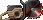
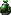
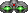

= Freedoom Manual
// SPDX-License-Identifier: BSD-3-Clause

Bienvenido a Freedoom, un juego completo que es software libre y de código
abierto. Freedoom esta disponible bajo una licencia BSD modificada, lo que
significa que cualquiera es libre de compartirlo, modificarlo y reutilizar
partes de el.

Para más detalles, ver la <<reusing,sección de reuso>>.

Traducción: NecSau, DoomguyAlighieri

image::../graphics/titlepic/titlepic.png[Freedoom Title Image,align="center",width=380,pdfwidth=50vw]

== Instalar Freedoom

Freedoom esta distribuido en dos archivos llamados `freedoom1.wad` y
`freedoom2.wad` los cuales contienen todo el contenido gráfico, niveles,
música y efectos de sonido que componen al juego. Para ser jugado se
necesita ser emparejado con un source port. Fans de los juegos de Doom
originales han creado un puñado de estos;
https://doomwiki.org/wiki/Source_port[La página de source ports] de la
Wiki de Doom tiene una comprensiva lista. Las siguientes son algunas buenas
sugerencias estandart:

* https://zdoom.org[GZDoom] es un source port moderno que incluye varias
  funciones tales como renderización por hardware
* https://www.chocolate-doom.org/wiki/index.php/Crispy_Doom[Crispy Doom] es
  un source port más minimalista que retiente esa sensación de la “vieja
  escuela”.

La configuración depende del source port que uses, y lo mejor es referirse
a las instrucciones de tal source port.
Sin embargo, en general, puedes probar uno de los siguientes metodos:

* Coloca los archivos Freedoom .wad en el mismo folder que el source port
  antes de iniciarlo. Pueden ser automaticamente detectados.
* Al iniciar desde las líneas de comando, probar por ejemplo.
  `my-favorite-port -iwad freedoom1.wad`.

Freedoom esta dividido en _Freedoom: Phase 1_ (`freedoom1.wad`) y
_Freedoom: Phase 2_ (`freedoom2.wad`). Phase 1 esta dividido en cuatro
episodios separados de ocho niveles cada uno, mientras que Phase 2 es una
sola compaña de 30 niveles. Esto da 62 niveles por los cuales jugar, y
ademas existen también niveles secretos -- si puedes descubrir cómo llegar
a ellos.

<<<

[[menus]]
== Usar los Menús de Freedoom

Los menús de Freedoom son bastante auto-explicativos, pero aquí hay unas
breves instrucciones. El menú principal puede desplegarse a cualquier
momento al presionar la Tecla _Esc_ en tú teclado.

image::images/menu-mainmenu.png[Freedoom Main Menu,align="center",width=380,pdfwidth=50vw]

[cols="1,4",width="90%",align="center",valign="middle"]
|==========================
| <<newgame,**New game**>> | Comienza un Nuevo Juego, abandonando el juego en
curso (Si ya estas jugando).
| **Options** | Muestra el menú de opciones. La apariencia de este menú y las
opciones disponibles dependen del source port que eses usando.
| <<savegame,**Load Game**>> | Carga un juego guardado.
| <<savegame,**Save Game**>> | Guarda el juego en curso, para que puedas
continuar jugando después.
| **Read This!** | Despliega una pantalla de ayuda que muestra una descripción
de los objetos que puedes encontrar en el juego.
| **Quit Game** | Termina el juego y regresa al Sistema operativo.
|==========================

[[newgame]]
=== Comenzar un nuevo juego

Para empezar un nuevo juego, presiona _Esc_ para mostrar el menú principal, y
elije _New Game_.

Cuando inicies un nuevo juego, es posible que se te pida con que episodio
comenzar a jugar.

image::images/menu-episode.png[Freedoom Episode Menu,align="center",width=432,pdfwidth=50vw]

Si eres nuevo en el juego, empieza con Outpost Outbreak, el primer episodio (y
el más fácil). Una vez que termines un episodio, puedes pasar al siguiente. Si
estas aburrido del episodio que estas jugando o atascado, siempre puedes
intentar jugar un episodio diferente en su lugar. No hay ningún requerimiento
para jugar los episodios en orden.

[[skill]]
Después de elegir un episodio, necesitas elegir un nivel de dificultad. El
nivel de dificultad afecta múltiples factores en el juego, más convenientemente
el numero de monstruos con los que te encontraras.

image::images/menu-skill.png[Skill Selection Menu,align="center",width=473,pdfwidth=50vw]

[cols="1,3,8",width="90%",align="center",valign="middle"]
|==========================
| 1 | **Please Don’t Kill Me!** | El nivel de dificultad más sencillo. Este es
esencialmente igual a _Will This Hurt?_, excepto que el daño enemigo se reduce
a la mitad.
| 2 | **Will This Hurt?** | Nivel de dificultad fácil, una buena elección si
encuentras _Bring on the Pain_ demasiado desafiante.
| 3 | **Bring on the Pain.** | El nivel de dificultad default.
| 4 | **Extreme Carnage.** | Un nivel de dificultad más desafiante, recomendado
para jugadores experimentados y personas que estén en busca de un desafío.
| 5 | **MAYHEM!** | **No Recomendado**. Esto es equivalente a _Extreme Carnage_
con la excepción de que los ataques de los monstruos son el doble de rápidos, y
los monstruos asesinados regresan a la vida tras aproximadamente 40 segundos.
|==========================

[[savegame]]
=== Cargar y guardar el juego

Es una Buena idea guardar el juego regularmente -- por ejemplo, al comienzo de
cada nuevo nivel. También podrías querer guardar el juego tras completar una
sección desafiante de un nivel para que no tengas que repetirlo de nuevo si
mueres.

image::images/menu-save-game.png[Save Game Menu,align="center",width=473,pdfwidth=50vw]

Para guardar el juego, presiona _Esc_ para mostrar el menú, selecciona _Save
Game_ y elije un espacio en el cual guardar. Teclea una descripción para el
juego guardado y presiona _Enter_. Algunos source ports tienen un número
limitado de espacios, en tal caso tendrás que sobrescribir un juego guardado ya
existente una vez que ya no haya más espacios de guardado disponibles. Por la
misma razón es una buena idea escribir una buena descripción para tu juego
guardado. Incluir el número del nivel y algo descriptivo de hasta donde has
llegado; por ejemplo: “E1M3 - Blue Key Door.”

El menú de _Load Game_ usualmente luce prácticamente idéntico al menú de _Save
Game_. Para restaurar tu juego guardado, simplemente selecciona _Load Game_
desde el menú principal y escoge tu juego guardado.

Si te encuentras a ti mismo guardando el juego a menudo, tal vez quieras usar
la función de Guardado Rápido. Presiona _F6_ durante el juego para hacer un
guardado rápido. El menú para Guardar Juego aparecerá como es usual; elegir una
ranura hace que esta se convierta en tú espacio de guardado rápido. Presionar
_F6_ de nuevo en el futuro sobre-escribirá en tu espacio de guardado rápido con
tan solo presionar un par de teclas. Si mueres también puedes restaurar tu
espacio de guardado rápido al presionar _F9_.

=== Salir del juego

Cuando hayas terminado de jugar Freedoom, presiona _Esc_ para mostrar el menú
principal y selecciona _Quit Game_ para salir. Puede que quieras seleccionar
_Save Game_ primero para guardar tú progreso para que puedas regresar a donde
lo dejaste la próxima vez que juegues.

=== Atajos del teclado

Los siguientes son algunos útiles atajos del teclado que pueden ahorrarte
tiempo para acceder a funciones comunes del menú.

[cols="1,3,7",width="90%",align="center",valign="middle"]
|==========================
| **Esc** | <<menus,Menu>> | Muestra el menú principal.
| **F1** | Help | Muestra la pantalla de ayuda que muestra información de los
objetos dentro del juego.
| **F2** | <<savegame,Save>> | Muestra el menú de _Guardar Juego_.
| **F3** | <<savegame,Load>> | Muestra el menú de _Cargar Juego_.
| **F4** | Volume | Muestra un menú para controlar los niveles de volumen.
| **F6** | <<savegame,Quicksave>> | Guarda el juego en tu ranura de _guardado
rápido_, lo que guarda tiempo si estas guardando tu progreso repetidamente
mientras juegas.
| **F7** | End Game | Termina el juego en curso y regresas a la pantalla de
titulo.
| **F8** | Messages | Alterna entre mostrar u ocultar en la pantalla los
mensajes mostrados cuando recolectas un objeto.
| **F9** | <<savegame,Quickload>> | Carga el juego de tu ranura de _juego rápido_.
| **F10** | Quit Game | Sales del juego y regresas al Sistema operativo.
| **F11** | Brightness | Modifica los niveles de brillo de la pantalla.
|==========================

<<<

== Como Jugar

image::images/c5m1-sshot.png[Freedoom Screenshot,width="640",pdfwidth="70vw",align="center"]

Freedoom es un juego en tiempo real de disparos en primera persona (FPS).
Estarás explorando una serie de niveles, en cada uno, tratando de encontrar un
camino hacia la salida. Una variedad de monstruos trataran de detenerte, y
necesitarás usar armas para defenderte. Algunas partes de los niveles pueden
ser inaccesibles hasta que encuentre una llave en particular, o encuentres un
interruptor para abrir una puerta bloqueada. Esto le da un elemento de
rompecabezas al juego que se añade a la acción.

Por default, las teclas del cursor del teclado te moverán hacia adelante y
hacia atrás, y te harán girar a la izquierda y a la derecha. La tecla _Control_
dispara el arma en uso, y la barra espaciadora abre puertas y activa
interruptores. Todos los source ports te permitirán modificar estas teclas a
una configuración que te resulte más cómoda. También querrás considerar el uso
de las teclas de strafe (paso lateral) y correr para para controlar mejor tu
movimiento.

Si no has jugado Freedoom antes, tomate unos minutos cuando comience el juego
para familiarizarte con los controles, y reconfigura los controles a medida que
lo encuentres más cómodo jugar. Practica moverte y disparar el arma. Puede que
encuentres algunos monstruos de nivel bajo, pero aquellos que se encuentran en
el primer nivel no presentan un gran desafío y son una buena oportunidad para
practicar el cómo disparar.

Dentro del juego encontrarás varios objetos coleccionables y potenciadores.
Estos típicamente te darán más <<ammo,munición>> para tus armas, más
<<health,salud>> o más <<armor,armadura>>. También puedes encontrar
<<weapons,nuevas armas>> y algunos de los <<specialitems,potenciadores más
raros>> que te otorgan habilidades especiales. Recoger algo es tan simple
como solo caminar sobre el objeto — un mensaje en tu pantalla y un breve
parpadeo de la pantalla indicaran que lo has hecho exitosamente. Si no lo
recoges, es probable que no lo necesites en este momento (por ejemplo, no
puedes recoger un paquete de salud cuando ya tienes 100% de salud).

=== Barra de Estatus

En la zona inferior de la pantalla, podrás ver la barra de estatus, la cual
está dividida en las siguientes secciones:

image::images/status-bar.png[Freedoom Status Bar,width="640",pdfwidth="70vw",align="center"]

[cols="2,5",width="90%",align="center",valign="middle"]
|==========================
| **Ammo** | El número de unidades de <<ammo,munición>> restantes en el arma
actual.
| **Health** | Si llega a zero, ¡estas muerto! Mira la <<health,sección de
salud>> para ver potenciadores que puedes encontrar para recuperar tu salud.
| **Arms** | Cuales armas has encontrado hasta ahora. Revisa la
<<weapons,sección de armas>> para más información.
| **Freedoomguy** | Una rápida indicación visual de como se encuentra tu salud.
| **Armor** | Mientras más armadura tengas, menos sufrirá tu salud cuando seas
lastimado. Mira la <<armor,sección de armadura>> para más información.
| **Ammo counts** | Cuanto estas cargando de cada uno de los <<ammo,cuatro
tipos de munición>>, junto con el máximo que puedes cargar de cada una.
|==========================

[[weapons]]
=== Armas de Freedoom

Empiezas un juego con tan solo una pistola, 50 balas y tus puños a los que
recurrir cuando se acaban. Querrás encontrar un mejor armamento tan pronto como
sea posible.

[options="header",cols="4,2,5,3,2",valign="middle",width="100%"]
|==========================
| Arma | Tecla | Descripción | | Munición
| Fist | 1 | Si no tienes munición, siempre puedes recurrir a golpear a los
monstruos con tus manos desnudas.  | | Ninguna
| Angle Grinder | 1 | Diseñada para cortar a través del metal, pero la
amoladora angular funciona igual de bien como arma cuerpo a cuerpo para cortar
a través de la carne.  |  | Ninguna
| Handgun | 2 | Tu arma inicial. Unos cuantos disparos derribaran monstruos de
bajo nivel, pero es mejor obtener algo mejor antes de confrontar oponentes más
duros.  | | Balas
| Pump-action Shotgun | 3 | El arma principal; dispara siete perdigones en un
estrecho grupo, y es efectiva tanto a corto como largo alcance contra enemigos
de nivel bajo y medio.  | image:../sprites/shota0.png[Image] | Perdigones
| Double-barrelled Shotgun | 3 | El Doble de poderosa que la escopeta, pero
menos efectiva a cortas distancias; Es Buena a corto alcance contra grupos de
enemigos.  | image:../sprites/sgn2a0.png[Image] | Perdigones
| Minigun | 4 | Conceptualmente es una versión mucha más rápida de la pistola
básica, pero consume munición mucho más rápido.  |
image:../sprites/mguna0.png[Image] | Balas
| Missile Launcher | 5 | Dispara misiles explosivos que son efectivos contra
monstruos de alto nivel. ¡Ten cuidado de no ser atrapado en la explosión!  |
image:../sprites/launa0.png[Image] | Misiles
| Polaric Energy Cannon | 6 | Produce un continuo flujo de proyectiles de
energía polarica. Los cuales son efectivos contra monstruos de alto nivel.  |
image:../sprites/plasa0.png[Image] | Energía
| SKAG 1337 | 7 | Un arma experimental que lanza una bola orbe de energía que
hace una gran cantidad de daño, además de que daña otros enemigos en la
proximidad. Lenta para disparar, pero increiblemente poderosa.  |
image:../sprites/bfuga0.png[Image] | Energía
|==========================

Presiona la Tecla numerada en el teclado para cambiar al arma correspondiente
(¡Si ya ha sido recogida!). Con excepción de las armas cuerpo a cuerpo, cada
arma consume cierto tipo de munición, y deberás estar atento de buscar más
munición mientras estas explorando.

[[ammo]]
[options="header",cols="2,1,1",width="70%",align="center",valign="middle"]
|==========================
| Tipo de municion | Small | Large
| **Balas** |
image:../sprites/clipa0.png[Ammo Clip] |
image:../sprites/ammoa0.png[Ammo Clip]
| **Perdigones** |
image:../sprites/shela0.png[Shotgun Shells] |
image:../sprites/sboxa0.png[Box of Shotgun Shells]
| **Misiles** |
image:../sprites/rocka0.png[Missile] |
image:../sprites/broka0.png[Crate of Missiles]
| **Energía** |
image:../sprites/cella0.png[Small Energy Recharge] |
image:../sprites/celpa0.png[Large Energy Recharge]
| **Mochila** |
- |
image:../sprites/bpaka0.png[Mochila]
|==========================

La mochila es un objeto especial que contiene múltiples tipos de munición y
duplica el máximo de munición que puedes cargar.

[[health]]
=== Salúd

Mueres si tu salud llega a 0%. Encontraras bonos de salud alrededor de los
niveles, los cuales pueden restaurarte de vuelta al 100% de salud; bonos de
salud del 1% pueden subir tú salud más allá del 100% y elevarla hasta el 200%
de salud.

[options="header",cols="1,1,1,1",width="70%",align="center",halign="center"]
|==========================
| 1% | 10% | 25% | 100%
|  |
image:../sprites/stima0.png[Small Health Pack] |
image:../sprites/media0.png[Large Health Pack] |
image:../sprites/soula0.png[Overdrive Sphere]
|==========================

[[armor]]
=== Armadura

Comienzas con 0% de armadura y puede incrementar hasta 200% al recolectar
bonos.

[options="header",cols="1,1,1",width="70%",align="center",halign="center"]
|==========================
| 1% | 100% | 200%
| image:../sprites/bon2a0.png[1% Armor Bonus] |
image:../sprites/arm1a0.png[Light Armor Vest] |
image:../sprites/arm2a0.png[Heavy Armor Vest]
|==========================

La armadura normal absorbe un tercio del daño que recibes. Por ejemplo, supon
que te golpea un misil que reduce tu salud del 100% al 50%. Si te golpea el
mismo misil mientras llevas un 100% de armadura, tu salud se reducirá a solo
un 66%, pero perderás un 16% de armadura.

El chaleco de armadura pesada tiene un comportamiento ligeramente diferente: en
adición de valer un 200 % de armadura, también absorbe la mitad de todo el
daño. Por esta razón, es una muy buena idea tener en tus manos un chaleco
blindado pesado si puedes encontrar uno.

[[specialitems]]
=== Objetos Especiales

También puedes encontrar cualquiera de estos objetos especiales mientras
exploras:

[cols="2,1,5",width="80%",align="center",valign="middle"]
|==========================
| **Keys** |
image:../sprites/bkeya0.png[Blue Key]
image:../sprites/bskua0.png[Blue Key]
image:../sprites/rkeya0.png[Red Key]
image:../sprites/rskua0.png[Red Key]
image:../sprites/ykeya0.png[Yellow Key]
image:../sprites/yskua0.png[Yellow Key] |
Permiten abrir ciertas puertas bloqueadas y activar interruptores bloqueados.
Suelen ser imprescindibles para poder progresar, aunque en ocasiones permiten
acceder a zonas secretas.
| **Night Vision Goggles** |
 |
Te permiten ver en la obscuridad por un tiempo limitado.
| **Ultra-Overdrive Sphere** |
image:../sprites/megaa0.png[Ultra-Overdrive Sphere] |
Maximiza tu salud y armadura hasta el 200%
| **Tactical Survey Map** |
image:../sprites/pmapa0.png[Tactical Survey Map] |
Desbloquea todas las áreas del mapa, incluidas algunas áreas secretas que
pueden no ser inmediatamente visibles.
| **Hazard Suit** |
image:../sprites/suita0.png[Hazard Suit] |
Te protege de la radiación de los pisos dañinos, por un tiempo limitado.
| **Strength Power-Up** |
image:../sprites/pstra0.png[Strength Power-Up] |
Incrementa tu salud al 100% y mejora tus puños para que hagan 10 veces su daño
normal, hasta el final del nivel.
| **Stealth Sphere** |
image:../sprites/pinsa0.png[Stealth Sphere] |
Te hace casi invisible por tiempo limitado.
| **Invulnerability Sphere** |
image:../sprites/pinva0.png[Invulnerability Sphere] |
Te hace inmune a todo el daño por tiempo limitado.
|==========================

=== Enemigos

Los niveles están llenos de monstruos que no tienen otro objetivo más que
impedir que completes tu misión. Aquí hay una selección de algunos de estos
monstruos con los que puedes encontrarte.

[frame="none",cols="2,6,3",valign="middle",grid="none",align="center",width="100%"]
|==========================
| **Zombie** |
Estas criaturas no muertas están armadas con una pistola y tienen la intención
de destruirte. Sueltan un cargador de balas cuando muere. |
image:images/monster-zombie.png[Zombie,100,100,width=100%]
| **Shotgun Zombie** |
Estos muchachos cambiaron su pistola por una escopeta y tienen mucho más
impacto. Sueltan una escopeta cuando mueren. |
image:images/monster-shotgun-zombie.png[Shotgun Zombie,100,100,width=100%]
| **Minigun Zombie** |
Tan pronto como estés a la vista de uno de estos, activaran su ametralladora y
seguirá disparando hasta que estés muerto. Lo mejor es ponerse a cubierto
rápidamente o eliminarlo. Sueltan una ametralladora cuando mueren. |
image:images/monster-minigun-zombie.png[Minigun Zombie,100,100,width=100%]
| **Serpentipede** |
Serpientes soldado que fungen como la infantería de la invasión alienígena.
Deja que se acerquen y te harán trizas; a distancia, en cambio, lloverán bolas
de fuego. |
image:images/monster-serpentipede.png[Serpentipede,100,100,width=100%]
| **Flesh Worm** |
Resistentes y rápidos, estos gusanos atacan a corta distancia y necesitan
varios disparos de escopeta para derribarlos. Lo mejor es quedarse atrás. |
image:images/monster-flesh-worm.png[Flesh Worm,100,100,width=100%]
| **Stealth Worm** |
A estas variantes de los gusanos de carne se les han dado habilidades de sigilo
que las hacen prácticamente invisibles. |
image:images/monster-stealth-worm.png[Stealth Worm,100,100,width=100%]
| **Hatchling** |
Larvas alienígenas flotantes que cargan desde la distancia. |
image:images/monster-hatchling.png[hatchling,100,100,width=100%]
| **Matribite** |
La madre de las larvas se asegurará de que siempre tengas más de sus bebés con
los que lidiar. |
image:images/monster-matribite.png[matribite,100,100,width=100%]
| **Trilobite** |
Estas criaturas voladoras con forma de orbe escupen bolas de fuego y muerden si
te acercas demasiado. |
image:images/monster-trilobite.png[Trilobite,100,100,width=100%]
| **Pain Bringer** |
100% musculo, estos tipos necesitan al menos tres disparos de cohetes para
derribarlos y, mientras lo intentas, te bañarán con proyectiles de energía. |
image:images/monster-pain-bringer.png[Pain Bringer,100,100,width=100%]
| **Pain Lord** |
Por si el Pain Bringer no fuera lo suficientemente duro, este puede resistir
cinco explosiones de cohetes. |
image:images/monster-pain-lord.png[Pain Lord,100,100,width=100%]
| **Octaminator** |
Rápidos, resistentes y disparan misiles autoguiados. No te metas en un
combate de boxeo con uno de estos tipos. |
image:images/monster-octaminator.png[Octaminator,100,100,width=100%]
| **Necromancer** |
Si no te está prendiendo fuego, está deshaciendo todo tu arduo trabajo al traer
a sus amigos de entre los muertos. |
image:images/monster-necromancer.png[Necromancer,100,100,width=100%]
| **Combat Slug** |
Estas súper-babosas diseñadas genéticamente han sido equipadas con lanzallamas
de larga distancia, convirtiéndolas prácticamente en tanques vivientes y
deslizantes. |
image:images/monster-combat-slug.png[Combat Slug,100,100,width=100%]
| **Technospider** |
Estas criaturas arácnidas han sido equipadas con cañones de energía polar, lo
que las convierte en un desafío mortal. |
image:images/monster-technospider.png[Technospider,100,100,width=100%]
| **Large Technospider** |
Este tanque con patas está equipado con una ametralladora de fuego rápido y
requerirá mucho esfuerzo para derribarlo. |
image:images/monster-large-technospider.png[Large Technospider,100,100,width=100%]
| **Assault Tripod** |
La combinación definitiva de tecnología militar e ingeniería genética, estas
criaturas de tres patas se mueven rápidamente, están fuertemente blindadas y
equipadas con un lanzamisiles que querrás evitar. |
image:images/monster-assault-tripod.png[Assault Tripod,100,100,width=100%]
|==========================

=== Usando el mapa

Al explorar los niveles de Freedoom, a veces es posible perderse, especialmente
si el nivel es particularmente grande o complejo. Afortunadamente, el mapa está
disponible para ayudarlo a encontrar su camino. Presiona la tecla _Tab_ durante
el juego para que aparezca el mapa.

image::images/map.png[Map Screenshot,width="640",pdfwidth="70vw",align="center"]

Tu posición y orientación actuales se muestran con una flecha blanca. Las áreas
del mapa generalmente están codificadas por colores de la siguiente manera:

[frame="none",cols="3,8",valign="middle",align="center",width="70%"]
|==========================
| **Rojo** | Paredes (o posibles puertas secretas)
| **Amarillo** | Cambios en la altura del techo, incluidas las puertas.
| **Café** | Cambios en la altura del suelo (ej. escalones)
| **Gris** | Áreas sin descubrir (normalmente no se muestran, pero pueden
revelarse si se descubre el <<specialitems,Mapa de Inspección Táctica>>).
|==========================

Mientras usas el mapa, el juego continúa con normalidad, por lo que es
aconsejable encontrar un lugar seguro antes de activarlo, para evitar ser
emboscado por monstruos. Los controles normales continúan funcionando como de
costumbre, pero las siguientes teclas adicionales están disponibles:

[frame="none",cols="1,4",valign="middle",align="center",width="80%"]
|==========================
| **Tab** | Mostrar Mapa
| **-** | Menos Zoom
| **+** | Más Zoom
| **0** | Aleja el zoom al máximo
| **F** | Cambia si el mapa sigue al jugador. Cuando está deshabilitado, las
teclas del cursor se pueden usar para desplazar la vista del mapa
independientemente de tu posición actual.
| **G** | Muestra la cuadricula del mapa
| **M** | Agrega un marcador al mapa sobre tu ubicación actual.
| **C** | Elimina todos los marcadores.
|==========================

=== Peligros Ambientales

Por si los monstruos no fueran suficientes, el ambiente mismo posee peligros
que pueden lastimarte, ¡o incluso matarte!

[frame="none",cols="2,5,3",valign="middle",grid="none",width="100%"]
|==========================
| **Barriles** |
Estos barriles explosivos ensucian muchos de los niveles. Varios disparos con
una pistola suelen ser suficientes para hacerlos detonar, dañando cualquier
cosa en sus proximidades. ¡Asegúrate de no pararte demasiado cerca cuando estés
en combate, o un disparo perdido de un enemigo puede hacer que uno explote en
tu cara! Ten en cuenta también el potencial de reacción en cadena cuando se
agrupan varios barriles. |
image:images/hazard-barrels.png[Barrels,150,150,width=100%]
| **Suelos Dañinos** |
La lava al rojo vivo y el lodo radiactivo son solo dos de los tipos de suelo
dañino que puedes encontrar en los niveles de Freedoom. Si es necesario caminar
sobre el, intenta encontrar un <<specialitems,traje de protección>>, pero ten
en cuenta que solo te protegerá por un tiempo limitado. |
image:images/hazard-slime.png[Radioactive slime,150,150,width=100%]
| **Techos Aplastantes** |
Muchos de los niveles han sido manipulados con trampas y esta es solo una de
ellas. Estos techos móviles a menudo se colocan sobre elementos de aspecto
tentador. Ten mucho cuidado de no quedar atrapado debajo de uno, ¡o te
aplastará rápidamente hasta convertirte en una pasta! |
image:images/hazard-crusher.png[Crushing Ceiling,150,150,width=100%]
|==========================

=== Consejos Tácticos

Si tienes problemas con la dificultad del juego, una opción es cambiar a un
nivel de habilidad más fácil. Alternativamente, puedes probar algunas de estas
sugerencias tácticas:

* En primer lugar, dedica algo de tiempo a configurar tus controles. La mayoría
  de los jugadores encuentran que una combinación de mouse y teclado es la más
  efectiva, donde el mouse se usa para girar mientras que el teclado se usa
  para moverse. En particular, asegúrate de haber configurado las teclas de
  strafe (paso lateral). Muchos de los enemigos del juego lanzan proyectiles
  que hay que esquivar. Eludir estos proyectiles es una habilidad importante
  para aprender. Sabrás que has dominado esta habilidad cuando puedas rodear
  fácilmente a un enemigo y esquivar sus proyectiles mientras mantienes tu arma
  apuntada hacia él.

* Juega con auriculares. La separación estéreo del juego puede brindar pistas
  de audio útiles sobre las posiciones de los enemigos y alertarte sobre los
  proyectiles que se aproximan. Los auriculares te brindan una forma más
  precisa de captar estas señales.

* ¡Ponte a cubierto! Los monstruos solo atacan cuando estás en su línea de
  visión. Querrás encontrar paredes, pilares y otras formas de cobertura tras
  las que puedas esconderte mientras recargas tu arma. Este consejo es
  particularmente importante cuando te enfrentas a ciertos monstruos que pueden
  "fijarte" (minigun zombie, nigromante); esconderse de estos es una habilidad
  crucial.

* Muchos de los niveles están llenos de barriles que explotan. Si bien estos
  pueden representar un peligro para ti, son igualmente peligrosos para tus
  oponentes. Un solo disparo de escopeta en el momento oportuno dirigido a un
  barril puede derribar a varios enemigos a la vez. La explosión de un barril
  puede desencadenar otro, por lo que a veces puedes desencadenar una reacción
  en cadena que derriba a toda una multitud, ¡pero ten cuidado de que no te
  incluya a ti!

* Si un monstruo es herido por otro monstruo, tomará represalias contra el que
  lo hirió (a esto se llama _lucha interna de monstruos_). Si te enfrentas a una
  multitud de enemigos, una estrategia efectiva puede ser pararte en el lugar
  correcto para que los de atrás disparen a los de adelante. Hazlo bien y
  pasarán más tiempo peleando entre ellos que peleando contigo, y los
  sobrevivientes se debilitarán significativamente. Sin embargo, ten en cuenta
  que un monstruo no puede ser herido por un proyectil lanzado por otro de la
  misma especie.

* A veces te enfrentarás a multitudes de monstruos, lo que puede resultar
  abrumador y agotar tus reservas de munición. Aprende a dominar el control de
  multitudes. El instinto primario de todos los monstruos es moverse hacia ti.
  Circule alrededor de la multitud continuamente -- esto los alienta a agruparse
  en un solo lugar que es más fácil para ti. También fomenta las luchas
  internas entre monstruos; si se hace de manera efectiva, gastarán su energía
  matándose unos a otros y ahorrarás en municiones.

* Si te encuentras con una horda de gusanos de carne o gusanos sigilosos, la
  amoladora angular es una gran arma para conservar munición y evitar daños.
  Los gusanos no pueden atacar mientras están siendo aserrados, y si retrocedes
  hacia cualquier esquina que sea aproximadamente tan ancha o más estrecha que
  un ángulo recto, solo pueden atacarte uno a la vez. La amoladora angular
  también funciona bien en trilobites: no pueden atacar mientras reciben daño
  de ella.

<<<

[[wads]]
== Jugar fan-made WADs y mods

.Scythe MAP09 jugándose con Freedoom.
image::images/scythe-map09.png[Scythe MAP09,width="640",pdfwidth="70vw",align="center"]

Una de las mejores características de Freedoom es su compatibilidad con el
catálogo de miles de niveles creados por fanáticos para los juegos clásicos de
_Doom_. Con algunas excepciones, las modificaciones y los niveles más populares
de _Doom_ y _Doom II_ también se pueden jugar con Freedoom. El repositorio más
grande de mods de _Doom_ es el archivo idgames, y una interfaz de navegación para
el archivo https://www.doomworld.com/idgames/[puede encontrarse en Doomworld].

Jugar un archivo `.wad` usualmente es bastante simple. Para mods diseñados para
el original _Doom_, usa Freedoom: Phase 1 (`freedoom1.wad`); para otras
diseñadas para _Doom 2_ or _Final Doom_, usa Freedoom: Phase 2
(`freedoom2.wad`). Si estas usando una linea de comandos, usa el parámetro
`-file` cuando empieces el juego. Por ejemplo, para cargar el archivo
`scythe.wad`:

  my-favorite-port -iwad freedoom2.wad -file scythe.wad

Si no estas usando lineas de comando, puedes intentar arrastrar y soltar el
archive `.wad` en el icono del source port en tu administrador de
archivos -- múltiples source ports poseen esta función.

=== Sugerencias

Durante más de dos décadas, se han creado literalmente miles de niveles de
_Doom_, y hay tantos que puede parecer difícil saber por dónde empezar. Las
siguientes son algunas sugerencias sobre dónde buscar el mejor contenido:

* https://www.doomworld.com/10years/bestwads/[El Top 100 WADs de Todos los
  Tiempos] de Doomworld fue escrito en 2003 y tenía como objetivo enumerar los
  mejores trabajos de los primeros 10 años de mods creados por fans. Sigue
  siendo una gran lista de mods clásicos.

* https://www.doomworld.com/cacowards/[Los Cacowards] son la ceremonia anual de
  Doomworld que reconoce los mejores lanzamientos de la comunidad _Doom_ durante
  el último año. Esta es una excelente manera de conocer los desarrollos más
  recientes, incluidos algunas de los mods más inusuales que la gente está
  lanzando.

* https://doomwiki.org/wiki/List_of_notable_WADs[La Lista de WADs notables] de
  la Doom Wiki contiene una lista bastante extensa de WADs creadas por fans. La
  wiki de Doom incluye amplia información sobre dichos mods, incluidas capturas
  de pantalla, mapas y estadísticas por nivel, por lo que es un punto de
  entrada útil para descubrir mods interesantes.

* La interfaz de archivos de idgames de Doomworld incluye la habilidad de
  listar https://www.doomworld.com/idgames/index.php?top[los niveles top
  basado] en una calificación de 5 estrellas por los visitantes del sitio.

<<<

== Trucos

Si encuentra el juego demasiado difícil, siempre puede intentar jugar en
<<skill,un nivel de dificultad más fácil>>. Sin embargo, si eso no es
suficiente, o si solo quieres divertirte sintiéndote como una máquina de matar
imparable, hay una serie de trucos a los que puedes recurrir:

[cols="2,4",width="90%",align="center",valign="middle"]
|==========================
| **IDDQD** | Modo Dios. Te hace invulnerable a todo el daño.
| **IDFA** | Te da todas las armas y munición.
| **IDKFA** | Todas las armas, munición y llaves.
| **IDCLIP** | Activa el modo noclip, lo que te permite caminar a traves de las
paredes.
| **IDDT** | Revela el mapa completo; escribelo dos veces para revelar todos
los enemigos y objetos.
| **IDCLEVxy** | Teletransportate a CxMy (Phase 1) o MAPxy (Phase 2).
| **IDMUSxy** | Cambia la música por la de CxMy (Phase 1) o MAPxy (Phase 2).
| **IDCHOPPERS** | Te da una angle grinder.
| **IDBEHOLDV** | Te da la esfera de invulnerabilidad.
| **IDBEHOLDS** | Te da una mejora de fuerza.
| **IDBEHOLDI** | Te da una esfera de sigilo.
| **IDBEHOLDR** | Te da un traje de protección.
| **IDBEHOLDM** | Te da un mapa de inspección táctica.
| **IDBEHOLDL** | Te da unas gafas de visión nocturna.
|==========================

<<<

== Contribuir a Freedoom

Freedoom es un proyecto de
https://www.gnu.org/philosophy/free-sw.es.html[contenido libre] al que
contribuyen muchos usuarios de todo el mundo. Está disponible tanto como sin
costo (gratis) y en derechos de modificación y redistribución (libre como en
libertad de expresión) para los usuarios finales, siempre que la licencia de
software original esté incluida y/o sea visible para los usuarios del software
modificado o versiones redistribuidas.

Si te gustaría contribuir al proyecto Freedoom, por favor revisa la
https://github.com/freedoom/freedoom[página del proyecto],
https://www.doomworld.com/forum/17-freedoom/[foros de discusión], y el
https://discord.gg/9DA3fut[chat de discord].

https://help.github.com/es/github[Cómo usar el control de versiones de Git para
contribuciones].

https://guides.github.com/activities/forking/[Cómo bifurcar un proyecto y crear
una solicitud de extracción con Git (Revisar)].

<<<

[[reusing]]
== Reusar porciones Freedoom

Dado que https://freedoom.github.io/about.html[Freedoom es libre], algunos
otros proyectos han utilizado los materiales de Freedoom. Creemos que este es
un gran uso del proyecto y debe fomentarse. Si tu usas partes de Freedoom en tu
proyecto, puedes informarnos presentando una solicitud a
https://github.com/freedoom/freedoom.github.io[la página web del proyecto
Freedoom].

