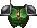

= Manuel Freedoom
// SPDX-License-Identifier: BSD-3-Clause
:toc:
:toc-title:

image::../graphics/titlepic/titlepic.png[Freedoom Title Image,align="center",width=380,pdfwidth=50vw]

Bienvenue sur Freedoom, un jeu complet qui est
https://www.gnu.org/philosophy/free-sw.html[libre]
et https://opensource.org/osd/[open source].
Freedoom est disponible sous <<licence, la licence BSD Modifiée>>, permettant
n'importe qui de partager, de modifier et de réutiliser des parties du jeu.

Pour plus de détails, consultez le site web https://freedoom.github.io/.

== Installation de Freedoom

Freedoom est distribué sous la forme de trois fichiers nommés `freedoom1.wad`,
`freedoom2.wad` et `freedm.wad` qui contiennent les graphismes, les niveaux,
la musique et les effets sonores qui composent le jeu.

Pour jouer au jeu, vous pouvez utiliser l'une des nombreuses adaptations (« portages »)
du programme Doom que les fans ont développé pour les ordinateurs modernes.

Le Doom Wiki possède une
https://doomwiki.org/wiki/Source_port[page dédiée aux portages], où vous pouvez trouver
une liste exhaustive de ces programmes. Comme point de départ, vous pouvez essayer:

* https://zdoom.org[GZDoom], un portage moderne qui intègre le rendu
  matériel et offre une plus grande flexibilité pour les modifications.
* https://www.chocolate-doom.org/wiki/index.php/Crispy_Doom[Crispy Doom],
  un portage minimaliste qui préserve une atmosphère « old school ».

La configuration dépend du portage que vous utilisez, et il est préférable
de se référer aux instructions pour ce portage. En règle générale, vous
pouvez essayer l'une des méthodes suivantes :

* Placez les fichiers `.wad` de Freedoom dans le même dossier que le portage
  avant de le lancer. Il est possible que le portage les détecte automatiquement.
* Pour le lancer avec la ligne de commande, essayez
  ex. `mon-portage-favori -iwad freedoom1.wad`.

Freedoom est séparé en deux parties, _Freedoom: Phase 1_ (`freedoom1.wad`) et
_Freedoom: Phase 2_ (`freedoom2.wad`). _Phase 1_ est composée de quatre épisodes
de huit niveaux, tandis que la _Phase 2_ est une campagne unique de 30 niveaux.
Ça revient à 62 niveaux à jouer, plus des niveaux secrets -- si vous pouvez 
découvrir comment les atteindre.

FreeDM (`freedm.wad`) est un ensemble de niveaux sans monstre, conçu
spécifiquement pour le PvP. Si vous souhaitez savoir comment héberger une
partie multijoueur, veuillez consulter les instructions de votre portage.

<<<

[[menus]]
== L'utilisation des menus Freedoom

Le menu principal peut être affiché à tout moment en appuyant sur la touche
_Échap_ de votre clavier.

image::images/menu-mainmenu.png[Freedoom Main Menu,align="center",width=380,pdfwidth=39vw]

[cols="2,5",width="100%",align="center",valign="middle"]
|==========================
| <<newgame,**New game**>> | Commencez une nouvelle partie, et mettez fin à la partie actuelle
(si vous jouez déjà).
| **Options** | Affiche les options. L'apparence de ce menu et les
options à disposition varient en fonction du portage que vous utilisez.
| <<savegame,**Load Game**>> | Charge une partie sauvegardée.
| <<savegame,**Save Game**>> | Sauvegarder votre partie actuelle, afin de pouvoir
continuer à jouer plus tard.
| **Read This!** | Affiche un écran d'aide montrant les objets que vous verrez
dans le jeu.
| **Quit Game** | Éteint le jeu et vous retourne au système d'exploitation.
|==========================

[[newgame]]
=== Commencer une nouvelle partie

[**Raccourci:** Sur la plupart des portages, en appuyant plusieurs fois sur la touche _Entrée_
après avoir lancé le jeu, vous commencerez une nouvelle partie avec le niveau de difficulté par défaut
(dans le premier épisode si vous jouez Phase 1). Vous n'avez pas besoin de le faire rapidement.]

Pour commencer une nouvelle partie, appuyez sur la touche _Échap_ afin d'afficher le menu principal, puis sélectionnez
_New Game_.

Lorsque vous commencez une nouvelle partie, il est possible que vous soyez invité à choisir l'épisode que vous allez jouer.

image::images/menu-episode.png[Freedoom Episode Menu,align="center",width=432,pdfwidth=50vw]

Si vous êtes nouveau au jeu, commencez par la Phase 1 _Outpost Outbreak_, le premier épisode (et le plus facile). Il n'y a aucune obligation de jouer les épisodes dans l'ordre.

[[skill]]
Après avoir choisi un épisode, vous devez sélectionner un niveau de difficulté. Le niveau de difficulté affecte plusieurs facteurs dans le jeu, le plus important étant le nombre de monstres que vous rencontrerez.

image::images/menu-skill.png[Skill Selection Menu,align="center",width=473,pdfwidth=50vw]

[cols="1,3,8",width="90%",align="center",valign="middle"]
|==========================
| 1 | **Please Don’t Kill Me!** | Le niveau de difficulté le plus facile. Identique à _Will This Hurt?_, sauf que les dégâts sont divisés par deux.
| 2 | **Will This Hurt?** | Niveau de difficulté Facile.
| 3 | **Bring on the Pain.** | Niveau de difficulté par défaut.
| 4 | **Extreme Carnage.** | Niveau de difficulté Difficile.
| 5 | **MAYHEM!** | **Déconseillé**. Ceci est équivalent à _Extreme Carnage_ sauf que les attaques des monstres sont jusqu'à deux fois plus rapides, et les monstres tués reviennent à la vie après environ 40 secondes.

|==========================

[[savegame]]
=== Charger et sauvegarder une partie

Il est judicieux de sauvegarder votre partie régulièrement -- par exemple, au début de chaque nouveau niveau. Vous allez peut-être vouloir aussi sauvegarder votre partie après avoir terminé une section difficile afin que vous n’ayez pas à la répéter si vous mourez.

image::images/menu-save-game.png[Save Game Menu,align="center",width=473,pdfwidth=50vw]

Pour sauvegarder votre partie, appuyez sur _Échap_ afin d'afficher le menu, puis sélectionnez _Save Game_ et choisissez l'emplacement pour la sauvegarde. Entrer une description mémorable pour votre sauvegarde (ex.,“E1M3 - Porte Clé Bleue”) et appuyer sur _Entrée_. S'il n'y a plus d'emplacement libre, vous pouvez écraser un emplacement utilisé, ce qui effacera les données précédentes.

Pour charger une partie sauvegardée, sélectionnez _Load Game_ sur le menu principal et choisissez une sauvegarde.

Si vous sauvegardez fréquemment votre partie, vous allez peut-être vouloir utiliser la fonction _Sauvegarde Rapide_. Appuyez sur _F6_ lors d'une partie pour sauvegarder rapidement. Le menu _Save Game_ apparaîtra comme d’habitude; le choix de cet emplacement fera que cet emplacement sera celui pour vos sauvegardes rapides. À l'avenir, lorsque vous appuierez sur _F6_ à nouveau, cela écrasera votre emplacement de sauvegarde rapide sans passer par le menu.

Vous pouvez charger la partie de votre emplacement de sauvegarde rapide à travers le menu ou appuyant sur _F9_.

[**Attention:** Le portage Chocolate Doom réplique un bug du jeu _Doom_ original qui fait planter le jeu lorsque vous sauvegardez une partie avec trop de choses qui se passent dans le niveau. Ceci peut-être désactiver dans `chocolate-setup` sous la catégorie « Vanilla savegame limit ».]

=== Quitter le jeu

Lorsque vous aurez fini de jouer à Freedoom, appuyez sur _Échap_ pour afficher le menu principal et sélectionnez _Quit Game_ pour quitter. Vous aurez sûrement envie de sélectionner _Save Game_ en premier afin d'enregistrer votre progrès et pouvoir revenir à l'endroit où vous vous étiez arrêté lors de votre prochaine session.

=== Raccourcis clavier

Quelques raccourcis clavier pour accéder aux fonctions du menu instantanément.

[cols="4,6,15",width="90%",align="center",valign="middle"]
|==========================
| **Échap** | <<menus,Menu>> | Affiche le menu principal.
| **F1** | Info | Affiche l'écran d'aide qui présente des informations sur les objets dans le jeu.
| **F2** | <<savegame,Sauvegarder>> | Affiche le menu _Save Game_.
| **F3** | <<savegame,Charger>> | Affiche le menu _Load Game_.
| **F4** | Volume | Affiche le menu pour régler le volume.
| **F6** | <<savegame,Sauvegarde Rapide>> | Savevarge la partie à l'emplacement de _sauvegarde rapide_, ce qui permet de gagner du temps si vous sauvegardez fréquemment lors d'une partie.
| **F7** | Quitter la Partie | Termine la partie actuelle et retourne au menu principal.
| **F8** | Messages | Bascule entre montrer ou masquer les messages à l'écran pour les objets ramassés, les clés, les triches, etc...
| **F9** | <<savegame,Charger Sauvegarde Rapide>> | Charge la partie de votre emplacement _sauvegarde rapide_.
| **F10** | Quitter le Jeu | Quitte le jeu et vous retourne au système d'exploitation.
| **F11** | Luminosité | Permet de régler le niveau de luminosité dans le jeu.
|==========================

<<<

== Comment Jouer

image::images/map01-sshot.png[Freedoom Screenshot,width="640",pdfwidth="51vw",align="center"]

Freedoom est un jeu de tir à la première personne (FPS) en temps réel. Explorez une série de niveaux dans lesquels devez trouver le chemin vers la sortie. Un assortiment de monstres tentera de vous arrêter, et vous aurez besoin d'utiliser vos armes pour vous défendre. Certaines parties des niveaux peuvent demeurer inaccessibles jusqu'à ce que vous trouviez une clé spécifique ou un interrupteur pour ouvrir un passage. Le gameplay impliquera des puzzles d'exploration pour dénicher des objets cachés ainsi que des puzzles d'action en temps réel sur le placement et le timing de vos tirs.

Voici un tableau avec les contrôles de base du jeu. **Les contrôles par défaut de Doom sont généralement considérées comme obsolètes ;** vérifiez votre portage pour savoir comment les reconfigurer. Des alternatives courantes sont fournies, mais il n'y a pas de « meilleure » solution qui convient pour tout le monde -- vous allez devoir expérimenter. Au minimum, vous devez être à l'aise en vous déplaçant dans l'une des quatre directions tout en tournant et en tirant simultanément.

[options="header",cols="1,1,1,1",width="100%",align="center",halign="center"]
|==========================
| Fonction | Touche par défaut 1 | Touche par défaut 2 | Alternatives courantes
| Déplacer avant/arrière | Haut/Bas | Déplacement de la souris (ou Mouse2 pour avancer) | Z/S ^1^
| Déplacer ("strafe") gauche/droite | ,/. | Alt (ou Mouse3) + Gauche/Droite | Q/D
| Tourner gauche/droite ^2^ | Gauche/Droite | Déplacement de la souris | Déplacement de la souris
| Tirer | Ctrl | Mouse1 | Mouse1
| Utiliser | Espace | Double-clic Mouse2 ou Mouse3 | E
| Courir ^3^ | Shift | _<rien>_ | Shift
|==========================

^1^ Sur un clavier AZERTY les touches Z, S, Q et D forme un second ensemble de touches directionnelles pour la main gauche.

^2^ Si vous avez un monstre, un baril ou un adversaire en PvP qui traverse le milieu de votre écran lors du coup de feu de votre arme, le jeu ajustera votre visée verticale pour vous. Certains portages vous permettront de désactiver ce comportement et de viser manuellement à la place.

^3^ La plupart des portages ont une option « Toujours courir » (« Always Run ») où le fait de maintenir cette touche vous ralentit. Puisque le personnage du joueur ne se fatigue pas, se déplacer lentement ne sert qu'à augmenter votre précision.

<<<

=== Un tutoriel

image::images/e1m1-tutorial-sshot.png[Freedoom Screenshot,width="640",pdfwidth="70vw",align="center"]

Ce tutoriel vous présentera toutes les actions de base dont vous aurez besoin pour jouer et battre Freedoom.

Commencez une nouvelle partie dans Freedoom Phase 1, épisode 1 sur le niveau de difficulté facile et suivez les étapes. Ignorez tout ce qui vous ennuie ou vous embrouille, et refaites tout ce que vous trouvez difficile aussi longtemps que vous le souhaitez, avant de passer à l'étape suivante ou de refaire une étape précédente.

. Essayez de vous déplacer en avant, en arrière, à gauche, et à droite.
  Tracez un carré. Essayez de le faire dans le sens horaire et antihoraire. Essayez de faire le numéro huit. (Ne quittez pas la cage pour l'instant -- il y a des monstres à l'extérieur.)

. Tournez en rond pour examiner votre environnement. Faites-le à votre propre
  rythme, en vous arrêtant ou en changeant de direction pour regarder n'importe où quand vous voulez. Faites un deuxième cercle, en vous déplaçant un peu au fur à mesure, et observez comment cela change la perspective et comment le mouvement latéral peut vous aider à voir la longueur d'un mur ou la distance d'un objet.

. Retournez au milieu de la cage. Tournez et pointez votre pistolet
  sur l'une des colonnes du cadre de porte.

. Déplacez-vous -- sans tourner -- afin que votre pistolet soit pointé vers 
  l'autre colonne. (Idéalement, essayez de vous arrêter naturellement sur la cible.)

. Déplacez-vous un peu à gauche ou à droite, puis tournez à nouveau pour
  pointer vers la colonne. Recommencez, mais tournez avant que votre élan ne s'estompe. Recommencez quelques fois, en utilisant les quatre directions et en tournant de plus en plus tôt jusqu'à ce que vous pointiez et que vous vous déplaciez de façon fluide. (Reculez ou avancez pour réinitialiser si vous vous approchez trop ou si vous courez dans les murs.)

. Essayez de faire un carré (ou le numéro huit, etc.) tout en pointant
  vers la colonne en même temps. Privilégiez la fluidité au lieu de la précision -- il vaut mieux être proche la plupart du temps que rarement parfait.

. Déplacez-vous sur un des lits dans les coins afin que la colonne ne
  soit plus visible. Déplacez-vous afin que la colonne entre et sorte de vue. Expérimentez avec la distance et le timing. Ensuite, tentez de pointer vers la colonne même si vous ne pouvez pas la voir.

. Jouez un peu avec ce qui a été dit précédemment. Essayez d'appuyer
  sur la touche Tirer pour tirer sur la colonne en restant immobile et en vous déplaçant, observez où et quand un petit nuage de fumée se forme. (Arrêtez de tirer avant que votre nombre de munitions tombe en dessous de 30 -- vous en aurez besoin pour plus tard !)

. Appuyez sur la touche 1 du clavier pour passer à vos poings, et
  tentez de frapper la colonne et observez jusqu'à quelle distance vous pouvez le faire. Appuyez sur la touche 2 pour retourner à votre pistolet.

. Maintenant vérifiez si vous pouvez accomplir toutes les tâches
  tout en maintenant la touche Courir enfoncée.

. Descendez dans la tranchée et tuez un <<enemies,zombie>>. Essayez
  de ne pas prendre de dégâts.

. Une fois en sécurité, regardez près du corps du zombie pour voir
  s'il a laissé tomber un <<ammo,chargeur>>. Si oui, déplacez-vous pour le ramasser.

. Retournez en arrière d'où vous venez. Allez à l'ascenseur comme
  si vous alliez le frapper, puis appuyez sur la touche Utiliser pour l'appeler. Montez dessus et il vous sortira de la tranchée. Ramassez les objets dans la zone supérieure pour rétablir ou booster votre santé.

. Explorez le reste de la zone. Vous trouverez deux portes qui peuvent être utilisées directement, comme l'ascenseur. La porte du bas vous mènera vers un chemin plus proche de la sortie, tandis que celle du haut vous mènera vers un chemin plus dur mais également plus gratifiant.

. Une fois que vous avez fait votre choix, ouvrez la porte et préparez-vous à utiliser le savoir que vous avez acquis.

<<<

=== La barre d'état

En bas de l’écran, vous verrez la barre d’état, qui est divisée en plusieurs sections:

image::images/status-bar.png[Freedoom Status Bar,width="640",pdfwidth="70vw",align="center"]

[cols="2,5",width="90%",align="center",valign="middle"]
|==========================
| **Ammo** | Quantité de <<ammo,munitions>> restantes pour l’arme actuelle.
| **Health** | Si ceci atteint zéro, vous êtes mort ! Consultez la <<health,section santé>> pour les objets qui peuvent être trouvés pour rétablir votre santé.
| **Arms** | Les armes que vous avez trouvées jusqu’à présent. Consultez la <<weapons,section armes>> pour plus d’informations.
| **MecFreedoom** | Une indication visuelle rapide de votre état de santé.
| **Armor** | Plus vous avez d’armure, moins votre santé souffrira si vous êtes blessé. Consultez la <<armor,section armure>> pour plus d’informations.
| **Nombre de munitions** | Quantité des <<ammo,quatre types de munitions>> à disposition, avec le maximum que vous pouvez transporter pour chacun.
|==========================

[[items]]
=== Objets

Dans le jeu, vous trouverez divers objets ramassables : <<weapons,des armes>>, <<ammo,des munitions>>, <<health,de la santé>>, <<armor,de l'armure>>, <<keys,des clés>> et des <<specialitems,power-ups plus rares>> qui vous donnent des capacités spéciales.

Pour ramasser quelque chose, il suffit tout simplement de marcher dessus -- un message à l'écran et un bref flash indiquent que vous l'avez bien ramassé. Si vous ne le ramassez pas, il est probable que vous n'en ayez pas besoin actuellement (par exemple, vous ne pouvez pas prendre des objets qui rétablis votre santé lorsque votre santé est à 100%). Si un objet vous donne plus que ce que vous pouvez transporter, la différence est perdue.

[[weapons]]
=== Armes

Vous commencez le jeu avec seulement un pistolet, 50 balles et vos poings. En explorant le niveau, vous trouverez plus d'armes et de munitions que vous pourrez utiliser.

En appuyant sur les touches numériques du clavier, vous pouvez basculer vers l'arme liée à la touche (si vous l'avez). En dehors des armes de corps à corps, chaque arme consomme un type de munitions, qui peut être trouvé quelque part dans le niveau.

[options="header",cols="3,2,9",valign="middle",width="100%"]
|==========================
| Arme | Touche | Description
| **Poing** | 1 | Si vous n'avez plus de munitions, vous pouvez toujours frapper les monstres à mains nues. _Munitions:_ Aucune
| **Scie** +
image:../sprites/csawa0.png[Ripsaw] |
1 | Conçue pour couper le bois, la scie fonctionne également comme une arme de corps à corps pour trancher la chair. _Munitions:_ Aucune
| **Pistolet** +
image:../sprites/pista0.png[Handgun] |
2 | Votre arme de départ. Elle vous permet de vous battre pour obtenir une meilleure arme, et d'activer des interrupteurs sans gaspiller de balle. _Munitions:_ Balles
| **Fusil à Pompe** +
image:../sprites/shota0.png[Pump-action Shotgun] |
3 | Tire sept cartouches qui se propagent, vous permettant de toucher plusieurs cibles ou une grande cible. _Munitions:_ Cartouches
| **Fusil à Double Canon** +
image:../sprites/sgn2a0.png[Double-barrelled Shotgun] |
3 | Une meilleure tolérance pour les charges puissantes signifie une meilleure fragmentation des projectiles, ce qui se traduit par une augmentation de près de 50% du nombre de coups par cartouches sur une zone plus étendue. Bon à courte portée contre les groupes d'ennemis. _Munitions:_ Cartouches
| **Minigun** +
image:../sprites/mguna0.png[Minigun] |
4 | Une utilisation bien plus efficace de vos balles qu'avec le pistolet. Jusqu'à quarante secondes de tir continu pour vous protéger. _Munitions:_ Balles
| **Lance-Missile** +
image:../sprites/launa0.png[Missile Launcher] |
5 | Tire des missiles qui infligent beaucoup de dégâts à l'impact, puis explose pour éliminer les petits monstres à proximité. Attention, évitez d'être trop proche de l'explosion ! _Munitions:_ Missiles
| **Arme à Énergie Polarique** +
image:../sprites/plasa0.png[Polaric Energy Weapon] |
6 | Produit un flux continu de projectiles d'énergie polarique qui sont très efficaces contre les monstres forts.
_Munitions:_ Énergie
| **SKAG 1337** +
image:../sprites/bfuga0.png[SKAG 1337] |
7 | Une arme expérimentale qui tire une boule d'énergie polarique massive, puis déclenche une explosion d'énergie secondaire dans la même direction ! Cette arme tire lentement, mais ça en vaut la peine. _Munitions:_ Énergie
|==========================

<<<

[[ammo]]
=== Munitions
[options="header",cols="2,1,1",width="70%",align="center",valign="middle"]
|==========================
| Type de Munitions | Petit | Large
| **Balles** |
image:../sprites/clipa0.png[Bullet Clip] |
image:../sprites/ammoa0.png[Case of Bullets]
| **Cartouches** |
image:../sprites/shela0.png[Shotgun Shells] |
image:../sprites/sboxa0.png[Box of Shotgun Shells]
| **Missiles** |
image:../sprites/rocka0.png[Missile] |
image:../sprites/broka0.png[Crate of Missiles]
| **Énergie** |
image:../sprites/cella0.png[Small Energy Recharge] |
image:../sprites/celpa0.png[Large Energy Recharge]
| **Sac à Dos** |
- |
image:../sprites/bpaka0.png[Backpack]
|==========================

Le sac à dos donne l'équivalent d'une petite recharge de munitions pour chaque type de munitions. Une fois que vous en avez un, vous pouvez transporter deux fois plus de munitions que d’habitude durant le reste de la partie.

[[health]]
=== Santé

Vous commencez avec votre santé à 100%. Vous mourez lorsque votre santé atteint 0%.

En ramassant n'importe quel objet de santé, vous récupérerez la valeur indiquée, jusqu’à sa limite. Les recharges sont limitées à 100%, mais les boosts (1% et 100%) sont limités à 200%.

[options="header",cols="1,1,1,1",width="70%",align="center",halign="center"]
|==========================
| 1% | 10% | 25% | 100%
| image:../sprites/bon1a0.png[Health Boost] |
image:../sprites/stima0.png[Small Health Refill] |
image:../sprites/media0.png[Large Health Refill] |
image:../sprites/soula0.png[Ectoplasmic Surge]
|==========================

[[armor]]
=== Armure

Vous commencez avec 0% d'armure. En ramassant une veste vous pourrez atteindre la quantité d'armure indiquée. Chaque petit boost augmente votre armure jusqu'à ce que vous atteigniez 200%.

[options="header",cols="1,1,1",width="70%",align="center",halign="center"]
|==========================
| 1% | 100% | 200%
| image:../sprites/bon2a0.png[Armor Boost] |
 |
image:../sprites/arm2a0.png[Attuned Force Field Armor Vest]
|==========================

L'armure normale absorbe un tiers des dégâts que vous recevez, ceci est arrondie vers le bas. Si vous avez 100% de vie et 100% d'armure, et que vous subissez 50% de dégâts, vous perdrez 34% de vie et 16% d'armure.

L'armure blindée a un comportement légèrement différent : en plus de valoir 200% d'armure, elle absorbe également la moitié des dégâts. Étant donné que les petits boosts ajoutent le même type d'armure que vous avez déjà, il est peut-être préférable de ramasser l'armure blindée immédiatement si vous n'en avez pas déjà une.

[[keys]]
=== Clés

image:../sprites/bkeya0.png[Blue Passcard] image:../sprites/bskua0.png[Blue Skeleton Key] +
image:../sprites/ykeya0.png[Yellow Passcard] image:../sprites/yskua0.png[Yellow Skeleton Key] +
image:../sprites/rkeya0.png[Red Passcard] image:../sprites/rskua0.png[Red Skeleton Key]

Les clés vous permettent d'ouvrir certaines portes verrouillées et d'activer les interrupteurs verrouillés. En règle générale, elles sont indispensables pour progresser, bien qu'elles permettent parfois l'accès à des raccourcis ou des zones secrètes.

=== Accessibilité daltonisme

Les clées dans Freedoom sont non seulement conçues pour être distinguées par leur couleur mais aussi par leur forme, afin de rendre le jeu plus accessible aux joueurs daltoniens. Chaque clé colorée est associée à une forme :

[cols="2,3",width="50%",align="center",valign="middle"]
|==========================
| **Couleur de la Clée** | **Forme**
| Bleu | Croix diagonale
| Jaune | Lignes verticales
| Rouge | Lignes horizontales
|==========================

Ces formes sont utilisées de façon cohérente avec les icônes de la barre d'état, les images des clés et sur les murs indiquant les portes verrouillées.

Pour les clés squelettes, faites attention à la direction vers laquelle les cornes pointent. Par exemple, voici comment les icônes des clés apparaissent dans la barre d'état :

image:images/key-icons.png[Key icons,align="center"]

<<<

[[specialitems]]
=== Objets spéciaux

Il est possible que vous les voyiez lorsque vous explorez:

[cols="4,10",width="100%",align="center",valign="middle"]
|==========================
| **Lunettes Vision Sombre** +
image:../sprites/pvisa0.png[Low-Light Goggles] |
Permet de voir dans le noir. Dure 2 minutes.
| **Carte Enquête Zone** +
image:../sprites/pmapa0.png[Area Survey Map] |
Révèle les zones inexplorées de la carte, y compris les zones secrètes qui ne sont pas immédiatement visibles. Dure jusqu'à la fin du niveau actuel.
| **Combinaison de Secours** +
image:../sprites/suita0.png[Rescue Operations Suit] |
Protège contre la chaleur, les toxines et les radiations provenant des sols endommagés. Dure 1 minute.
| **Symbiote de la Force** +
image:../sprites/pstra0.png[Strength Symbiote] |
Rétablis votre santé à 100%, et vos poings font 10x plus de dégâts. La vie dure jusqu'à ce que vous preniez des dégâts, et les dégâts jusqu'à la fin du niveau actuel.
| **Cape d'Invisibilité** +
image:../sprites/pinsa0.png[Invisibility Cloak] |
Vous rend presque invisible. Les monstres détectent toujours votre présence, mais ils auront beaucoup plus de mal à viser. Dure 1 minute.
| **Surtension Néguentropique** +
image:../sprites/megaa0.png[Negentropic Surge] |
Maximise votre santé et armure à 200%. Dure jusqu'à ce que vous preniez des dégâts.
| **Dispositif Vanguard** +
image:../sprites/pinva0.png[Vanguard Device] |
Vous immunise aux dégâts, vous permettant de surmonter les défenses de l'ennemi et les pièges inévitables. Dure 30 secondes.
|==========================

[[enemies]]
=== Ennemis

Les niveaux sont remplis de monstres qui ont pour unique objectif de vous empêcher de terminer votre mission. Voici une sélection des monstres que vous allez rencontrer.

[frame="none",cols="8,3",valign="middle",grid="none",align="center",width="100%"]
|==========================
| **Zombie** +
Ces travailleurs d'iniquité qui n'ont rien dans la tête sont armés d'un pistolet et sont résolus à vous anéantir. Ils lâchent un chargeur de balles lorsqu'ils sont tués. |
image:images/monster-zombie.png[Zombie,100,100,width=100%]
| **Zombie Fusil à Pompe** +
Ces gars ont échangé leur pistolet contre un fusil à pompe qui a plus de punch. Lâche un fusil à pompe lorsqu'ils sont tués. |
image:images/monster-shotgun-zombie.png[Shotgun Zombie,100,100,width=100%]
| **Zombie Minigun** +
Dès qu'un d'eux vous apercevra, ils se verrouilleront avec leur minigun sur vous et continueront à tirer jusqu'à ce que vous mouriez. Il est préférable de se mettre à l'abri rapidement ou de les abattre. Ils lâchent un minigun lorsqu'ils sont tués. |
image:images/monster-minigun-zombie.png[Minigun Zombie,100,100,width=100%]
| **Serpentipede** +
Fantassins de rang et de file pour l'invasion alien. Laissez-les trop s'approcher et ils vous charcuteront; à distance, ils feront pleuvoir des boules de feu. |
image:images/monster-serpentipede.png[Serpentipede,100,100,width=100%]
| **Ver de chair** +
Balaises et rapides, ces vers attaquent au corps-à-corps et peuvent encaisser plusieurs coups de fusil à pompe avant de succomber. Il est préférable de maintenir une certaine distance. |
image:images/monster-flesh-worm.png[Flesh Worm,100,100,width=100%]
| **Ver furtif** +
Certains Vers de chair peuvent courber la lumière autour d'eux, les rendant presque invisibles dans les environnements plus obscurs et remplis. |
image:images/monster-stealth-worm.png[Stealth Worm,100,100,width=100%]
| **Larvillon** +
Des larves aliens ionisées qui infligent des dégâts surprenants lorsqu'elle vous plaque. |
image:images/monster-hatchling.png[Hatchling,100,100,width=100%]
| **Matribite** +
Quelle mère cinglé envoie ses propres bébés se battre? Ainsi est le devoir de l'empire. |
image:images/monster-matribite.png[Matribite,100,100,width=100%]
| **Trilobite** +
Ces choses volantes crachent du plasma et mordent si vous vous approchez trop. |
image:images/monster-trilobite.png[Trilobite,100,100,width=100%]
| **Procureur de douleur** +
Ces gars encaissent au moins trois missiles avant de succomber, et pendant que vous essayez d'aligner ces derniers, ils vous fusille avec des projectiles d'énergie. |
image:images/monster-pain-bringer.png[Pain Bringer,100,100,width=100%]
| **Seigneur de la douleur** +
Si le Procureur de douleur n'était pas assez balèze, celui-ci peut encaisser cinq missiles. |
image:images/monster-pain-lord.png[Pain Lord,100,100,width=100%]
| **Octaminator** +
Rapide, balaise, et tirent des missiles à tête chercheuse. Ne boxez pas avec un de ces gars. |
image:images/monster-octaminator.png[Octaminator,100,100,width=100%]
| **Nécromancien** +
S'ils ne vous mettent pas en feu, ils ruinent votre travail en ramenant leurs amis de l'au-delà. |
image:images/monster-necromancer.png[Necromancer,100,100,width=100%]
| **Limace de combat** +
Ces monstres de chair glissant génétiquement modifiés ont été équipés de lance-flammes à longue portée. |
image:images/monster-combat-slug.png[Combat Slug,100,100,width=100%]
| **Technospider** +
Ces créatures cybernétiques tirent des armes à haute capacité d'énergie poliarque, ce qui fait d'eux un défi mortel. |
image:images/monster-technospider.png[Technospider,100,100,width=100%]
| **Grosse Technospider** +
Ce char avec des jambes est équipé d'un minigun à haute cadence et il demandera un effort considérable pour l'achever. Immunisé contre les explosions de missiles et de barils. |
image:images/monster-large-technospider.png[Large Technospider,100,100,width=100%]
| **Trépied d'assaut** +
Le mélange ultime de technologies militaire et de manipulations génétiques, ces créatures à trois pattes sont rapides, lourdement blindés et équipés d'un lance-missiles que vous souhaiterez éviter. Immunisé contre les explosions de missiles et de barils. |
image:images/monster-assault-tripod.png[Assault Tripod,100,100,width=100%]
|==========================

=== Utilisation de la carte

En explorant les niveaux de Freedoom, il est possible de se perdre, surtout si le niveau est particulièrement vaste ou complexe. Heureusement, la carte est disponible pour vous aider à trouver votre chemin. Appuyez sur la touche _Tab_ lors d'une partie pour afficher la carte.

image::images/map.png[Map Screenshot,width="640",pdfwidth="70vw",align="center"]

Votre position et orientation sont indiquées par une flèche blanche. Généralement, les zones de la carte sont codées par couleur de la façon suivante :

[frame="none",cols="3,8",valign="middle",align="center",width="70%"]
|==========================
| **Rouge** | Murs (ou possiblement une porte secrète).
| **Jaune** | Différences de hauteur du plafond, y compris les portes.
| **Marron** | Différences de hauteur du sol (ex. marches).
| **Gris** | Zones non découvertes (pas affichées normalement, mais peuvent l'être
si l'objet <<specialitems,Carte Enquête Zone>> est découvertes).
|==========================

Lors de l'utilisation de la carte, le jeu n'est pas mis sur pause. Les contrôles continuent de fonctionner comme d'habitude, avec les additions suivantes:

[frame="none",cols="1,4",valign="middle",align="center",width="80%"]
|==========================
| **Tab** | Affiche/Cache la carte.
| **-** | Zoom arrière.
| **+** | Zoom avant.
| **0** | Zoom arrière au maximum.
| **F** | Active/Désactive si la carte suit le joueur. Lorsque désactivé, utilisées les touches du curseur pour déplacer la vue de la carte indépendamment de votre position actuelle.
| **G** | Active/Désactive la grille de la carte.
| **M** | Ajoutez un marque-page sur la carte à votre position actuelle.
| **C** | Effacer tous les marque-pages.
|==========================

=== Dangers environnementaux

Si les monstres ne suffisaient pas, l'environnement lui-même pose des dangers qui peuvent vous blesser ou même vous tuer !

[frame="none",cols="2,5,3",valign="middle",grid="none",width="100%"]
|==========================
| **Barils** |
Ces barils explosifs parsèment de nombreux niveaux. Quelques tirs avec le pistolet suffisent pour les faire exploser, causant des dégâts à tout ce qui se trouve à proximité. Lorsque vous êtes engagé dans un combat, assurez-vous de ne jamais vous tenir trop près d'un baril car un tir perdu d'un ennemi peut entraîner l'explosion de ce dernier dans votre visage ! Soyez également conscient du potentiel d'une réaction en chaîne lorsque plusieurs barils sont regroupés. |
image:images/hazard-barrels.png[Barrels,150,150,width=100%]
| **Sols nocifs** |

La lave rouge brûlante et la boue radioactive ne sont que deux des types de sols nocifs que vous pouvez rencontrer dans les niveaux de Freedoom. Si vous devez marcher dessus, essayez de trouver une <<specialitems,combinaison de secours>>, un chemin plus court à travers la zone, ou une façon de traverser la zone sans toucher le sol. |
image:images/hazard-slime.png[Radioactive slime,150,150,width=100%]
| **Plafonds Écraseur** |

De nombreux niveaux ont été truqués avec des pièges, et celui-ci n'est qu'un parmi d'autres. Ces plafonds mobiles sont souvent placés au-dessus d'objets tentants. Soyez très prudent de ne pas rester coincé en dessous d'un, sinon il vous écrasera rapidement en bouillie! |
image:images/hazard-crusher.png[Crushing Ceiling,150,150,width=100%]
|==========================

=== Mourir

Éventuellement, vous allez vous retrouver dans une situation que vous ne pouvez pas gérer et votre avatar se fera tuer.

Vous pouvez voir cela comme un signe pour faire une pause, ou recharger votre dernière sauvegarde, ou appuyez sur la touche Utiliser pour redémarrer le niveau avec votre santé complète, mais sans équipements, à part pour votre pistolet et 50 balles. (Certains portages ne font pas ce dernier, à la place ils sauvegardent votre partie au début de chaque niveau, et en appuyant sur la touche Utiliser vous chargez cette partie.)

Il n'y a pas de limite au nombre de vies.

En multijoueur, la touche Utiliser réinitialisera votre santé et votre inventaire et vous placera au départ, mais la partie elle-même continue normalement. Il est possible de ramasser toutes les munitions d'un niveau et de mourir sans les utiliser, forçant votre équipe à terminer le niveau en utilisant uniquement des pistolets, et de mourir afin de recharger.

=== Conseils tactiques

Si vous galérez avec la difficulté du jeu, ça vaut peut-être le coup d'examiner les suggestions suivantes :

* Prenez le temps pour configurer vos contrôles, à la fois l'affectation des
  touches/bouttons et la sensibilité de la souris/manette. Aucune configuration n'est idéale pour tout le monde, c'est donc une bonne idée d'expérimenter : tout ce qui vous aide à esquiver les projectiles tout en gardant votre arme pointée sur l'ennemi, et offre le moins de distraction lorsque vous vous déplacez dans le niveau à la recherche de choses, est positif.

* Jouez avec un casque audio. La séparation stéréo du jeu peut vous donner des
  indices audio utiles sur la position des ennemis et vous alerter de projectiles qui se dirigent vers vous. Le casque vous permettra de capter ces signaux de manière plus précise.

* Ne spammez *pas* les boutons! Presque toutes les armes ont un léger délai
  lorsque vous lâchez la touche Tirer, ce qui prends du temps et donne à votre cible l'opportuniter de riposter. Enfoncer la touche Tirer vous permettra de tirer avec n'importe quelle arme en continu jusqu'à l'épuisement de vos munitions ou que vous lâchiez la touche.

* Mettez-vous à l'abri ! Les monstres n'attaquent que lorsque vous êtes dans
  leur champ de vision. Vous allez vouloir trouver un abri solide (la plupart des choses opaques qui apparaissent sur votre automap sans codes de triche) que vous pouvez mettre entre vous et tout ennemi que vous n'attaquez pas activement avec votre arme. Un abri est particulièrement important lorsque vous êtes face aux monstres qui peuvent se verrouiller sur vous (minigun zombie; nécromancien) et trouver un abri peut être le seul moyen pour qu'il cesse de tirer et vous permette de riposter. Les monstres avec des armes à feu ne sont ni meilleurs ni pires pour vous toucher, que vous soyez en mouvement ou immobile, afin que vous ne puissiez pas les éviter en permanence sur un terrain ouvert comme vous le pouvez contre les projectiles visisbles.

* Une bonne partie des niveaux sont jonchés de barils explosifs. Ces
  derniers peuvent représenter un danger pour vous, mais aussi pour vos adversaires. Un seul coup de fusil au bon moment sur un baril peut abattre plusieurs ennemis simultanément. Une explosion de baril peut en déclencher une autre, ce qui peut provoquer une réaction en chaîne qui abat toute une foule -- mais faites en sorte que cela ne vous inclut pas !

* Si un monstre blesse un autre monstre, il se vengera contre celui
  qui l'a blessé (on parle alors de _monster in-fighting_). Face à une foule d'ennemis, une stratégie efficace peut être de se positionner au bon endroit pour que ceux qui sont derrière tirent sur ceux qui sont devant. Faites-le correctement et ils passeront plus de temps à se bagarrer entre eux que de vous attaquer, ce qui affaiblira considérablement les survivants. Sachez cependant qu'un monstre ne peut pas être blessé par un projectile visible lancé par un autre de la même espèce.

* Parfois, vous affronterez des foules de monstres, ce qui peut être
  épuisant et drainer vos munitions. Apprenez à maîtriser le contrôle des foules. L'instinct primaire de tous les monstres est de se diriger vers vous. Tournez continuellement autour de la foule -- cela les incite à se regrouper dans un seul endroit, plus facile à cibler. Cela encourage également les monstres à se battre. Si cela se produit, ils dépenseront leur énergie à s'entretuer et vous économiserez vos munitions.

* Si vous rencontrez des Vers de chair ou des Vers furtifs et que vous
  n'êtes pas à risque immédiat d'être encerclé, la scie est un moyen excellent pour conserver des munitions et éviter de subir des dégâts. Les vers ne peuvent pas attaquer lorsqu'ils se font sciés, et si vous vous positionnez dans un endroit assez étroit, ils ne pourront que venir vous attaquer un à la fois.

<<<

[[wads]]
== Jouer avec des WADS et mods faits par les fans ==

.Scythe MAP09 en utilisant Freedoom.
image::images/scythe-map09.png[Scythe MAP09,width="640",pdfwidth="70vw",align="center"]

Une des meilleures fonctionnalités de Freedoom est sa compatibilité avec le catalogue de milliers de niveaux créés par les fans pour les jeux classiques _Doom_ . La plupart des mods et niveaux pour _Doom_ et _Doom II_ peuvent également être joués avec Freedoom.

Pour les mods conçus pour le premier _Doom_, utilisez Freedoom: Phase 1 (`freedoom1.wad`); pour les autres conçus pour _Doom 2_ ou _Final Doom_, utilisez Freedoom: Phase 2 (`freedoom2.wad`).
Si vous vous servez de la ligne de commandes, utilisez le paramètre `-file` lorsque vous démarrez le jeu. Par exemple, pour charger le fichier `scythe.wad` :

  portage-favori -iwad freedoom2.wad -file scythe.wad

Si vous n'utilisez pas la ligne de commandes, vous pouvez cliquer-glisser le fichier `.wad` sur l'icône de votre portage dans votre gestionnaire de fichiers -- plusieurs portages prennent en charge cette fonctionnalité.

=== Ressources suggérées

Au cours de plus de deux décennies, littéralement des milliers de niveaux _Doom_ ont été créés, et il y en a tellement qu'il peut être difficile de savoir par où commencer. Voici quelques suggestions pour trouver le meilleur contenu:

* Le https://www.doomworld.com/10years/bestwads/[Top 100 des meilleurs WADs de tous les temps] de Doomworld a été écrit en 2003 et visait à répertorier les meilleures œuvres des 10 premières années réalisées par les fans. C'est toujours une bonne liste de mods classiques.

* https://www.doomworld.com/cacowards/[Les Cacowards] sont une cérémonie annuelle organisée par Doomworld, avec une remise de prix qui récompense les meilleures sorties de la communauté _Doom_ au cours de la dernière année. C'est un bon moyen de découvrir les développements plus récents, y compris les mods les plus inhabituels que les gens publient.

* La https://doomwiki.org/wiki/List_of_notable_WADs[Liste des WADs notables] du Doom Wiki contient une liste exhaustive de WADs fait par les fans avec des captures d'écran, des cartes et des statistiques par niveau.

* L'interface de Doomworld vers l'archive idgames inclut la capacité de lister les https://www.doomworld.com/idgames/index.php?top[meilleurs niveaux] en fonction du score cinq étoiles attribuées par les visiteurs du site.

<<<

== Triches ==

Si vous trouvez le jeu trop difficile, peu importe le <<skill,niveau de difficulté>>, ou si vous voulez expérimenter avec les mécaniques du jeu, voici quelques triches que vous pouvez utiliser:

[cols="2,6",width="100%",align="center",valign="middle"]
|==========================
| **IDDQD** | Mode Dieu, vous rend invulnérable à tous les dégâts.
| **IDFA** | Donne toutes les armes et munitions.
| **IDKFA** | Donne toutes les armes, munitions et clés.
| **IDCLIP** | Mode Noclip, vous permet de traverser les murs et les acteurs.
| **IDDT** | Révèle entièrement la carte; à rentrer deux fois pour révéler tous les ennemis et objets.
| **IDCLEVxy** | Commence une nouvelle partie (ce qui réinitialise tout) sur ExMy (Phase 1) ou MAPxy (Phase 2).
| **IDMUSxy** | Changez la musique pour celle de ExMy (Phase 1) ou MAPxy (Phase 2).
| **IDCHOPPERS** | Donne l'arme, la Scie.
| **IDBEHOLDV** | Donne le powerup, Dispositif vanguard.
| **IDBEHOLDS** | Donne le powerup, Symbiote de la force.
| **IDBEHOLDI** | Donne le powerup, Cape d'invisibilité.
| **IDBEHOLDR** | Donne le powerup, Combinaison de secours.
| **IDBEHOLDM** | Donne le powerup, Carte enquête zone.
| **IDBEHOLDL** | Donne le powerup, Lunettes vision sombre.
|==========================

<<<

== Freedoom met en avant la liberté ==

Quand les gens entendent parler de Freedoom, ils assument souvent que le nom fait référence au prix -- que le seul but du projet est de fournir une alternative gratuite à Doom. Mais ceci n'est pas le cas.

Le mot « free » a deux significations différentes en Anglais. On dit « free » pour signifier que quelque chose ne coûte rien, mais on l'utilise aussi pour désigner la liberté -- comme « la liberté d'expression » ou « la liberté de la presse ». Freedoom fait référence à ce dernier. Cela peut sembler bizarre. Qu'est-ce que cela signifie?

Imaginez un monde où les artistes ne peuvent qu'acheter de la peinture d'une seule compagnie. Un tel monopole signifierait que la peinture couterait plus chères, mais le prix ne serait pas le problème principal. Le plus gros problème serait le pouvoir qu'il accorderait à cette compagnie. La liberté de ces artistes de s'exprimer dépendrait de la compagnie qui leur fournit leurs peintures.

Depuis plus de 30 ans, la communauté de modders Doom a produit des milliers de niveaux, mods et même des nouveaux jeux construits à partir des jeux Doom originaux. Ce sont des œuvres d'art qui doivent être reconnues comme telles. https://www.youtube.com/watch?v=KxYND6K6u8w[Doom est une scène artistique]. La matière première à partir de laquelle ces œuvres d'art sont fabriquées n'est ni de la peinture ou de l’encre, mais le jeu original lui-même -- sans cesse modifié, réutilisé et remixé en de nouvelles variations.

Les auteurs de Doom, id Software, ont historiquement été très généreux envers la communauté Doom. Dès la sortie du jeu, ils ont fait de leur mieux pour partager les détails techniques avec les fans, et quelques années après ils ont publié le code source de Doom sous une licence libre -- quelque chose qui était inconnu dans l'industrie du jeu vidéo à l'époque et qui devrait être félicité. Mais malgré cette bienveillance, ils ont toujours occupé une position de pouvoir. Aujourd'hui, au lieu d'être un petit studio indépendant, eux et la franchise Doom appartiennent à une grande multinationale.

Tout le monde mérite de pouvoir apprécier la merveille qu'est Doom et de participer dans sa communauté de modding qui a enduré après tant d'années. Mais cette communauté mérite aussi sa liberté et son indépendance. En fournissant une alternative libre que tout le monde peut jouer, partager, modifier et réutiliser, nous espérons que c'est quelque chose que Freedoom peut aider à offrir.

== Contribuer à Freedoom ==

Freedoom est un projet au https://www.gnu.org/philosophy/free-sw.html[contenu libre] avec de nombreux contributeurs venant du monde entier. Il est disponible à la fois "free" ^1^ en coût ("free" ^1^ comme une bière gratuite) et en droit de modification et de redistribution ("free" ^1^ comme la liberté d'expression) aux utilisateurs finaux, à condition que la licence originale soit incluse et/ou visible aux utilisateurs de versions modifiées ou redistribuées. 

Si vous souhaitez contribuer au projet Freedoom, veuillez consulter
les hubs communautaires suivants:

* Le dépots de source de Freedoom: +
https://github.com/freedoom/freedoom

* Le Forum de discussion Freedoom sur Doomworld: +
https://www.doomworld.com/forum/17-freedoom/

* La Guilde Discord: +
https://discord.gg/9DA3fut

Pour savoir comment soumettre une contribution, veuillez consulter les pages suivantes sur l'utilisation de GitHub :

* Comment utiliser le contrôle de version Git pour des contributions : +
https://help.github.com/en/github

* Comment faire un « fork » d'un projet et créer une demande d'intégration (« pull request ») avec Git : +
https://guides.github.com/activities/forking/

^1^ Le mot « free » en anglais veut à la fois dire gratuit et libre.

[[reusing]]
== Réutilisation de portions de Freedoom ==

Puisque https://freedoom.github.io/about.html[Freedoom est libre], d'autres projets ont utilisé des éléments de Freedom.  Nous pensons que c'est une excellente utilisation du projet et nous l'encourageons. Si vous utilisez des portions de Freedoom dans votre projet, veuillez nous informer en formulant une « issue » ou un « pull request » sur la page du projet Freedoom
https://github.com/freedoom/freedoom .

<<<

[[licence]]
=== BSD 3-Clause copyright licence

Copyright © 2001-2024
Contributors to the Freedoom project.  All rights reserved.

Redistribution and use in source and binary forms, with or without
modification, are permitted provided that the following conditions are
met:

  * Redistributions of source code must retain the above copyright
    notice, this list of conditions and the following disclaimer.
  * Redistributions in binary form must reproduce the above copyright
    notice, this list of conditions and the following disclaimer in the
    documentation and/or other materials provided with the distribution.
  * Neither the name of the Freedoom project nor the names of its
    contributors may be used to endorse or promote products derived from
    this software without specific prior written permission.

THIS SOFTWARE IS PROVIDED BY THE COPYRIGHT HOLDERS AND CONTRIBUTORS “AS
IS” AND ANY EXPRESS OR IMPLIED WARRANTIES, INCLUDING, BUT NOT LIMITED
TO, THE IMPLIED WARRANTIES OF MERCHANTABILITY AND FITNESS FOR A
PARTICULAR PURPOSE ARE DISCLAIMED. IN NO EVENT SHALL THE COPYRIGHT OWNER
OR CONTRIBUTORS BE LIABLE FOR ANY DIRECT, INDIRECT, INCIDENTAL, SPECIAL,
EXEMPLARY, OR CONSEQUENTIAL DAMAGES (INCLUDING, BUT NOT LIMITED TO,
PROCUREMENT OF SUBSTITUTE GOODS OR SERVICES; LOSS OF USE, DATA, OR
PROFITS; OR BUSINESS INTERRUPTION) HOWEVER CAUSED AND ON ANY THEORY OF
LIABILITY, WHETHER IN CONTRACT, STRICT LIABILITY, OR TORT (INCLUDING
NEGLIGENCE OR OTHERWISE) ARISING IN ANY WAY OUT OF THE USE OF THIS
SOFTWARE, EVEN IF ADVISED OF THE POSSIBILITY OF SUCH DAMAGE.

For a list of contributors to the Freedoom project, see the file
CREDITS.
