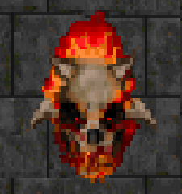
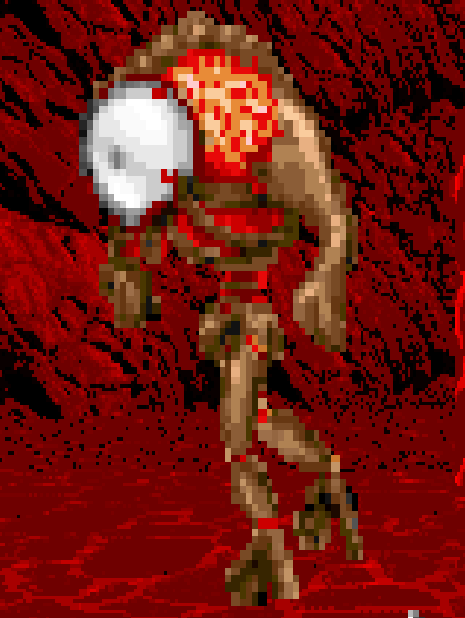

= Freedoom Manual

Welcome to Freedoom, a complete game that is free and open source software.
Freedoom is made available under the modified BSD license, meaning that
anyone is free to share it, modify it and reuse parts of it. For more
details, see the <<reusing,reusing section>>.

== Installing Freedoom

Freedoom by itself only consists of artwork and levels; to play the game it
needs to be paired with a source port. Fans of the original Doom games have
created a number of such ports; a good place to look is the Doom Wiki:

  <https://doomwiki.org/wiki/Source_port>

The following are some good default suggestions:

* https://zdoom.org[GZDoom] is a modern source port that includes various
  features such as a hardware renderer.
* https://www.chocolate-doom.org/wiki/index.php/Crispy_Doom[Crispy Doom]
  is a more minimalist source port that retains an "old school" feel.

Setup depends on the source port you use, and it's best to refer to the
instructions for that source port. Generally though, you can try one of the
following:

* Place the Freedoom `.wad` files into the same folder as the source port
  before launching it. They may be automatically detected.
* If launching from the command line, try
  eg. `my-favorite-port -iwad freedoom1.wad`.

== Using the Freedoom Menus

TODO: How to use the menus.

== How to Play

Freedoom is a real-time first-person shooter (FPS). You'll be exploring a
series of levels, in each one trying to find the way to the exit. An
assortment of monsters will try to stop you, and you'll need to use weapons
to defend yourself.
Portions of the levels may be inaccessible until you find a particular key, or
find a switch to open a locked door. This adds a puzzle element to the game in
addition to the action.

By default, the keyboard cursor keys will move forward and backward, and turn
left and right. The "control" key fires the current weapon, and the spacebar
will open doors and activate switches. All source ports allow you to rebind
these keys to a setup that you find more comfortable. You'll also want to look
into using the strafe (sidestep) and run keys to better control movement.

If you haven't played Freedoom before, take a few minutes to get familiar with
the controls, and reconfigure controls as you find makes it more comfortable
to play. Practice moving around and firing the weapon. You may encounter some
low-level monsters, but those encountered in the first level do not present
much of a challenge and they're a good opportunity to practice taking shots at.

Within the game you'll encounter various collectible items and power-ups.
These will typically give you more ammunition for your weapons, or more health
or armor. You can also find new weapons and some rarer power-ups which give
you special abilities. Picking something up is a simple matter of walking over
it - an on-screen message and a brief flash of the screen indicate that you've
done so successfully. If you don't pick it up, it's likely you don't need it
right now (for example, a health power-up when you already have 100% health).

=== The Status Bar

At the bottom of the screen, you'll see the status bar, which is divided into
the following sections:

|==========================
| **Ammo** | Number of units of ammunition remaining for the current weapon.
| **Health** | If this reaches zero, you're dead! See the
<<health,health section>> for power-ups you can find to replenish your health.
| **Arms** | Which weapons you've found so far. Check out the
<<weapons,weapons section>> for more information.
| **Freedoomguy** | A quick visual indication of how your health is.
| **Armor** | The more armor you have, the less your health will suffer if
you're injured. See the <<armor,armor section>> for more information.
| **Ammo counts** | How much you're carrying of each of the four types of
ammunition, along with the maximum of each you can carry.
|==========================

[[weapons]]
=== Freedoom's Weapons

You'll encounter a number of weapons within the game:

[options="header",cols="2,1,5,1"]
|==========================
| Weapon | Key | Description | Ammo
| **Fist** | 1 | If you have no ammunition, you can always fall back on punching the
monsters with your bare hands. | None
| **Angle Grinder** | 1 | Designed for cutting through metal, the angle grinder
also works well as a melee weapon for cutting through flesh. | None
| **Handgun** | 2 | Your starter weapon. A few shots will take down low-level
monsters but it's best to upgrade before taking on any tougher opponents. | Bullets
| **Pump-action Shotgun** | 3 | The main "workhorse" weapon; fires seven pellets
in a tight cluster and is effective over both short and long ranges against
low- and medium-level monsters. | Shells
| **Double-barrelled Shotgun** | 3 | Twice as powerful as the pump-action shotgun
but less effective at long ranges; good at short range against crowds of
enemies. | Shells
| **Minigun** | 4 | Conceptually like a faster version of the basic handgun, but
eats ammo much more quickly. | Bullets
| **Missile launcher** | 5 | Fires exploding missiles which are effective against
higher-level monsters. Be careful not to get caught in the blast! | Missiles
| **Polaric Energy Cannon** | 6 | Produces a continuous stream of polaric energy
projectiles which are very effective against higher-level monsters. | Energy
| **SKAG 1337** | 7 | Experimental weapon that launches a energy ball that does a
huge amount of damage, plus also damages other enemies in the vicinity.
Slow to fire, but incredibly powerful. | Energy
|==========================

Pressing the numbered key on the keyboard switches to the given weapon (if it
has been picked up!). Apart from the melee weapons, each weapon consumes a
certain type of ammo, and you should be careful to look out for more ammo as
you're exploring.

TODO: Add table of ammo powerups

[[health]]
=== Health

TODO: Add table of health powerups.

[[armor]]
=== Armor

TODO: Add table of armor powerups

=== Enemies

These are the monsters you'll encounter in the game:

[frame="none",cols="1,4,3",valign="middle",grid="none"]
|==========================
| **Zombie** |
These undead creatures are armed with a pistol and intent on your destruction.
Drops a clip of bullets when killed. |
image:images/monster-zombie.png[Zombie,150,150]
| **Shotgun Zombie** |
These guys traded their pistol for a shotgun and pack far more of a punch.
Drops a shotgun when killed. |
image:images/monster-shotgun-zombie.png[Shotgun Zombie,150,150]
| **Minigun Zombie** |
As soon as you're in sight of one of these, he'll lock on with his minigun and
keep on firing until you're dead. It's best to take cover quickly or take him
out. Drops a minigun when killed. |
image:images/monster-minigun-zombie.png[Minigun Zombie,150,150]
| **Serpentipede** |
Serpent footsoldiers of the alien invasion. Let them get close and they'll
tear you to shreds; at a distance they'll instead rain down fireballs. |
image:images/monster-serpentipede.png[Serpentipede,150,150]
| **Flesh Worm** |
Tough and fast-moving, these worms attack at close range and take several
shotgun blasts to take down. It's best to keep back. |
image:images/monster-flesh-worm.png[Flesh Worm,150,150]
| **Stealth Worm** |
These flesh worm variants have been given stealth abilities which make them
practically invisible. |
image:images/monster-stealth-worm.png[Stealth Worm,150,150]
| **Deadflare** |
Floating skulls which charge from a distance. |

| **Summoner** |
These mobile Deadflare production factories will ensure you always have more
work to do. |
| **Trilobite** |
These flying orb-like creatures spit fireballs and bite if you get too
close. |
image:images/monster-trilobite.png[Trilobite,150,150]
| **Pain Bringer** |
100% muscle, these guys take at least three rocket blasts to take down, and
while you're trying they'll shower you with energy projectiles. |
image:images/monster-pain-bringer.png[Pain Bringer,150,150]
| **Pain Lord** |
If the Pain Bringer wasn't tough enough, this one will take five rocket
blasts. |
image:images/monster-pain-lord.png[Pain Lord,150,150]
| **Dark Soldier** |
Fast moving, tough, and fires heat-seeking missiles. Do not get into a boxing
match with one of these guys. |
image:images/monster-dark-soldier.png[Dark Soldier,150,150]
| **Flame Bringer** |
If he's not setting you on fire, he's undoing all your hard work by bringing
his friends back from the dead. |

| **Combat Slug** |
These genetically-engineered super-slugs have been fitted with long distance
flame throwers, practically making them into living, slithering tanks. |
image:images/monster-combat-slug.png[Combat Slug,150,150]
| **Technospider** |
These spider creatures have been equipped with polaric energy cannons, making
them a deadly challenge. |
image:images/monster-technospider.png[Technospider,150,150]
| **Large Technospider** |
This tank on legs is equipped with a rapid-fire minigun and will take a lot
of effort to bring down. |
image:images/monster-large-technospider.png[Large Technospider,150,150]
| **Assault Tripod** |
The ultimate blend of military technology and genetic engineering, these
three-legged creatures are fast-moving, heavily armored and equipped with a
missile launcher that you'll want to avoid. |
image:images/monster-assault-tripod.png[Assault Tripod,150,150]
|==========================

=== Environmental Hazards

Barrels, damaging floors, crushing ceilings.

=== Tactical tips

If you're struggling with the difficulty of the game, one option is to change
to an easier skill level. Alternatively, you can try some of these tactical
suggestions:

* Firstly, put some time into setting up your controls. Most players find that
  a mouse and keyboard combination is the most effective, where the mouse is
  used to turn while the keyboard is used to move around. In particular, make
  sure that you have set up strafe (sidestep) keys. Many of the enemies in
  the game launch projectiles which must be dodged. Sidestepping these
  projectiles is an important skill to learn. You'll know you've mastered this
  skill when you can easily circle around an enemy and dodge its projectiles
  while simultaneously keeping your weapon trained on it.

* Take cover! Monsters only attack when you're in their line of sight. You'll
  want to find walls, pillars and other forms of cover you can hide behind
  while your weapon reloads. This advice is particularly important when
  facing certain monsters which can "lock on" to you (Minigun Zombie; Flame
  Bringer) and against whom hiding is a crucial skill.

* Many of the levels are littered with exploding barrels. While these can pose
  a danger to you, they're equally dangerous to your opponents. Wait for an
  enemies to walk too close to a barrel and a single shotgun blast to blow
  up the barrel can take down several enemies at once. One barrel explosion
  can trigger another, so it can sometimes set off a chain reaction that takes
  down a whole crowd - but be careful that doesn't include you!

* If a monster gets injured by another monster, it'll retaliate against the
  one that injured it. If faced with a crowd of enemies, an effective strategy
  can be to stand in just the right place so that those at the back shoot
  those at the front. Do it right and they'll spend more time fighting each
  other than fighting you, and the survivors will be significantly weakened.
  Be aware though, that a monster cannot be injured by a projectile launched
  by another of the same species.

[[reusing]]
== Reusing portions of Freedoom ==

TODO: Add some instructions.

