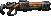
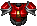

= Freedoom Manual
// SPDX-License-Identifier: BSD-3-Clause

Welcome to Freedoom, a complete game that is free and open source software.
Freedoom is made available under the modified BSD license, meaning that
anyone is free to share it, modify it and reuse parts of it.

For more details, see the <<reusing,reusing section>>.

image::../graphics/titlepic/titlepic.png[Freedoom Title Image,align="center",width=380,pdfwidth=50vw]

== Installing Freedoom

Freedoom is distributed as two files named `freedoom1.wad` and
`freedoom2.wad` which contain the artwork, levels, music and sound
effects that make up the game.  To be played it needs to be paired
with a source port. Fans of the original Doom games have created a
number of these; the Doom Wiki’s
https://doomwiki.org/wiki/Source_port[source ports page] has a
comprehensive list. The following are some good default suggestions:

* https://zdoom.org[GZDoom] is a modern source port that includes various
  features such as a hardware renderer.
* https://www.chocolate-doom.org/wiki/index.php/Crispy_Doom[Crispy Doom]
  is a more minimalist source port that retains an “old school” feel.

Setup depends on the source port you use, and it’s best to refer to the
instructions for that source port. Generally though, you can try one of the
following:

* Place the Freedoom `.wad` files into the same folder as the source port
  before launching it. They may be automatically detected.
* If launching from the command line, try
  eg. `my-favorite-port -iwad freedoom1.wad`.

Freedoom is split into _Freedoom: Phase 1_ (`freedoom1.wad`) and
_Freedoom: Phase 2_ (`freedoom2.wad`). _Phase 1_ is split into four separate
episodes of eight levels each, while _Phase 2_ is a single, 30 level campaign.
This gives 62 levels to play through, and there are also secret levels -- if
you can discover how to reach them.

<<<

[[menus]]
== Using the Freedoom Menus

Freedoom’s menus are fairly self-explanatory but here are some brief
instructions. The main menu can be brought up at any time by pressing the
_Esc_ key on your keyboard.

image::images/menu-mainmenu.png[Freedoom Main Menu,align="center",width=380,pdfwidth=50vw]

[cols="1,4",width="90%",align="center",valign="middle"]
|==========================
| <<newgame,**New game**>> | Start a new game, abandoning the current game (if you’re
already playing).
| **Options** | Brings up the options menu. The appearance of this menu
and the available options depend upon the source port you’re using.
| <<savegame,**Load Game**>> | Load a saved game.
| <<savegame,**Save Game**>> | Save your current game, so that you can continue playing
later.
| **Read This!** | Brings up a help screen showing a description of the
items you’ll encounter in the game.
| **Quit Game** | Finish playing and return to the operating system.
|==========================

[[newgame]]
=== Starting a new game

To start a new game, press _Esc_ to bring up the main menu, and choose
_New Game_.

When starting a new game, you may be prompted to choose which episode to
start playing.

image::images/menu-episode.png[Freedoom Episode Menu,align="center",width=432,pdfwidth=50vw]

If you’re new to the game, start with _Outpost Outbreak_, the first
episode (and easiest). Once you finish one episode, you can move on to
the next. If you’re bored with the episode you’re playing or stuck, you
can always try playing a different episode instead. There’s no requirement
to play episodes in order.

[[skill]]
After choosing a episode, you need to pick a skill level. Skill level
affects several factors in the game, most importantly the number of
monsters you’ll encounter.

image::images/menu-skill.png[Skill Selection Menu,align="center",width=473,pdfwidth=50vw]

[cols="1,3,8",width="90%",align="center",valign="middle"]
|==========================
| 1 | **Please Don’t Kill Me!** | The easiest skill level. This is
effectively the same as _Will This Hurt?_, except that damage is halved.
| 2 | **Will This Hurt?** | Easy skill level, a good choice if you’re
finding _Bring on the Pain_ too challenging.
| 3 | **Bring on the Pain.** | The default skill level.
| 4 | **Extreme Carnage.** | A more challenging skill level, suited more
for experienced players and people in search of a challenge.
| 5 | **MAYHEM!** | **Not Recommended**. This is equivalent to
_Extreme Carnage_ except that monster attacks are up to twice as fast,
and killed monsters come back to life after around 40 seconds.
|==========================

[[savegame]]
=== Loading and saving the game

It is a good idea to save the game regularly -- for example, at the start
of each new level. You may also want to save the game after completing a
challenging section of a level so that you do not have to repeat it again
if you die.

image::images/menu-save-game.png[Save Game Menu,align="center",width=473,pdfwidth=50vw]

To save the game, press _Esc_ to bring up the menu, select _Save Game_ and
choose a slot to save in. Type a description for the save game and press
_Enter_. Some source ports have a limited number of slots, in which case you
will have to overwrite an existing saved game once there are no more slots
available. For the same reason it’s a good idea to write a good description
for your saved game. Include the level number and something descriptive of
where you’ve reached; for example, “C1M3 - Blue Key Door.”

The _Load Game_ menu usually looks largely identical to the _Save Game_
menu. To restore your saved game, simply select _Load Game_ from the main
menu and choose your saved game.

If you find yourself saving the game often, you may want to use the
_Quicksave_ feature. Press _F6_ during play to quicksave. The _Save Game_
menu appears as usual; choosing a slot makes that your quicksave slot.
Pressing _F6_ again in the future will overwrite your quicksave slot with
just a couple of keystrokes. If you die you can also restore your
quicksave slot by pressing _F9_.

=== Quitting the game

When you’re finished playing Freedoom, press _Esc_ to bring up the main
menu and select _Quit Game_ to exit. You may want to select _Save Game_
first to save your progress so that you can return to where you left off
next time you play.

=== Keyboard shortcuts

The following are some useful keyboard shortcuts that can save time
accessing common menu functions.

[cols="1,2,8",width="90%",align="center",valign="middle"]
|==========================
| **Esc** | <<menus,Menu>> | Bring up the main menu.
| **F1** | Help | Bring up the help screen that shows information about the
in-game items.
| **F2** | <<savegame,Save>> | Bring up the _Save Game_ menu.
| **F3** | <<savegame,Load>> | Bring up the _Load Game_ menu.
| **F4** | Volume | Bring up a menu to control volume levels.
| **F6** | <<savegame,Quicksave>> | Save the game to your _quicksave_ slot,
which saves time if you’re repeatedly saving your progress while you play.
| **F7** | End Game | End the current game and return to the title screen.
| **F8** | Messages | Toggles between showing or hiding the on-screen
messages shown when you collect an item.
| **F9** | <<savegame,Quickload>> | Load the game from your _quicksave_ slot.
| **F10** | Quit Game | Quit the game and return to the operating system.
| **F11** | Brightness | Toggle the on-screen brightness level.
|==========================

<<<

== How to Play

image::images/c5m1-sshot.png[Freedoom Screenshot,width="640",pdfwidth="70vw",align="center"]

Freedoom is a real-time first-person shooter (FPS). You’ll be exploring a
series of levels, in each one trying to find the way to the exit. An
assortment of monsters will try to stop you, and you’ll need to use weapons
to defend yourself.
Portions of the levels may be inaccessible until you find a particular key, or
find a switch to open a locked door. This gives a puzzle element to the game in
addition to the action.

By default, the keyboard cursor keys will move forward and backward, and turn
left and right. The _Control_ key fires the current weapon, and the spacebar
will open doors and activate switches. All source ports allow you to rebind
these keys to a setup that you find more comfortable. You’ll also want to look
into using the strafe (sidestep) and run keys to better control over your
movement.

If you haven’t played Freedoom before, take a few minutes when you start the
game to get familiar with the controls, and reconfigure controls as you find
makes it more comfortable to play. Practice moving around and firing the
weapon. You may encounter some low-level monsters, but those encountered in
the first level do not present much of a challenge and they’re a good
opportunity to practice taking shots at.

Within the game you’ll encounter various collectible items and power-ups.
These will typically give you more <<ammo,ammunition>> for your weapons, more
<<health,health>> or more <<armor,armor>>. You can also find <<weapons,new
weapons>> and some <<specialitems,rarer power-ups>> which give you special
abilities. Picking something up is a simple matter of walking over it -- an
on-screen message and a brief flash of the screen indicate that you’ve done so
successfully. If you don’t pick it up, it’s likely you don’t need it right
now (for example, you can’t pick up a health pack when you already have 100%
health).

=== The Status Bar

At the bottom of the screen, you’ll see the status bar, which is divided into
the following sections:

image::images/status-bar.png[Freedoom Status Bar,width="640",pdfwidth="70vw",align="center"]

[cols="1,6",width="90%",align="center",valign="middle"]
|==========================
| **Ammo** | Number of units of <<ammo,ammunition>> remaining for the current
weapon.
| **Health** | If this reaches zero, you’re dead! See the
<<health,health section>> for power-ups you can find to replenish your health.
| **Arms** | Which weapons you’ve found so far. Check out the
<<weapons,weapons section>> for more information.
| **Freedoomguy** | A quick visual indication of how your health is.
| **Armor** | The more armor you have, the less your health will suffer if
you’re injured. See the <<armor,armor section>> for more information.
| **Ammo counts** | How much you’re carrying of each of the <<ammo,four types of
ammunition>>, along with the maximum of each you can carry.
|==========================

[[weapons]]
=== Freedoom’s Weapons

You start the game with only a handgun, 50 bullets and your fists to fall back
on once they run out. You’ll want to find yourself some better weaponry as
soon as possible.

[options="header",cols="4,1,7,3,2",valign="middle"]
|==========================
| Weapon | Key | Description | | Ammo
| **Fist** | 1 | If you have no ammunition, you can always fall back on punching the
monsters with your bare hands. | | None
| **Angle Grinder** | 1 | Designed for cutting through metal, the angle grinder
also works well as a melee weapon for cutting through flesh. |
image:../sprites/csawa0.png[Angle Grinder] |
None
| **Handgun** | 2 | Your starter weapon. A few shots will take down low-level
monsters but it’s best to upgrade before taking on any tougher opponents. | | Bullets
| **Pump-action Shotgun** | 3 | The main “workhorse” weapon; fires seven pellets
in a tight cluster and is effective over both short and long ranges against
low- and medium-level monsters. |
image:../sprites/shota0.png[Pump-action Shotgun] |
Shells
| **Double-barrelled Shotgun** | 3 | Twice as powerful as the pump-action shotgun
but less effective at long ranges; good at short range against crowds of
enemies. |
image:../sprites/sgn2a0.png[Double-barrelled Shotgun] |
Shells
| **Minigun** | 4 | Conceptually like a faster version of the basic handgun, but
eats ammo much more quickly. |
image:../sprites/mguna0.png[Minigun] |
Bullets
| **Missile Launcher** | 5 | Fires exploding missiles which are effective against
higher-level monsters. Be careful not to get caught in the blast! |
image:../sprites/launa0.png[Missile Launcher] |
Missiles
| **Polaric Energy Cannon** | 6 | Produces a continuous stream of polaric energy
projectiles which are very effective against higher-level monsters. |
 |
Energy
| **SKAG 1337** | 7 | Experimental weapon that launches a energy ball that does a
huge amount of damage, plus also damages other enemies in the vicinity.
Slow to fire, but incredibly powerful. |
image:../sprites/bfuga0.png[SKAG 1337] |
Energy
|==========================

Pressing the numbered key on the keyboard switches to the given weapon (if it
has been picked up!). Apart from the melee weapons, each weapon consumes a
certain type of ammo, and you should be careful to look out for more ammo as
you’re exploring.

[[ammo]]
[options="header",cols="2,1,1",width="50%",align="center",valign="middle"]
|==========================
| Ammo type | Small | Large
| **Bullets** |
image:../sprites/clipa0.png[Ammo Clip] |
image:../sprites/ammoa0.png[Ammo Clip]
| **Shells** |
image:../sprites/shela0.png[Shotgun Shells] |
image:../sprites/sboxa0.png[Box of Shotgun Shells]
| **Missiles** |
image:../sprites/rocka0.png[Missile] |
image:../sprites/broka0.png[Crate of Missiles]
| **Energy** |
image:../sprites/cella0.png[Small Energy Recharge] |
image:../sprites/celpa0.png[Large Energy Recharge]
| **Backpack** |
- |
image:../sprites/bpaka0.png[Backpack]
|==========================

The backpack item is a special item that contains several of every ammo type
and doubles the maximum amount of ammo you can carry.

[[health]]
=== Health

You die if your health reaches 0%. You’ll find health bonuses around the
levels which can restore you back to 100% health; 1% health bonuses can take
you over 100% and up to 200% health.

[options="header",cols="1,1,1,1",width="50%",align="center",halign="center"]
|==========================
| 1% | 10% | 25% | 100%
| image:../sprites/bon1a0.png[1% Health Bonus] |
image:../sprites/stima0.png[Small Health Pack] |
image:../sprites/media0.png[Large Health Pack] |
image:../sprites/soula0.png[Overdrive Sphere]
|==========================

[[armor]]
=== Armor

You start with 0% armor and can increase this up to 200% by collecting bonuses.

[options="header",cols="1,1,1",width="50%",align="center",halign="center"]
|==========================
| 1% | 100% | 200%
| image:../sprites/bon2a0.png[1% Armor Bonus] |
image:../sprites/arm1a0.png[Light Armor Vest] |

|==========================

Normal armor absorbs one third of damage you receive. For example, suppose
you’re hit by a missile that reduces your health from 100% to 50%. If you’re
hit by the same missile while wearing 100% armor, your health will reduce to
only 66%, but you’ll lose 16% armor.

The heavy armor vest has slightly different behavior: in addition to being
worth 200% armor, it also absorbs half of all damage. For this reason, it’s
a very good idea to get your hands on a heavy armor vest if you can locate one.

[[specialitems]]
=== Special Items

You may also encounter any one of these special items while exploring:

[cols="2,1,5",width="80%",align="center",valign="middle"]
|==========================
| **Keys** |
image:../sprites/bkeya0.png[Blue Key]
image:../sprites/bskua0.png[Blue Key]
image:../sprites/rkeya0.png[Red Key]
image:../sprites/rskua0.png[Red Key]
image:../sprites/ykeya0.png[Yellow Key]
image:../sprites/yskua0.png[Yellow Key] |
Allow you to open certain locked doors and activate locked switches.
Usually essential to be able to progress, although they sometimes allow
access to secret areas.
| **Night Vision Goggles** |
image:../sprites/pvisa0.png[Night Vision Goggles] |
Allow you to see in the dark for a limited time.
| **Ultra-Overdrive Sphere** |
image:../sprites/megaa0.png[Ultra-Overdrive Sphere] |
Maxes you out to 200% health and armor.
| **Tactical Survey Map** |
image:../sprites/pmapa0.png[Tactical Survey Map] |
Unlocks all areas of the map, including some secret areas that may not be
immediately visible.
| **Hazard Suit** |
image:../sprites/suita0.png[Hazard Suit] |
Protects you from the harmful radiation of damaging floors, for a limited
time.
| **Strength Power-Up** |
image:../sprites/pstra0.png[Strength Power-Up] |
Increases your health back to 100% and enhances your fists to 10x their
normal damage, until the end of level.
| **Stealth Sphere** |
image:../sprites/pinsa0.png[Stealth Sphere] |
Makes you almost invisible for a limited time.
| **Invulnerability Sphere** |
image:../sprites/pinva0.png[Invulnerability Sphere] |
Makes you immune to all damage for a limited time.
|==========================

=== Enemies

The levels are filled with monsters who have no other goal apart from stopping
you from completing your mission. Here’s a selection of some of these monsters
who you can expect to encounter.

[frame="none",cols="2,6,2",valign="middle",grid="none",align="center",width="90%"]
|==========================
| **Zombie** |
These undead creatures are armed with a pistol and intent on your destruction.
Drops a clip of bullets when killed. |
image:images/monster-zombie.png[Zombie,100,100]
| **Shotgun Zombie** |
These guys traded their pistol for a shotgun and pack far more of a punch.
Drops a shotgun when killed. |
image:images/monster-shotgun-zombie.png[Shotgun Zombie,100,100]
| **Minigun Zombie** |
As soon as you’re in sight of one of these, he’ll lock on with his minigun and
keep on firing until you’re dead. It’s best to take cover quickly or take him
out. Drops a minigun when killed. |
image:images/monster-minigun-zombie.png[Minigun Zombie,100,100]
| **Serpentipede** |
Serpent footsoldiers of the alien invasion. Let them get close and they’ll
tear you to shreds; at a distance they’ll instead rain down fireballs. |
image:images/monster-serpentipede.png[Serpentipede,100,100]
| **Flesh Worm** |
Tough and fast-moving, these worms attack at close range and take several
shotgun blasts to take down. It’s best to keep back. |
image:images/monster-flesh-worm.png[Flesh Worm,100,100]
| **Stealth Worm** |
These flesh worm variants have been given stealth abilities which make them
practically invisible. |
image:images/monster-stealth-worm.png[Stealth Worm,100,100]
| **Deadflare** |
Floating skulls which charge from a distance. |
image:images/monster-deadflare.png[Deadflare,100,100]
| **Summoner** |
These mobile Deadflare production factories will ensure you always have more
work to do. |
image:images/monster-summoner.png[Summoner,100,100]
| **Trilobite** |
These flying orb-like creatures spit fireballs and bite if you get too
close. |
image:images/monster-trilobite.png[Trilobite,100,100]
| **Pain Bringer** |
100% muscle, these guys take at least three rocket blasts to take down, and
while you’re trying they’ll shower you with energy projectiles. |
image:images/monster-pain-bringer.png[Pain Bringer,100,100]
| **Pain Lord** |
If the Pain Bringer wasn’t tough enough, this one will take five rocket
blasts. |
image:images/monster-pain-lord.png[Pain Lord,100,100]
| **Dark Soldier** |
Fast moving, tough, and fires heat-seeking missiles. Do not get into a boxing
match with one of these guys. |
image:images/monster-dark-soldier.png[Dark Soldier,100,100]
| **Necromancer** |
If he’s not setting you on fire, he’s undoing all your hard work by bringing
his friends back from the dead. |
image:images/monster-necromancer.png[Necromancer,100,100]
| **Combat Slug** |
These genetically-engineered super-slugs have been fitted with long distance
flame throwers, practically making them into living, slithering tanks. |
image:images/monster-combat-slug.png[Combat Slug,100,100]
| **Technospider** |
These spider creatures have been equipped with polaric energy cannons, making
them a deadly challenge. |
image:images/monster-technospider.png[Technospider,100,100]
| **Large Technospider** |
This tank on legs is equipped with a rapid-fire minigun and will take a lot
of effort to bring down. |
image:images/monster-large-technospider.png[Large Technospider,100,100]
| **Assault Tripod** |
The ultimate blend of military technology and genetic engineering, these
three-legged creatures are fast-moving, heavily armored and equipped with a
missile launcher that you’ll want to avoid. |
image:images/monster-assault-tripod.png[Assault Tripod,100,100]
|==========================

=== Using the map

When exploring Freedoom’s levels, it is sometimes possible to get lost,
especially if the level is particularly large or complex. Fortunately, the
map is available to help you find your way. Press the _Tab_ key during play to
bring up the map.

image::images/map.png[Map Screenshot,width="640",pdfwidth="70vw",align="center"]

Your current position and orientation are shown by a white arrow.
Areas of the map are usually color coded as follows:

[frame="none",cols="1,4",valign="middle",align="center",width="60%"]
|==========================
| **Red** | Walls (or possibly secret doors)
| **Yellow** | Changes in ceiling height, including doors.
| **Brown** | Changes in floor height (eg. steps)
| **Grey** | Undiscovered areas (not normally shown, but may be revealed
if the <<specialitems,Tactical Survey Map>> item is discovered).
|==========================

While using the map, the game continues as normal, so it is wise to find a
safe place before activating it, to avoid being ambushed by monsters. Normal
controls continue to work as usual, but the following additional keys are
available:

[frame="none",cols="1,4",valign="middle",align="center",width="80%"]
|==========================
| **Tab** | Toggle Map
| **-** | Zoom out
| **+** | Zoom in
| **0** | Maximum zoom out
| **F** | Toggle whether the map follows the player. When disabled, the
cursor keys can be used to pan the view of the map around independent of
your current position.
| **G** | Toggle map grid
| **M** | Add a map bookmark at the current location.
| **C** | Clear all bookmarks.
|==========================

=== Environmental Hazards

If the monsters weren’t enough, the environment itself poses hazards which
can hurt or even kill you!

[frame="none",cols="1,4,2",valign="middle",grid="none"]
|==========================
| **Barrels** |
These exploding barrels litter many of the levels. Several shots with a pistol
are usually enough to make them detonate, damaging anything in their immediate
vicinity. Make sure when engaged in combat to never stand too close, or a stray
shot from an enemy may cause one to explode in your face! Be aware too of the
potential for chain reactions when several barrels are clustered together. |
image:images/hazard-barrels.png[Barrels,150,150]
| **Damaging Floors** |
Red-hot lava and radioactive sludge are just two of the types of damaging floor
you can encounter in Freedoom’s levels. If walking over it is necessary, try to
find yourself a <<specialitems,hazard suit>>, but be aware that it will only
protect you for a limited time. |
image:images/hazard-slime.png[Radioactive slime,150,150]
| **Crushing Ceilings** |
Many of the levels have been rigged with traps and this is just one of them.
These moving ceilings are often placed above tempting-looking items. Be very
careful not to get caught beneath one, or it will quickly crush you into a
paste! |
image:images/hazard-crusher.png[Crushing Ceiling,150,150]
|==========================

=== Tactical tips

If you’re struggling with the difficulty of the game, one option is to change
to an easier skill level. Alternatively, you can try some of these tactical
suggestions:

* Firstly, put some time into setting up your controls. Most players find that
  a mouse and keyboard combination is the most effective, where the mouse is
  used to turn while the keyboard is used to move around. In particular, make
  sure that you have set up strafe (sidestep) keys. Many of the enemies in
  the game launch projectiles which must be dodged. Sidestepping these
  projectiles is an important skill to learn. You’ll know you’ve mastered this
  skill when you can easily circle around an enemy and dodge its projectiles
  while simultaneously keeping your weapon trained on it.

* Play with headphones. The game’s stereo separation can give helpful audio
  cues about the positions of enemies and alert you to incoming projectiles.
  Headphones give you a more precise way to pick up on these cues.

* Take cover! Monsters only attack when you’re in their line of sight. You’ll
  want to find walls, pillars and other forms of cover you can hide behind
  while your weapon reloads. This advice is particularly important when
  facing certain monsters which can “lock on” to you (minigun zombie;
  necromancer); hiding from these is a crucial skill.

* Many of the levels are littered with exploding barrels. While these can pose
  a danger to you, they’re equally dangerous to your opponents. A single,
  well-timed shotgun blast aimed at a barrel can take down several enemies at
  once. One barrel explosion can trigger another, so it can sometimes set off
  a chain reaction that takes down a whole crowd -- but be careful that
  doesn’t include you!

* If a monster gets injured by another monster, it’ll retaliate against the
  one that injured it (this is called _monster in-fighting_). If faced with a
  crowd of enemies, an effective strategy can be to stand in just the right
  place so that those at the back shoot those at the front. Do it right and
  they’ll spend more time fighting each other than fighting you, and the
  survivors will be significantly weakened.  Be aware though, that a monster
  cannot be injured by a projectile launched by another of the same species.

* Sometimes you’ll face crowds of monsters, which can be overwhelming and also
  drain your ammo supplies. Learn to master crowd control. The primary
  instinct of all monsters is to move towards you. Circle around the crowd
  continually -- this encourages them to cluster in a single spot that’s
  easier for you to target. It also encourages monster in-fighting; if done
  effectively, they’ll spend their energy killing each other and you’ll save
  on ammunition.

* If you encounter a horde of flesh worms or stealth worms, The angle
  grinder is a great weapon to use both to conserve ammo and avoid
  taking damage.  Worms can’t attack while being sawed, and if you
  back into any corner that is roughly as wide as or narrower than a
  right angle, they can only come at you one at a time. The angle
  grinder also works well on trilobites: they can’t attack while
  taking damage from it.

<<<

[[wads]]
== Playing with fan-made WADs and mods ==

.Scythe MAP09 playing with Freedoom.
image::images/scythe-map09.png[Scythe MAP09,width="640",pdfwidth="70vw",align="center"]

One of the nicest features of Freedoom is its compatibility with the
catalog of thousands of fan-made levels made for the classic _Doom_ games.
With some exceptions, most popular mods and levels for _Doom_ and _Doom II_
can also be played with Freedoom.
The largest repository of _Doom_ mods is the idgames archive, and a
browsing interface for the archive
https://www.doomworld.com/idgames/[can be found on Doomworld].

Playing a `.wad` file is usually fairly simple. For mods designed for the
original _Doom_, use Freedoom: Phase 1 (`freedoom1.wad`); for others designed
for _Doom 2_ or _Final Doom_, use Freedoom: Phase 2 (`freedoom2.wad`).
If you’re using the command line, use the `-file` parameter when you start the
game. For example, to load the file `scythe.wad`:

  my-favorite-port -iwad freedoom2.wad -file scythe.wad

If you’re not using the command line, you can try dragging and dropping the
`.wad` file onto the source port icon in your file manager -- several
source ports support this.

=== Suggestions

Over more than two decades, literally thousands of _Doom_ levels have been
made, and there are so many that it may seem difficult to know where to
start. The following are some suggestions for where to look for the best
content:

* Doomworld’s https://www.doomworld.com/10years/bestwads/[Top 100 WADs Of All Time]
was written in 2003 and aimed to list the best works from the first 10
years of fan-made mods. It’s still a great list of classic mods.

* https://www.doomworld.com/cacowards/[The Cacowards] are Doomworld’s
annual award ceremony that recognizes the best releases from the _Doom_
community over the past year. This is a great way to find out about more
recent developments, including some of the more unusual mods that people
are releasing.

* The Doom Wiki’s https://doomwiki.org/wiki/List_of_notable_WADs[List of
notable WADs] contains a rather extensive list of fan-made WADs. The Doom
Wiki includes extensive information about such mods including screenshots,
maps and per-level statistics, so it’s a useful entrypoint to discover
interesting mods.

* Doomworld’s interface to the idgames archive includes the ability to
list the https://www.doomworld.com/idgames/index.php?top[top levels] based
on five star rankings by visitors to the site.

<<<

== Cheats ==

If you’re finding the game too difficult, you can always try playing at
an <<skill,easier skill level>>. However, if that’s not enough, or if you just
want to have fun feeling like an unstoppable killing machine, there are a
number of cheats that you can turn to:

[cols="1,4",width="90%",align="center",valign="middle"]
|==========================
| **IDDQD** | God mode. Makes you invulnerable to all damage.
| **IDFA** | Gives all weapons and ammo.
| **IDKFA** | All weapons, ammo and keys.
| **IDCLIP** | Turn on noclip mode, which lets you walk through walls.
| **IDDT** | Reveals full map; type twice to reveal all enemies and items.
| **IDCLEVxy** | Warp to CxMy (Phase 1) or MAPxy (Phase 2).
| **IDMUSxy** | Change music to that of CxMy (Phase 1) or MAPxy (Phase 2).
| **IDCHOPPERS** | Gives the angle grinder weapon.
| **IDBEHOLDV** | Gives the invulnerability sphere powerup.
| **IDBEHOLDS** | Gives the strength powerup.
| **IDBEHOLDI** | Gives the stealth sphere powerup.
| **IDBEHOLDR** | Gives the hazard suit powerup.
| **IDBEHOLDM** | Gives the tactical survey map.
| **IDBEHOLDL** | Gives the night vision goggles.
|==========================

<<<

== Contributing to Freedoom ==

Freedoom is a
https://www.gnu.org/philosophy/free-sw.html[free content]
project contributed to by many users around the world. It is available as
both free in cost (free as in free beer) and in modification and
redistribution rights (free as in free speech) to end users,
provided that the original software license is included and/or
viewable by users of modified or redistributed versions.

If you’d like to contribute to the Freedoom project, please check out the
https://github.com/freedoom/freedoom[project’s page],
https://www.doomworld.com/forum/17-freedoom/[discussion forum],
and https://discord.gg/9DA3fut[discord chat].

https://help.github.com/en/github[How to use Git version control for contributions]

https://guides.github.com/activities/forking/[How to fork a project and create a pull request with Git]

<<<

[[reusing]]
== Reusing portions of Freedoom ==

Since https://freedoom.github.io/about.html[Freedoom is free], some other
projects have used Freedoom’s assets.  We think this is a great use of the
project and should be encouraged. If you use portions of Freedoom in your
project, please let us know by filing an issue or pull request on
https://github.com/freedoom/freedoom.github.io[Freedoom’s website project page]
